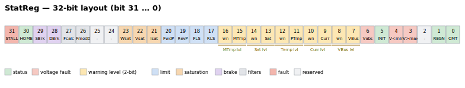

# StatReg

Read-only bitfield reporting general axis status, saturations, limits and multi-level warnings.

## Overview

`StatReg` reports the general status of an axis as a 32-bit field — it is the axis-level companion to the unit-level [UnitStat](../01-system/01-status/UnitStat.md) and the fault register [ConFlt](ConFlt.md). It is read-only, axis-scoped, and not saved to flash, so it always reflects the live state. Several statuses are **single bits** (set = condition true); five statuses are **2-bit severity fields** (none / low / medium / high). Agito PCSuite reads these bits to drive its status-panel LEDs (the 4-level warnings show as off / yellow / orange / red).



## Bit map

| Bit(s) | Field | Meaning when set |
|--------|-------|------------------|
| 0 | Commutation | Commutation / auto-phasing has completed |
| 1 | Regeneration | Regeneration is active |
| 2 | — | Reserved |
| 3 | Over-voltage | Bus voltage exceeded [MaxVBus](../06-protections/02-current-and-voltage/MaxVBus.md) |
| 4 | Under-voltage | Bus voltage below [MinVBus](../06-protections/02-current-and-voltage/MinVBus.md) |
| 5 | Initial delay | Power-up initial delay completed |
| 6 | Over-voltage (abs) | Bus voltage exceeded [MaxVBusAbs](../06-protections/02-current-and-voltage/MaxVBusAbs.md) |
| 7–8 | Bus-voltage warning | Severity level 0–3 (see below) |
| 9–10 | Current warning | Severity level 0–3 |
| 11–12 | Power/board-temperature warning | Severity level 0–3 (also covers [BoardTemp](../06-protections/07-board-temperature/BoardTemp.md)) |
| 13–14 | Saturation warning | Severity level 0–3 |
| 15–16 | Motor-temperature warning | Severity level 0–3 |
| 17 | RLS | Reverse limit switch active |
| 18 | FLS | Forward limit switch active |
| 19 | RevPLim | At reverse software limit ([RevPLim](../06-protections/03-motion/position-limit-protection/RevPLim.md)) |
| 20 | FwdPLim | At forward software limit ([FwdPLim](../06-protections/03-motion/position-limit-protection/FwdPLim.md)) |
| 21 | Current saturation | Current command is saturated ([PeakCL](../06-protections/02-current-and-voltage/PeakCL.md)/[ContCL](../06-protections/02-current-and-voltage/ContCL.md)) |
| 22 | Voltage saturation | Output voltage saturated (Va/Vb/Vc reached [MaxPWM](../06-protections/02-current-and-voltage/MaxPWM.md)) |
| 23 | Velocity saturation | Velocity command saturated ([MaxVel](../06-protections/03-motion/general-maximum-limits/MaxVel.md)) |
| 24–25 | Other-warning code | 2-bit code (bit 24 = LSB, bit 25 = MSB): `0` none, `2` power limit reached (I²t / [ContCL](../06-protections/02-current-and-voltage/ContCL.md)); values `1` and `3` reserved |
| 26 | Filters modified | Loop filters changed since last `CalcFilters` |
| 27 | Calc-filters failed | The last filter calculation failed |
| 28 | Dynamic brake | Dynamic brake is active |
| 29 | Static brake | Static-brake lock is requested |
| 30 | Homing done | Homing has completed |
| 31 | Stall | Stall detected |

### Severity (2-bit warning fields)

The bus-voltage, current, power/board-temperature, saturation, and motor-temperature warnings each occupy **two bits** encoding a severity level:

| Value | Level | PCSuite LED |
|-------|-------|-------------|
| 0 | None | Off |
| 1 | Low | Yellow |
| 2 | Medium | Orange |
| 3 | High | Red |

## How it works

To extract a single status, mask and shift:

$$
Status = (\text{StatReg}\ \&\ \text{Bit mask}) \gg \text{Bit offset}
$$

For a single-bit status the result is 0 or 1; for a 2-bit warning field the result is the 0–3 severity level. For example, the bus-voltage warning level is `(StatReg & 0x180) >> 7`, and "voltage saturation" is `(StatReg & 0x400000) >> 22`.

## Examples

```text
AStatReg                       ; read the full axis status word
```

Check current saturation (bit 21) in a user program by masking with `0x200000`; read the motor-temperature warning level (bits 15–16) with `(AStatReg & 0x18000) >> 15`.

## See also

- [ConFlt](ConFlt.md) — axis fault code (disabling faults, separate from these status bits)
- [MotionStat](../10-motion/05-motion-status/MotionStat.md) — motion-specific status bitfield
- [UnitStat](../01-system/01-status/UnitStat.md) — unit-level hardware/firmware status
- [LimitsStat](../06-protections/03-motion/position-limit-protection/LimitsStat.md) — dedicated limit-switch status
