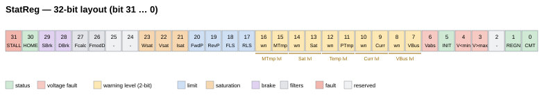

# StatReg

只读位域，报告轴的一般状态、饱和、限位及多级告警。

## 概述

`StatReg` 以 32 位字段报告轴的一般状态——它是单元级 [UnitStat](../01-system/01-status/UnitStat.md) 和故障寄存器 [ConFlt](ConFlt.md) 在轴级别的对应物。它是只读的、轴级的，且不会保存至闪存，因此始终反映实时状态。若干状态为**单个位**（置位 = 条件为真）；五个状态为 **2 位严重级别字段**（无 / 低 / 中 / 高）。Agito PCSuite 读取这些位以驱动其状态面板 LED（4 级告警显示为关闭 / 黄 / 橙 / 红）。



## 位映射

| 位 | 字段 | 置位时含义 |
|--------|-------|------------------|
| 0 | Commutation | 换相 / 自动定相已完成 |
| 1 | Regeneration | 再生处于活动状态 |
| 2 | — | 保留 |
| 3 | Over-voltage | 母线电压超过 [MaxVBus](../06-protections/02-current-and-voltage/MaxVBus.md) |
| 4 | Under-voltage | 母线电压低于 [MinVBus](../06-protections/02-current-and-voltage/MinVBus.md) |
| 5 | Initial delay | 上电初始延迟已完成 |
| 6 | Over-voltage (abs) | 母线电压超过 [MaxVBusAbs](../06-protections/02-current-and-voltage/MaxVBusAbs.md) |
| 7–8 | Bus-voltage warning | 严重级别 0–3（见下文） |
| 9–10 | Current warning | 严重级别 0–3 |
| 11–12 | Power/board-temperature warning | 严重级别 0–3（也涵盖 [BoardTemp](../06-protections/07-board-temperature/BoardTemp.md)） |
| 13–14 | Saturation warning | 严重级别 0–3 |
| 15–16 | Motor-temperature warning | 严重级别 0–3 |
| 17 | RLS | 反向限位开关激活 |
| 18 | FLS | 正向限位开关激活 |
| 19 | RevPLim | 处于反向软件限位（[RevPLim](../06-protections/03-motion/position-limit-protection/RevPLim.md)） |
| 20 | FwdPLim | 处于正向软件限位（[FwdPLim](../06-protections/03-motion/position-limit-protection/FwdPLim.md)） |
| 21 | Current saturation | 电流指令已饱和（[PeakCL](../06-protections/02-current-and-voltage/PeakCL.md)/[ContCL](../06-protections/02-current-and-voltage/ContCL.md)） |
| 22 | Voltage saturation | 输出电压已饱和（Va/Vb/Vc 达到 [MaxPWM](../06-protections/02-current-and-voltage/MaxPWM.md)） |
| 23 | Velocity saturation | 速度指令已饱和（[MaxVel](../06-protections/03-motion/general-maximum-limits/MaxVel.md)） |
| 24–25 | Other-warning code | 2 位代码（位 24 = LSB，位 25 = MSB）：`0` 无，`2` 达到功率限制（I²t / [ContCL](../06-protections/02-current-and-voltage/ContCL.md)）；值 `1` 和 `3` 保留 |
| 26 | Filters modified | 自上次 `CalcFilters` 以来环路滤波器已更改 |
| 27 | Calc-filters failed | 上次滤波器计算失败 |
| 28 | Dynamic brake | 动态制动处于活动状态 |
| 29 | Static brake | 已请求静态制动器抱闸 |
| 30 | Home input | 原点输入（开关）激活；镜像 [HomeStat](../16-homing/HomeStat.md) |
| 31 | Stall | 检测到堵转 |

### 严重级别（2 位告警字段）

母线电压、电流、功率/板温、饱和及电机温度告警各占用**两位**，编码一个严重级别：

| 值 | 级别 | PCSuite LED |
|-------|-------|-------------|
| 0 | 无 | 关闭 |
| 1 | 低 | 黄 |
| 2 | 中 | 橙 |
| 3 | 高 | 红 |

## 工作原理

要提取单个状态，进行掩码和移位：

$$
Status = (\text{StatReg}\ \&\ \text{Bit mask}) \gg \text{Bit offset}
$$

对于单位状态，结果为 0 或 1；对于 2 位告警字段，结果为 0–3 的严重级别。例如，母线电压告警级别为 `(StatReg & 0x180) >> 7`，而“电压饱和”为 `(StatReg & 0x400000) >> 22`。

## 示例

```text
AStatReg                       ; read the full axis status word
```

在用户程序中通过用 `0x200000` 掩码来检查电流饱和（位 21）；用 `(AStatReg & 0x18000) >> 15` 读取电机温度告警级别（位 15–16）。

## 另请参阅

- [ConFlt](ConFlt.md) — 轴故障码（禁用性故障，与这些状态位分开）
- [MotionStat](../10-motion/05-motion-status/MotionStat.md) — 运动专用状态位域
- [UnitStat](../01-system/01-status/UnitStat.md) — 单元级硬件/固件状态
- [LimitsStat](../06-protections/03-motion/position-limit-protection/LimitsStat.md) — 专用限位开关状态
