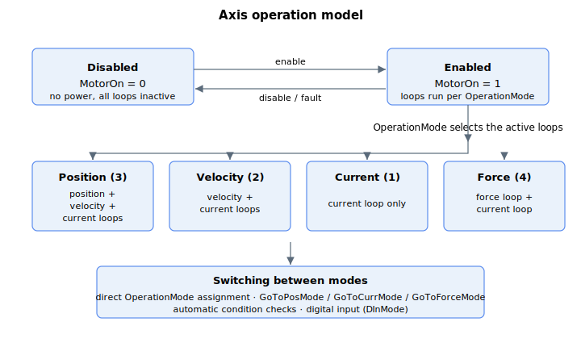

# Axis operation

Depending on application, user can operate in different control mode (e.g. position control mode for point-to-point motion, current control mode for slave driver application, etc.).

The axis is first enabled or disabled with [MotorOn](01-general-keywords/MotorOn.md); once enabled, [OperationMode](01-general-keywords/OperationMode.md) selects which control loops are active.

User can choose to switch the control mode (OperationMode)

1.  manually

2.  by command keyword

3.  by assigning conditions for automatic transition, or

4.  by digital input defined by [DInMode](../../02-keywords/05-inputs-outputs/04-digital-inputs/DInMode.md)

For **manual** transition, user can assign to OperationMode keyword directly.

For **command keyword** (GoToCurrMode, GoToForceMode, GoToPosMode), user can call the command directly. Unlike manual transition, this method will ensure proper preparation is performed before control mode is finally changed.

For **condition assignment**, related keywords are used for condition checking. If conditions are satisfied, control mode switches accordingly by the controller. Various switching modes are available.

The following table shows the summary of axis operation keywords.

| No. | Sub-section             | Keywords      | Summary |
|-----|-------------------------|---------------|---------|
| 1   | General keywords        | [MotorOn](01-general-keywords/MotorOn.md)             | Enables or disables the motor, and reports the servo on/off status. |
| 2   | General keywords        | [OperationMode](01-general-keywords/OperationMode.md) | Selects the axis control mode and which control loops are active. |
| 3   | General keywords        | [OpenLoopCurr](01-general-keywords/OpenLoopCurr.md)   | Current reference applied to the current loop in current open-loop mode. |
| 4   | General keywords        | [OpenLoopOn](01-general-keywords/OpenLoopOn.md)       | Opens the control loop at a chosen point (none, current, or voltage). |
| 5   | General keywords        | [OpenLoopVolt](01-general-keywords/OpenLoopVolt.md)   | Voltage reference applied to the modulation in voltage open-loop mode. |
| 6   | General keywords        | [CanMotorOn](01-general-keywords/CanMotorOn.md)       | Command that attempts to enable the motor after running pre-checks. |
| 7   | General keywords        | [CanMotorOnRes](01-general-keywords/CanMotorOnRes.md) | Result code from the last CanMotorOn enable attempt. |
| 8   | Position operation mode | [BeginOnToPos](02-position-operation-mode/BeginOnToPos.md)   | One-time flag to run a point-to-point move on entering position mode. |
| 9   | Position operation mode | [GoToPosMode](02-position-operation-mode/GoToPosMode.md)     | Gracefully switches the axis into position control mode. |
| 10  | Position operation mode | [ModeSwitchPos](02-position-operation-mode/ModeSwitchPos.md) | Records the position when the axis enters or exits position mode. |
| 11  | Position operation mode | [PosPosFlag](02-position-operation-mode/PosPosFlag.md)       | Trigger direction for the position-feedback check to enter position mode. |
| 12  | Position operation mode | [PosPosTh](02-position-operation-mode/PosPosTh.md)           | Position-feedback threshold used with PosPosFlag to enter position mode. |
| 13  | Position operation mode | [RetractSpeed](02-position-operation-mode/RetractSpeed.md)   | Maximum velocity of the point-to-point move on entry to position mode. |
| 14  | Position operation mode | [RetractTarget](02-position-operation-mode/RetractTarget.md) | Absolute target of the point-to-point move on entry to position mode. |
| 15  | Current operation mode  | [CurrAInTh](03-current-operation-mode/CurrAInTh.md)       | Analog force-feedback threshold (condition B) to enter current mode. |
| 16  | Current operation mode  | [CurrCmdCntr](03-current-operation-mode/CurrCmdCntr.md)   | Time elapsed in current mode or in the active CurrCmdVal entry. |
| 17  | Current operation mode  | [CurrCmdHTime](03-current-operation-mode/CurrCmdHTime.md) | Holding time for each current-command table entry. |
| 18  | Current operation mode  | [CurrCmdIndex](03-current-operation-mode/CurrCmdIndex.md) | Active index into the current-command table. |
| 19  | Current operation mode  | [CurrCmdSlope](03-current-operation-mode/CurrCmdSlope.md) | Slope (ramp rate) of the current command. |
| 20  | Current operation mode  | [CurrCmdSrc](03-current-operation-mode/CurrCmdSrc.md)     | Selects the current-reference source. |
| 21  | Current operation mode  | [CurrCmdVal](03-current-operation-mode/CurrCmdVal.md)     | User-defined current-command value or table. |
| 22  | Current operation mode  | [CurrCurrTh](03-current-operation-mode/CurrCurrTh.md)     | Current threshold for condition switching. |
| 23  | Current operation mode  | [CurrCurrThDir](03-current-operation-mode/CurrCurrThDir.md) | Direction of the current threshold comparison. |
| 24  | Current operation mode  | [CurrPosErrTh](03-current-operation-mode/CurrPosErrTh.md) | Position-error threshold for condition switching. |
| 25  | Current operation mode  | [CurrPosTh](03-current-operation-mode/CurrPosTh.md)       | Position threshold for condition switching. |
| 26  | Current operation mode  | [CurrPosThDir](03-current-operation-mode/CurrPosThDir.md) | Direction of the position threshold comparison. |
| 27  | Current operation mode  | [CurrRefMaster](03-current-operation-mode/CurrRefMaster.md) | Master axis supplying the current reference in slave-drive mode. |
| 28  | Current operation mode  | [GoToCurrMode](03-current-operation-mode/GoToCurrMode.md) | Gracefully switches the axis into current control mode. |
| 29  | Force operation mode    | [Force](04-force-operation-mode/Force.md)               | Reports the measured force. |
| 30  | Force operation mode    | [ForceAInTh](04-force-operation-mode/ForceAInTh.md)     | Analog-input threshold for force-mode condition switching. |
| 31  | Force operation mode    | [ForceCmdCntr](04-force-operation-mode/ForceCmdCntr.md) | Time elapsed in force mode or in the active ForceCmdVal entry. |
| 32  | Force operation mode    | [ForceCmdHTime](04-force-operation-mode/ForceCmdHTime.md) | Holding time for each force-command table entry. |
| 33  | Force operation mode    | [ForceCmdIndex](04-force-operation-mode/ForceCmdIndex.md) | Active index into the force-command table. |
| 34  | Force operation mode    | [ForceCmdSlope](04-force-operation-mode/ForceCmdSlope.md) | Slope (ramp rate) of the force command. |
| 35  | Force operation mode    | [ForceCmdSrc](04-force-operation-mode/ForceCmdSrc.md)   | Selects the force-reference source. |
| 36  | Force operation mode    | [ForceCmdVal](04-force-operation-mode/ForceCmdVal.md)   | User-defined force-command value or table. |
| 37  | Force operation mode    | [ForceErr](04-force-operation-mode/ForceErr.md)         | Reports the force error (reference minus measured). |
| 38  | Force operation mode    | [ForceInTStat](04-force-operation-mode/ForceInTStat.md) | Reports the force in-target status. |
| 39  | Force operation mode    | [ForceInTTime](04-force-operation-mode/ForceInTTime.md) | Dwell time required to declare force in-target. |
| 40  | Force operation mode    | [ForceInTTol](04-force-operation-mode/ForceInTTol.md)   | Force tolerance band for the in-target test. |
| 41  | Force operation mode    | [ForcePosErrTh](04-force-operation-mode/ForcePosErrTh.md) | Position-error threshold for force-mode condition switching. |
| 42  | Force operation mode    | [ForceRef](04-force-operation-mode/ForceRef.md)         | Reports the active force reference. |
| 43  | Force operation mode    | [ForceSamples](04-force-operation-mode/ForceSamples.md) | Timings of the last completed ForceCmdVal application, in controller cycles. |
| 44  | Force operation mode    | [GoToForceMode](04-force-operation-mode/GoToForceMode.md) | Gracefully switches the axis into force control mode. |
