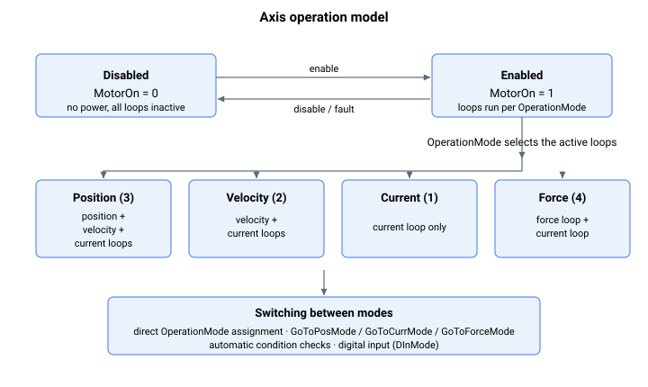

# 轴操作

根据应用的不同，用户可以采用不同的控制模式运行（例如，用于点到点运动的位置控制模式、用于从驱动应用的电流控制模式等）。

轴首先通过 [MotorOn](01-general-keywords/MotorOn.md) 使能或禁用；一旦使能，[OperationMode](01-general-keywords/OperationMode.md) 选择哪些控制环处于活动状态。

用户可以选择切换控制模式（OperationMode）

1.  手动

2.  通过命令关键字

3.  通过指定自动转换的条件，或

4.  通过由 [DInMode](../../02-keywords/05-inputs-outputs/04-digital-inputs/DInMode.md) 定义的数字量输入

对于**手动**转换，用户可以直接对 OperationMode 关键字赋值。

对于**命令关键字**（GoToCurrMode、GoToForceMode、GoToPosMode），用户可以直接调用该命令。与手动转换不同，此方法会确保在最终更改控制模式之前完成适当的准备。

对于**条件指定**，相关关键字用于条件检查。如果条件满足，控制器会相应地切换控制模式。可使用多种切换模式。

下表为轴操作关键字汇总。

| 序号 | 子章节             | 关键字      | 摘要 |
|-----|-------------------------|---------------|---------|
| 1   | 通用关键字        | [MotorOn](01-general-keywords/MotorOn.md)             | 使能或禁用电机，并报告伺服使能/关闭状态。 |
| 2   | 通用关键字        | [OperationMode](01-general-keywords/OperationMode.md) | 选择轴控制模式以及哪些控制环处于活动状态。 |
| 3   | 通用关键字        | [OpenLoopCurr](01-general-keywords/OpenLoopCurr.md)   | 在电流开环模式下施加到电流环的电流参考。 |
| 4   | 通用关键字        | [OpenLoopOn](01-general-keywords/OpenLoopOn.md)       | 在选定的点（无、电流或电压）开环。 |
| 5   | 通用关键字        | [OpenLoopVolt](01-general-keywords/OpenLoopVolt.md)   | 在电压开环模式下施加到调制的电压参考。 |
| 6   | 通用关键字        | [CanMotorOn](01-general-keywords/CanMotorOn.md)       | 运行预检查后尝试使能电机的命令。 |
| 7   | 通用关键字        | [CanMotorOnRes](01-general-keywords/CanMotorOnRes.md) | 上次 CanMotorOn 使能尝试的结果代码。 |
| 8   | 通用关键字        | [ForceMotorOn](01-general-keywords/ForceMotorOn.md)   | 受保护的使能，在换相完成前将电机使能，仅用于电流环整定（v5）。 |
| 9   | 位置运行模式 | [BeginOnToPos](02-position-operation-mode/BeginOnToPos.md)   | 一次性标志，在进入位置模式时运行一次点到点运动。 |
| 10  | 位置运行模式 | [GoToPosMode](02-position-operation-mode/GoToPosMode.md)     | 平稳地将轴切换到位置控制模式。 |
| 11  | 位置运行模式 | [ModeSwitchPos](02-position-operation-mode/ModeSwitchPos.md) | 记录轴进入或退出位置模式时的位置。 |
| 12  | 位置运行模式 | [PosPosFlag](02-position-operation-mode/PosPosFlag.md)       | 进入位置模式的位置反馈检查的触发方向。 |
| 13  | 位置运行模式 | [PosPosTh](02-position-operation-mode/PosPosTh.md)           | 与 PosPosFlag 一起用于进入位置模式的位置反馈阈值。 |
| 14  | 位置运行模式 | [RetractSpeed](02-position-operation-mode/RetractSpeed.md)   | 进入位置模式时点到点运动的最大速度。 |
| 15  | 位置运行模式 | [RetractTarget](02-position-operation-mode/RetractTarget.md) | 进入位置模式时点到点运动的绝对目标。 |
| 16  | 电流运行模式  | [CurrAInTh](03-current-operation-mode/CurrAInTh.md)       | 进入电流模式的模拟力反馈阈值（条件 B）。 |
| 17  | 电流运行模式  | [CurrCmdCntr](03-current-operation-mode/CurrCmdCntr.md)   | 在电流模式中或在活动 CurrCmdVal 条目中已用的时间。 |
| 18  | 电流运行模式  | [CurrCmdHTime](03-current-operation-mode/CurrCmdHTime.md) | 每个电流命令表条目的保持时间。 |
| 19  | 电流运行模式  | [CurrCmdIndex](03-current-operation-mode/CurrCmdIndex.md) | 电流命令表中的活动索引。 |
| 20  | 电流运行模式  | [CurrCmdSlope](03-current-operation-mode/CurrCmdSlope.md) | 电流命令的斜率（斜坡变化率）。 |
| 21  | 电流运行模式  | [CurrCmdSrc](03-current-operation-mode/CurrCmdSrc.md)     | 选择电流参考源。 |
| 22  | 电流运行模式  | [CurrCmdVal](03-current-operation-mode/CurrCmdVal.md)     | 用户定义的电流命令值或表。 |
| 23  | 电流运行模式  | [CurrCurrTh](03-current-operation-mode/CurrCurrTh.md)     | 用于条件切换的电流阈值。 |
| 24  | 电流运行模式  | [CurrCurrThDir](03-current-operation-mode/CurrCurrThDir.md) | 电流阈值比较的方向。 |
| 25  | 电流运行模式  | [CurrPosErrTh](03-current-operation-mode/CurrPosErrTh.md) | 用于条件切换的位置误差阈值。 |
| 26  | 电流运行模式  | [CurrPosTh](03-current-operation-mode/CurrPosTh.md)       | 用于条件切换的位置阈值。 |
| 27  | 电流运行模式  | [CurrPosThDir](03-current-operation-mode/CurrPosThDir.md) | 位置阈值比较的方向。 |
| 28  | 电流运行模式  | [CurrRefMaster](03-current-operation-mode/CurrRefMaster.md) | 在从驱动模式下提供电流参考的主轴。 |
| 29  | 电流运行模式  | [GoToCurrMode](03-current-operation-mode/GoToCurrMode.md) | 平稳地将轴切换到电流控制模式。 |
| 30  | 力运行模式    | [Force](04-force-operation-mode/Force.md)               | 报告测得的力。 |
| 31  | 力运行模式    | [ForceAInTh](04-force-operation-mode/ForceAInTh.md)     | 用于力模式条件切换的模拟量输入阈值。 |
| 32  | 力运行模式    | [ForceCmdCntr](04-force-operation-mode/ForceCmdCntr.md) | 在力模式中或在活动 ForceCmdVal 条目中已用的时间。 |
| 33  | 力运行模式    | [ForceCmdHTime](04-force-operation-mode/ForceCmdHTime.md) | 每个力命令表条目的保持时间。 |
| 34  | 力运行模式    | [ForceCmdIndex](04-force-operation-mode/ForceCmdIndex.md) | 力命令表中的活动索引。 |
| 35  | 力运行模式    | [ForceCmdSlope](04-force-operation-mode/ForceCmdSlope.md) | 力命令的斜率（斜坡变化率）。 |
| 36  | 力运行模式    | [ForceCmdSrc](04-force-operation-mode/ForceCmdSrc.md)   | 选择力参考源。 |
| 37  | 力运行模式    | [ForceCmdVal](04-force-operation-mode/ForceCmdVal.md)   | 用户定义的力命令值或表。 |
| 38  | 力运行模式    | [ForceErr](04-force-operation-mode/ForceErr.md)         | 报告力误差（参考减去测量值）。 |
| 39  | 力运行模式    | [ForceInTStat](04-force-operation-mode/ForceInTStat.md) | 报告力到位状态。 |
| 40  | 力运行模式    | [ForceInTTime](04-force-operation-mode/ForceInTTime.md) | 声明力到位所需的驻留时间。 |
| 41  | 力运行模式    | [ForceInTTol](04-force-operation-mode/ForceInTTol.md)   | 到位测试的力容差带。 |
| 42  | 力运行模式    | [ForcePosErrTh](04-force-operation-mode/ForcePosErrTh.md) | 用于力模式条件切换的位置误差阈值。 |
| 43  | 力运行模式    | [ForceRef](04-force-operation-mode/ForceRef.md)         | 报告活动的力参考。 |
| 44  | 力运行模式    | [ForceSamples](04-force-operation-mode/ForceSamples.md) | 上次完成的 ForceCmdVal 应用的时序，以控制器周期为单位。 |
| 45  | 力运行模式    | [GoToForceMode](04-force-operation-mode/GoToForceMode.md) | 平稳地将轴切换到力控制模式。 |
