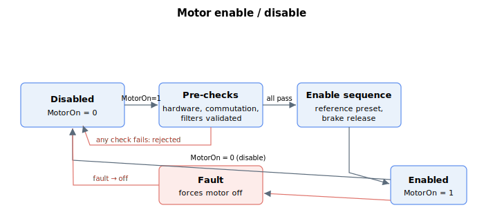

# General keywords

This section describes general keywords usable across all operation modes.

The central action here is enabling and disabling the motor with [MotorOn](MotorOn.md). Writing `MotorOn = 1` runs a set of pre-checks; only if they all pass does the enable sequence run and the motor turn on. A controller fault, a digital input, or `MotorOn = 0` returns the axis to the disabled state. Use [CanMotorOn](CanMotorOn.md) / [CanMotorOnRes](CanMotorOnRes.md) to test the pre-checks without enabling.

