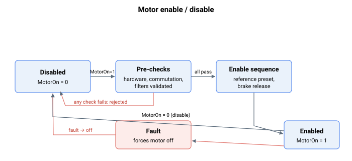

# 通用关键字

本节介绍可在所有运行模式下使用的通用关键字。

此处的核心操作是通过 [MotorOn](MotorOn.md) 使能和禁用电机。写入 `MotorOn = 1` 会运行一组预检查；只有在全部通过后，才会执行使能序列并使电机上电。控制器故障、数字量输入或 `MotorOn = 0` 会使轴返回禁用状态。使用 [CanMotorOn](CanMotorOn.md) / [CanMotorOnRes](CanMotorOnRes.md) 可以在不使能的情况下测试这些预检查。

