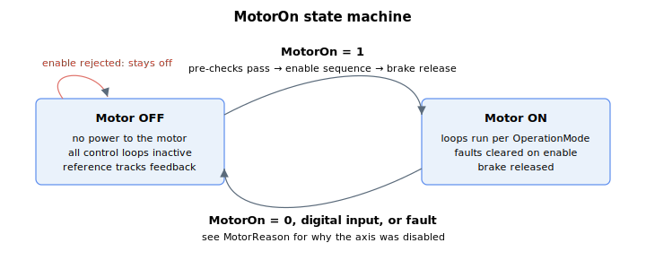

# MotorOn

Enables or disables the motor, and reports the servo on/off status.

## Overview

`MotorOn` is used to enable/disable the motor (by writing) or report the servo status (by reading). `MotorOn = 0` disables the motor; `MotorOn = 1` enables it. When the motor is disabled, no power is applied to the motor and none of the control loops are active.

The motor can also be disabled internally by a controller fault (see [ConFlt](../../../02-keywords/07-status-and-faults/ConFlt.md) and [Controller error codes](../../../04-error-codes/controller-error-codes.md)). When the axis is enabled, `ConFlt` is cleared; if the fault state remains, the fault is retriggered and the axis is disabled again. To enable the motor with pre-checks and a reportable result, use [CanMotorOn](CanMotorOn.md) / [CanMotorOnRes](CanMotorOnRes.md).

Some keywords are only writable or callable when the axis is disabled — refer to each keyword's attribute table (`ok_motor_on`) for details.

## How it works

Writing `MotorOn` requests an enable or disable; reading it returns the live servo status. The controller performs two very different sequences depending on the value written.



### Enabling — `MotorOn = 1`

A list of **pre-conditions** is checked first; if any fails the write is rejected with an error and the axis stays off. In order:

1. Unit hardware is healthy — the FPGA is not faulty, the dynamic-brake / variant / full-scale FPGA versions match the firmware, and (on Zynq products) the firmware matches the board flash.
2. On a Central-i master (when the remote is **not** a simulation amplifier), the remote port is active, the remote device is an amplifier, and — on AMP55 remotes — its inrush relay is closed. Simulation-amp remotes skip these three checks.
3. The inrush charge resistor has been bypassed.
4. **Commutation is complete** ([StatReg](../../07-status-and-faults/StatReg.md) bit 0, commutation done). If commutation has not been done and the commutation mode is "on motor-on" / "on power-on and motor-on", the enable *blocks* and runs auto-phasing first, then waits about 2 s for the motor to settle before continuing.
5. The last [CalcFilters](../../11-control-tuning/01-general-keywords/CalcFilters.md) succeeded ([StatReg](../../07-status-and-faults/StatReg.md) bit 27, calc-filters failed, is clear) and the loop filters are not in the "modified, not recalculated" state ([StatReg](../../07-status-and-faults/StatReg.md) bit 26, filters modified, is clear).

When `MotorType` is set to simulation or the amplifier is a PD type, these checks are skipped (no real power stage).

Once the checks pass and the axis was previously off, the enable sequence runs:

1. **Reference preset / smoothing init.** The jerk-smoothing history and running sum are preloaded with the current reference, and — if [input shaping](../../11-control-tuning/08-input-shaping/ShapingOn.md) is on — the shaping history is preloaded too. This makes the reference start from where the axis already is, so there is no step at enable. (The reference itself is kept equal to the feedback while off — see [PosRef](../../10-motion/01-kinematics-status/PosRef.md) / [Pos](../../10-motion/01-kinematics-status/Pos.md).)
2. **Bootstrap-capacitor charge.** If dynamic braking is not already on, it is turned on for about 2 ms to charge the gate-driver bootstrap capacitors, then turned off.
3. **Enable.** The servo is switched on, [ConFlt](../../07-status-and-faults/ConFlt.md) is cleared to `0`, the in-target status is set to the enabled state, and [MotorReason](../../07-status-and-faults/MotorReason.md) is reset to `0`.
4. **Brake release.** If the static brake is in "automatic by MotorOn" mode and a brake is fitted, the release command is issued and the controller waits the configured brake-release time before completing. See [Static brake](../../06-protections/06-brake/Staticbrake.md).

### Disabling — `MotorOn = 0`

1. If the static brake is "automatic by MotorOn", the lock command is issued and the controller waits the configured brake-lock time before powering down (see [Static brake](../../06-protections/06-brake/Staticbrake.md)).
2. The servo is switched off, and [MotorReason](../../07-status-and-faults/MotorReason.md) is recorded — `3` if the disable came from a running user program, otherwise `4` (communication).

### What "off" holds

Switching the servo off is not the whole story — every control cycle, while the motor is off, the controller holds the axis in a clean, jump-free state:

- All loop **integrals are zeroed** — the velocity-loop integral, the current-loop d/q integrals, and the force integral.
- All errors and references are zeroed or reset (position error `0`, current references and phase voltages `0`), and the force reference is set to the measured force so force mode can re-engage smoothly.
- [OpenLoopCurr](OpenLoopCurr.md) and [OpenLoopVolt](OpenLoopVolt.md) are forced to `0`, gantry is forced off, stall state is cleared, and the motor-off status bits in [StatReg](../../07-status-and-faults/StatReg.md) are cleared.
- If a [ConFlt](../../07-status-and-faults/ConFlt.md) is present at the off transition, [MotorReason](../../07-status-and-faults/MotorReason.md) is set to `1`.

Because the loops are inactive and the reference tracks the feedback while off, the position error is zero at the instant of the next enable.

### Internal (forced) disable

A controller fault disables the axis automatically (for example the high-position-error and high-velocity-error protections), loading [ConFlt](../../07-status-and-faults/ConFlt.md) with the relevant fault code and snapshotting state. A digital input configured to disable the axis forces the motor off and records [MotorReason](../../07-status-and-faults/MotorReason.md) = `2`. Re-enabling clears `ConFlt`; if the fault condition is still present the protection fires again and the axis trips off immediately.

## Examples

```text
AMotorOn=1           ; enable the motor
AMotorOn=0           ; disable the motor
AMotorOn            ; read servo status (0 = off, 1 = on)
```

### Walk-through: power up an axis and verify ready

A safe enable sequence: confirm the configured mode, pre-flight the pre-conditions, enable, and check the result.

```text
AOperationMode=3          ; position control mode (default)
                          ; OperationMode is flash-saveable and only writable while disabled
ACanMotorOn               ; pre-check; does not enable the motor
ACanMotorOnRes            ; expect 1 (would enable). Any other value is the reject/fault code:
                          ;   – inspect ConFlt, StatReg (commutation / filter bits), UnitStat
AMotorOn=1                ; enable; rejected if any pre-condition still fails
AMotorOn                  ; expect 1 = on
AStatReg                  ; commutation-done bit set; filter-modified / calc-failed bits clear
AConFlt                   ; expect 0 (no fault)
```

If `MotorOn = 1` is rejected after `CanMotorOn` returned 1, the cause is a time-dependent or post-enable protection: read [ConFlt](../../07-status-and-faults/ConFlt.md), [MotorReason](../../07-status-and-faults/MotorReason.md) and [StatReg](../../07-status-and-faults/StatReg.md) for the snapshot. To disable cleanly, write `AMotorOn=0` — the static brake (if "automatic by MotorOn") locks first, then the servo powers down and `MotorReason` is recorded.

### Edge cases

- **Already on** — `MotorOn = 1` while the motor is already on is a no-op (no smoothing reinit, no brake release reissued).
- **Already off** — `MotorOn = 0` while the motor is already off is a no-op (no brake lock reissued).
- **Simulation motor / PD amplifier** — the pre-condition list (commutation, calc-filters, filters-modified) is skipped; the motor enables as long as basic hardware/communication checks pass. There is no real power stage to engage.
- **Burn-in mode** — when `BurnInMode = 1`, the commutation-done check is bypassed so the motor can be enabled before phasing for production testing.
- **Inrush still active** — `MotorOn = 1` is rejected with `NOT_ALLOWED_WHILE_INRUSH_RESISTOR_ACTIVE`; wait for the inrush relay to close.
- **Drive too hot / overall current limit** (AGD301 32 A only) — `MotorOn = 1` is rejected with `DRV02_TOO_HIGH_OVERALL_CURRENT` if the sum of `ContCL[A]`+`[B]`+`[C]` exceeds 28000.
- **Gantry pair member disabled** — if either gantry member of a pair turns off, the other is automatically forced off with [ConFlt](../../07-status-and-faults/ConFlt.md) = `CON_FLT_GANTRY_MEMBER_UNEXPECTED_MOTOR_OFF` and gantry is cleared. See [GantryOn](../../12-gantry-control/01-general-variables/GantryOn.md).
- **In motion** — `MotorOn = 0` while moving issues a hard-off; controlled stop should be requested first via [Stop](../../10-motion/04-motion-command/Stop.md) or [Abort](../../10-motion/04-motion-command/Abort.md) if smoothness is important.
- **Fault input asserted** — even after `MotorOn = 1` succeeds, a still-active fault input ([DInMode](../../05-inputs-outputs/04-digital-inputs/DInMode.md) code 24 / 26) will retrigger and disable the motor with `MotorReason = 2`.
- **Read during enable sequence** — `MotorOn` reflects the **target** state; during the multi-step enable (auto-phasing wait, bootstrap charge, brake release) the read may return `1` before all post-enable hardware is settled. Use [InTargetStat](../../10-motion/05-motion-status/InTargetStat.md) or [ConFlt](../../07-status-and-faults/ConFlt.md) for a fuller picture.
- **Platform** — Zynq products add a flash/firmware-mismatch check; other platforms skip it.

## See also

- [CanMotorOn](CanMotorOn.md) — enable the motor with pre-checks
- [CanMotorOnRes](CanMotorOnRes.md) — result code of the last enable attempt
- [MotorReason](../../07-status-and-faults/MotorReason.md) — why the axis was last disabled (fault / IO / user program / communication)
- [ConFlt](../../07-status-and-faults/ConFlt.md) — controller fault register that can force the motor off
- [StatReg](../../07-status-and-faults/StatReg.md) — commutation, brake and other status bits checked at enable
- [OperationMode](OperationMode.md) — which loops are active once enabled
- [Pos](../../10-motion/01-kinematics-status/Pos.md) / [PosRef](../../10-motion/01-kinematics-status/PosRef.md) — reference tracks feedback while off, so there is no jump at enable
