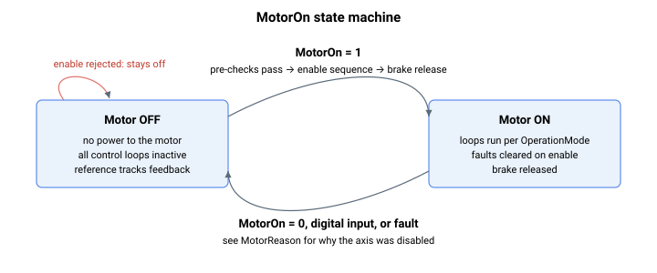

# MotorOn

使能或禁用电机，并报告伺服使能/关闭状态。

## 概述

`MotorOn` 用于使能/禁用电机（通过写入）或报告伺服状态（通过读取）。`MotorOn = 0` 禁用电机；`MotorOn = 1` 使能电机。当电机被禁用时，不会向电机施加功率，且所有控制环均不激活。

电机也可能因控制器故障而被内部禁用（参见 [ConFlt](../../../02-keywords/07-status-and-faults/ConFlt.md) 和 [控制器错误代码](../../../04-error-codes/controller-error-codes.md)）。当轴被使能时，`ConFlt` 会被清除；如果故障状态仍然存在，故障将被重新触发，轴随即再次被禁用。如需在使能电机时进行预检查并获得可报告的结果，请使用 [CanMotorOn](CanMotorOn.md) / [CanMotorOnRes](CanMotorOnRes.md)。

某些关键字仅在轴被禁用时才可写入或调用——详情请参阅各关键字的属性表（`ok_motor_on`）。

## 工作原理

写入 `MotorOn` 请求使能或禁用；读取它则返回实时伺服状态。控制器会根据写入的值执行两套截然不同的流程。



### 使能——`MotorOn = 1`

首先检查一组**前置条件**；如果任何一项失败，写入将以错误被拒绝，轴保持关闭状态。依次为：

1. 单元硬件健康——FPGA 无故障，动态制动 / 变体 / 满量程 FPGA 版本与固件匹配，并且（在 central-i 产品上）固件与板载闪存匹配。
2. 在 Central-i 主站上（当远程单元**不是**仿真驱动器时），远程端口处于活动状态，远程设备为驱动器，并且——在 AMP55 远程单元上——其浪涌继电器已闭合。仿真驱动器远程单元会跳过这三项检查。
3. 浪涌充电电阻已被旁路。
4. **换相完成**（[StatReg](../../07-status-and-faults/StatReg.md) bit 0，换相完成）。如果换相尚未完成，且换相模式为“电机使能时”/“上电及电机使能时”，则使能会*阻塞*并先执行自动定相，然后等待约 2 s 待电机稳定后再继续。
5. 上一次 [CalcFilters](../../11-control-tuning/01-general-keywords/CalcFilters.md) 已成功（[StatReg](../../07-status-and-faults/StatReg.md) bit 27，计算滤波器失败位被清除），且环路滤波器未处于“已修改、未重新计算”状态（[StatReg](../../07-status-and-faults/StatReg.md) bit 26，滤波器已修改位被清除）。此检查适用于 v4；在 v5（central-i）上这两个滤波器状态不再阻止使能——它们仅指示是否需要重新计算。

当 `MotorType` 设为仿真，或驱动器为 PD 类型时，这些检查会被跳过（无真实功率级）。

一旦检查通过且轴此前处于关闭状态，使能流程随即运行：

1. **参考预置 / 平滑初始化。** 急动平滑历史和累加和会以当前参考值预加载，并且——如果 [输入整形](../../11-control-tuning/08-input-shaping/ShapingOn.md) 已开启——整形历史也会被预加载。这使参考从轴所在的当前位置开始，因此在使能时不会出现阶跃。（在关闭期间参考本身被保持为等于反馈——参见 [PosRef](../../10-motion/01-kinematics-status/PosRef.md) / [Pos](../../10-motion/01-kinematics-status/Pos.md)。）
2. **自举电容充电。** 如果动态制动尚未开启，则将其开启约 2 ms 以对栅极驱动器自举电容充电，然后关闭。
3. **使能。** 伺服被接通，[ConFlt](../../07-status-and-faults/ConFlt.md) 被清除为 `0`，到位状态被置为使能状态，[MotorReason](../../07-status-and-faults/MotorReason.md) 被复位为 `0`。
4. **松闸。** 如果静态制动器处于“由 MotorOn 自动控制”模式且已装配制动器，则发出松闸指令，控制器等待所配置的松闸时间后再完成。参见 [静态制动器](../../06-protections/06-brake/Staticbrake.md)。

### 禁用——`MotorOn = 0`

1. 如果静态制动器处于“由 MotorOn 自动控制”模式，则发出抱闸指令，控制器等待所配置的抱闸时间后再下电（参见 [静态制动器](../../06-protections/06-brake/Staticbrake.md)）。
2. 伺服被关闭，[MotorReason](../../07-status-and-faults/MotorReason.md) 被记录——如果禁用来自正在运行的用户程序则为 `3`，否则为 `4`（通信）。

### “关闭”状态所保持的内容

关闭伺服并非全部——在电机关闭期间的每个控制周期，控制器都将轴保持在一个干净、无跳变的状态：

- 所有环路**积分项被清零**——速度环积分项、电流环 d/q 积分项以及力积分项。
- 所有误差和参考被清零或复位（位置误差 `0`，电流参考和相电压 `0`），并且力参考被置为测量到的力，以便力模式可以平滑地重新接入。
- [OpenLoopCurr](OpenLoopCurr.md) 和 [OpenLoopVolt](OpenLoopVolt.md) 被强制为 `0`，龙门被强制关闭，堵转状态被清除，[StatReg](../../07-status-and-faults/StatReg.md) 中的电机关闭状态位被清除。
- 如果在关闭转换时存在 [ConFlt](../../07-status-and-faults/ConFlt.md)，则 [MotorReason](../../07-status-and-faults/MotorReason.md) 被置为 `1`。

由于在关闭期间环路不激活且参考跟踪反馈，因此在下一次使能的瞬间位置误差为零。

### 内部（强制）禁用

控制器故障会自动禁用轴（例如高位置误差和高速度误差保护），将相关故障码载入 [ConFlt](../../07-status-and-faults/ConFlt.md) 并对状态进行快照。配置为禁用轴的数字量输入会强制电机关闭并记录 [MotorReason](../../07-status-and-faults/MotorReason.md) = `2`。重新使能会清除 `ConFlt`；如果故障条件仍然存在，保护将再次触发，轴随即立即跳闸关闭。

## 示例

```text
AMotorOn=1           ; enable the motor
AMotorOn=0           ; disable the motor
AMotorOn            ; read servo status (0 = off, 1 = on)
```

### 操作演练：给轴上电并验证就绪

一个安全的使能流程：确认所配置的模式、对前置条件进行预检查、使能，然后检查结果。

```text
AOperationMode=3          ; position control mode (default)
                          ; OperationMode is flash-saveable and only writable while disabled
ACanMotorOn               ; pre-check; does not enable the motor
ACanMotorOnRes            ; expect 1 (would enable). Any other value is the reject/fault code:
                          ;   – inspect ConFlt, StatReg (commutation / filter bits), UnitStat
AMotorOn=1                ; enable; rejected if any pre-condition still fails
AMotorOn                  ; expect 1 = on
AStatReg                  ; commutation-done bit set; filter-modified / calc-failed bits clear
AConFlt                   ; expect 0 (no fault)
```

如果 `CanMotorOn` 返回 1 后 `MotorOn = 1` 仍被拒绝，原因是某项时间相关或使能后的保护：读取 [ConFlt](../../07-status-and-faults/ConFlt.md)、[MotorReason](../../07-status-and-faults/MotorReason.md) 和 [StatReg](../../07-status-and-faults/StatReg.md) 获取快照。如需干净地禁用，请写入 `AMotorOn=0`——静态制动器（如果处于“由 MotorOn 自动控制”）先抱闸，然后伺服下电并记录 `MotorReason`。

### 边界情况

- **已使能**——在电机已使能时执行 `MotorOn = 1` 为空操作（不重新初始化平滑，不重新发出松闸指令）。
- **已关闭**——在电机已关闭时执行 `MotorOn = 0` 为空操作（不重新发出抱闸指令）。
- **仿真电机 / PD 驱动器**——前置条件列表（换相、计算滤波器、滤波器已修改）被跳过；只要基本的硬件/通信检查通过，电机即被使能。没有真实的功率级需要接入。
- **老化测试模式**——当 `BurnInMode = 1` 时，换相完成检查被绕过，从而可在定相之前使能电机以进行生产测试。
- **浪涌仍处于活动状态**——`MotorOn = 1` 因浪涌继电器尚未闭合而以错误（86）被拒绝；请等待浪涌充电电阻被旁路。
- **驱动器过热 / 总电流限制**（仅 AGD301 32 A）——`MotorOn = 1` 以错误（241）被拒绝，因为连续电流限值之和（`ContCL[A]`+`[B]`+`[C]`）超过 28000 mA。
- **龙门对成员被禁用**——如果一对龙门成员中任一关闭，另一个会被自动强制关闭，并伴随 [ConFlt](../../07-status-and-faults/ConFlt.md) = `1061`（另一龙门成员已电机关闭），龙门被清除。参见 [GantryOn](../../12-gantry-control/01-general-variables/GantryOn.md)。
- **运动中**——在运动时执行 `MotorOn = 0` 会发出硬关闭；如果平滑性重要，应先通过 [Stop](../../10-motion/04-motion-command/Stop.md) 或 [Abort](../../10-motion/04-motion-command/Abort.md) 请求受控停止。
- **故障输入被置位**——即使 `MotorOn = 1` 成功，仍处于活动状态的故障输入（[DInMode](../../05-inputs-outputs/04-digital-inputs/DInMode.md) 代码 24 / 26）也会重新触发并禁用电机，伴随 [ConFlt](../../07-status-and-faults/ConFlt.md) = `1050`（代码 24）或 `1062`（代码 26）以及 [MotorReason](../../07-status-and-faults/MotorReason.md) = `1`。`MotorReason = 2` 仅由伺服使能/关闭数字量输入的下降沿设置，而不由故障输入设置。
- **使能流程期间读取**——`MotorOn` 反映的是**目标**状态；在多步使能过程中（自动定相等待、自举充电、松闸），读取可能在所有使能后硬件稳定之前就返回 `1`。使用 [InTargetStat](../../10-motion/05-motion-status/InTargetStat.md) 或 [ConFlt](../../07-status-and-faults/ConFlt.md) 可获得更完整的情况。
- **平台**——central-i 产品增加了闪存/固件不匹配检查；standalone 产品则跳过该检查。

## 另请参阅

- [CanMotorOn](CanMotorOn.md) —— 带预检查地使能电机
- [CanMotorOnRes](CanMotorOnRes.md) —— 上次使能尝试的结果代码
- [MotorReason](../../07-status-and-faults/MotorReason.md) —— 轴上次被禁用的原因（故障 / IO / 用户程序 / 通信）
- [ConFlt](../../07-status-and-faults/ConFlt.md) —— 可强制电机关闭的控制器故障寄存器
- [StatReg](../../07-status-and-faults/StatReg.md) —— 使能时检查的换相、制动器及其他状态位
- [OperationMode](OperationMode.md) —— 使能后哪些环路处于激活状态
- [Pos](../../10-motion/01-kinematics-status/Pos.md) / [PosRef](../../10-motion/01-kinematics-status/PosRef.md) —— 关闭期间参考跟踪反馈，因此使能时无跳变
