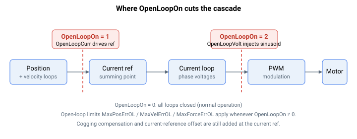

# OpenLoopOn

在选定的点（无、电流或电压）处打开控制环。

## 概述

`OpenLoopOn` 在选定的点处打开控制环，主要用于调试投运和诊断。当在电流参考处打开环路时，由 [OpenLoopCurr](OpenLoopCurr.md) 提供参考；当在电压参考处打开时，由 [OpenLoopVolt](OpenLoopVolt.md) 提供参考。

## 工作原理

`OpenLoopOn` 在选定的点处切断级联，并用用户值替代上层环路本应产生的输出。它独立于 [OperationMode](OperationMode.md) 工作，且电机必须已使能才能出现任何驱动。

| OpenLoopOn | 环路切断位置 | 驱动源 |
|---|---|---|
| 0 | — | 所有环路闭合（正常运行）。 |
| 1 | 在电流参考处，紧靠电流环之前 | [OpenLoopCurr](OpenLoopCurr.md) 成为电流参考。 |
| 2 | 在相电压输出处，紧靠 PWM 调制之前 | [OpenLoopVolt](OpenLoopVolt.md) 设定所注入正弦波的幅值。 |



### 电流开环（1）

每个周期控制器用来自 [OpenLoopCurr](OpenLoopCurr.md) 的用户值覆盖电流参考。上层的位置、速度和力环被绕过；只有齿槽补偿（[UPMVelTable](../../09-current-and-voltage/03-current-compensation/UPMVelTable.md)）仍会叠加在上面（仅限无刷电机）。电流环本身保持闭合，并将电机调节到该参考。

### 电压开环（2）

这会将一个正弦波直接注入到相 A 上，相 B 和相 C 保持为零，其中相位以 [InjectFreq](../../13-injection/InjectFreq.md) 速率推进。电流环被完全绕过。此模式用于测量电机电阻与电感（R/L），并假定频率足够高以致电机几乎不动，且幅值足够小以免汲取过大电流——因此 [OpenLoopVolt](OpenLoopVolt.md) 被限制在 20 % PWM。

### 打开期间的误差保护限值

只要 `OpenLoopOn` 非零，控制器就会将正常的位置/速度/力误差限值替换为更宽的开环限值（`MaxPosErrOL` / `MaxVelErrOL` / `MaxForceErrOL`）并武装这三项检查，因为环路不再将误差保持在接近零的水平。设置 `OpenLoopOn = 0` 会恢复正常限值。

### 禁用时默认安全

当电机关闭时，两个驱动值都被强制为 `0`，并且只要 `OpenLoopOn ≠ 1` 就将 `OpenLoopCurr` 清零，只要 `OpenLoopOn ≠ 2` 就将 `OpenLoopVolt` 清零，因此离开开环模式或禁用轴时不会残留任何驱动。

## 示例

```text
AOpenLoopOn=1        ; current open loop, drive with OpenLoopCurr
AOpenLoopOn=2        ; voltage open loop, drive with OpenLoopVolt
AOpenLoopOn=0        ; close all loops (normal operation)
```

### 边界情况

- **写入时电机使能**——被拒绝（`NOMTRON`）。该参数必须**在电机关闭时**写入，然后再使能电机。
- **写入时处于运动中**——被拒绝（`NOMOTN`）。请先停止轴。
- **超出范围**——超出 `0`–`2` 的值会被参数表拒绝。
- **接入后电机关闭**——`OpenLoopCurr` 和 `OpenLoopVolt` 在每个电机关闭周期都被强制为 `0`，因此两者中都不会留有残留驱动。
- **驱动变量不匹配**——只要 `OpenLoopOn ≠ 1`，`OpenLoopCurr` 也会被强制为 `0`，只要 `OpenLoopOn ≠ 2`，`OpenLoopVolt` 也会被强制为 `0`；你无法留下过时的驱动值。
- **误差限值**——当 `OpenLoopOn ≠ 0` 时，更宽的开环限值会取代正常的位置/速度/力误差限值；清除 `OpenLoopOn` 会在同一周期恢复正常限值。
- **电压模式幅值**——`OpenLoopVolt` 被限制在 20 % PWM 以保护电机；超过上限的值会被拒绝（超出范围）。
- **模式无关性**——`OpenLoopOn` 会覆盖所配置的任何 [OperationMode](OperationMode.md)；无论 `OperationMode` 为何，位置 / 速度 / 力环都会被绕过。
- **仿真**——开环驱动需要真实的、已换相的电机。电流开环（`1`）仅在电机使能、换相已设置且电机不是仿真电机时才注入；在仿真电机上，电流参考不会被覆盖。
- **保存**——不可保存至闪存；每次复位后从 `0` 重新开始。

## 另请参阅

- [OpenLoopCurr](OpenLoopCurr.md) —— OpenLoopOn = 1 时使用的电流参考
- [OpenLoopVolt](OpenLoopVolt.md) —— OpenLoopOn = 2 时使用的电压幅值
- [OperationMode](OperationMode.md) —— 在环路闭合时选择哪些环路处于激活状态
- [MotorOn](MotorOn.md) —— 必须使能开环驱动才能出现；禁用会清除两个驱动值
