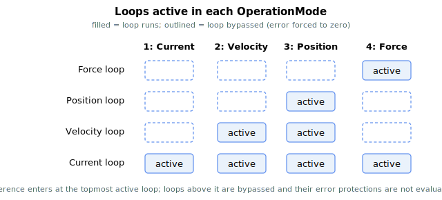

# OperationMode

Selects the axis control mode and which control loops are active.

## Overview

`OperationMode` determines the axis' active control mode and which control loops are activated. It can be changed manually (by direct assignment) or automatically — via digital inputs ([DInMode](../../../02-keywords/05-inputs-outputs/04-digital-inputs/DInMode.md)), the `GoTo...Mode` commands, or the internal switching algorithm using the condition-check keywords.

For graceful transitions, prefer the dedicated commands [GoToCurrMode](../03-current-operation-mode/GoToCurrMode.md), [GoToPosMode](../02-position-operation-mode/GoToPosMode.md) and [GoToForceMode](../04-force-operation-mode/GoToForceMode.md) over direct assignment, since they perform the proper preparation before switching.

## How it works

The four loops (position → velocity → current, plus the optional outer force loop) form a cascade. `OperationMode` selects how far *down* that cascade the live reference enters — the loops above the entry point are bypassed by forcing their error to zero each control cycle, so they neither contribute nor trip their error protections.

| OperationMode | Active loops | Reference source |
|---|---|---|
| 1 | Current only | **Current control mode.** Current reference from analog input or a user-defined value/table, selected by [CurrCmdSrc](../03-current-operation-mode/CurrCmdSrc.md). On Central-i v5 an additional source — a master axis's current reference (slave drive) — is available; see [CurrCmdSrc](../03-current-operation-mode/CurrCmdSrc.md) / [CurrRefMaster](../03-current-operation-mode/CurrRefMaster.md). |
| 2 | Velocity + current | **Velocity control mode.** Velocity reference comes only from the analog velocity-command input. |
| 3 (default) | Position + velocity + current | **Position control mode.** Position reference is generated by the motion profiler; the profile type is set with [MotionMode](../../10-motion/02-motion-configuration/MotionMode.md). |
| 4 | Force + current (standard), or force + position + velocity + current (force-over-PIV) | **Force control mode.** Force reference from analog input or a user-defined value/table, selected by [ForceCmdSrc](../04-force-operation-mode/ForceCmdSrc.md). In force-over-PIV the force loop is the outermost loop and generates the position reference. |



### How the loops are gated

The control loops read the operation mode each cycle:

- **Position error** is forced to zero unless the mode is position control (or force-over-PIV is on). So in current/velocity/force-standard modes the position loop produces no velocity reference.
- **Velocity error** is forced to zero unless the mode is position control, velocity control, or force-over-PIV. The velocity-loop integral is only advanced in those modes; in other modes the integral is kept loaded but not used, so switching back is bump-free.
- In velocity control the velocity reference is taken straight from the analog velocity command, overwriting the position-loop output.
- The high-position-error and high-velocity-error protections ([MaxPosErr](../../06-protections/03-motion/general-maximum-limits/MaxPosErr.md) / [MaxVelErr](../../06-protections/03-motion/general-maximum-limits/MaxVelErr.md)) only run in the modes where that error is meaningful — they are not evaluated where the error is held at zero.
- Whichever mode is active, the current reference produced at the bottom of the cascade passes through a shared output stage before reaching the current loop: it is clamped by the current limits ([CurrLimMode](../../06-protections/02-current-and-voltage/CurrLimMode.md) / [PeakCL](../../06-protections/02-current-and-voltage/PeakCL.md), setting [StatReg](../../07-status-and-faults/StatReg.md) bit 21 when saturated) and then inverted by [CurrDir](../../09-current-and-voltage/02-motor-variables/CurrDir.md). This stage is gated only by current control being enabled, so it applies identically in current, velocity, position and force modes.

### Changing mode

`OperationMode` is **flash-stored** and is only writable while the axis is **disabled** (`ok_in_motion = false`, `ok_motor_on = false`). To change mode on a running axis use the dedicated, graceful commands — [GoToCurrMode](../03-current-operation-mode/GoToCurrMode.md), [GoToPosMode](../02-position-operation-mode/GoToPosMode.md), [GoToForceMode](../04-force-operation-mode/GoToForceMode.md) — or mode switching by digital input ([DInMode](../../05-inputs-outputs/04-digital-inputs/DInMode.md)). These prepare the loops (preload integrals, capture the current force/position) so there is no jump. Internally the controller also switches the operation mode during these transitions (for example it forces position control while completing a move).

## Examples

```text
AOperationMode=3     ; position control mode (default)
AOperationMode=1     ; current control mode
AOperationMode      ; read the active control mode
```

### Edge cases

- **Motor on or in motion at write** — rejected (`NOMOTN`, `NOMTRON`). Use [GoToCurrMode](../03-current-operation-mode/GoToCurrMode.md) / [GoToPosMode](../02-position-operation-mode/GoToPosMode.md) / [GoToForceMode](../04-force-operation-mode/GoToForceMode.md) to switch mode while the axis is running.
- **Out of range** — values outside `1`–`4` are rejected by the parameter table.
- **Direct vs `GoTo*`** — direct assignment changes the flag but does not preload loop state; loops will jump unless the integrals already match. Direct assignment also does not reset [CurrCmdIndex](../03-current-operation-mode/CurrCmdIndex.md) / [ForceCmdIndex](../04-force-operation-mode/ForceCmdIndex.md), so a paused sequence resumes from its last entry on re-entry.
- **Velocity ↔ position** — there is **no `GoToVelMode`**. To go from velocity to position you must disable the motor, write `OperationMode = 3`, re-enable. [GoToPosMode](../02-position-operation-mode/GoToPosMode.md) is rejected from velocity mode.
- **Velocity → current / force** — [GoToCurrMode](../03-current-operation-mode/GoToCurrMode.md) and [GoToForceMode](../04-force-operation-mode/GoToForceMode.md) **do** transition out of velocity mode (the only exception is that `GoToForceMode` is rejected from current mode, and either command is rejected during a multi-axis/CNC motion). Direct assignment with the motor off also works.
- **Force-over-PIV** — when [ForcePIVOn](../../11-control-tuning/07-force-control/ForcePIVOn.md) = 1 and `OperationMode = 4`, all four loops are active (position + velocity + force + current).
- **Open-loop overrides** — when [OpenLoopOn](OpenLoopOn.md) ≠ 0, the position/velocity/force loops are bypassed regardless of `OperationMode`; restore loop control by setting `OpenLoopOn = 0`.
- **Save** — flash-saveable; the controller comes up in the last persisted mode after a reset.

## See also

- [GoToCurrMode](../03-current-operation-mode/GoToCurrMode.md) — graceful entry to current mode
- [GoToPosMode](../02-position-operation-mode/GoToPosMode.md) — graceful entry to position mode
- [GoToForceMode](../04-force-operation-mode/GoToForceMode.md) — graceful entry to force mode
- [DInMode](../../05-inputs-outputs/04-digital-inputs/DInMode.md) — mode switching by digital input
- [MotorOn](MotorOn.md) — must be off to assign `OperationMode` directly
- [OpenLoopOn](OpenLoopOn.md) — opens the loop below the current reference, independent of the mode
