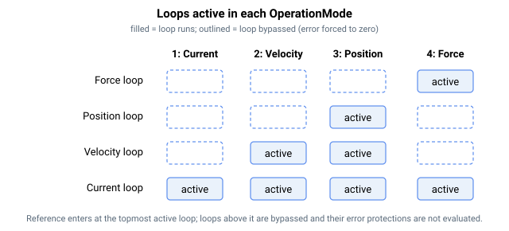

# OperationMode

选择轴的控制模式以及哪些控制环处于激活状态。

## 概述

`OperationMode` 决定轴当前激活的控制模式以及哪些控制环被激活。它可以手动更改（通过直接赋值），也可以自动更改——通过数字量输入（[DInMode](../../../02-keywords/05-inputs-outputs/04-digital-inputs/DInMode.md)）、`GoTo...Mode` 命令，或使用条件检查关键字的内部切换算法。

为实现平滑切换，应优先使用专用命令 [GoToCurrMode](../03-current-operation-mode/GoToCurrMode.md)、[GoToPosMode](../02-position-operation-mode/GoToPosMode.md) 和 [GoToForceMode](../04-force-operation-mode/GoToForceMode.md)，而非直接赋值，因为这些命令会在切换前完成正确的准备工作。

## 工作原理

四个控制环（位置环 → 速度环 → 电流环，加上可选的外层力环）构成一个级联。`OperationMode` 选择实时参考值进入该级联的*深度*——进入点以上的各环通过在每个控制周期将其误差强制为零而被旁路，因此它们既不产生贡献，也不会触发其误差保护。

| OperationMode | 激活的控制环 | 参考源 |
|---|---|---|
| 1 | 仅电流 | **电流控制模式。** 电流参考来自模拟量输入或用户自定义的值/表，由 [CurrCmdSrc](../03-current-operation-mode/CurrCmdSrc.md) 选择。在 Central-i v5 上，还提供一个附加源——主轴的电流参考（从轴驱动器）；参见 [CurrCmdSrc](../03-current-operation-mode/CurrCmdSrc.md) / [CurrRefMaster](../03-current-operation-mode/CurrRefMaster.md)。 |
| 2 | 速度 + 电流 | **速度控制模式。** 速度参考仅来自模拟量速度指令输入。 |
| 3（默认） | 位置 + 速度 + 电流 | **位置控制模式。** 位置参考由运动规划器生成；曲线类型由 [MotionMode](../../10-motion/02-motion-configuration/MotionMode.md) 设置。 |
| 4 | 力 + 电流（标准），或力 + 位置 + 速度 + 电流（force-over-PIV） | **力控制模式。** 力参考来自模拟量输入或用户自定义的值/表，由 [ForceCmdSrc](../04-force-operation-mode/ForceCmdSrc.md) 选择。在 force-over-PIV 中，力环是最外层的环并生成位置参考。 |



### 各控制环如何被门控

控制环在每个周期读取运行模式：

- **位置误差**被强制为零，除非处于位置控制模式（或开启了 force-over-PIV）。因此在电流/速度/力（标准）模式下，位置环不产生速度参考。
- **速度误差**被强制为零，除非处于位置控制、速度控制或 force-over-PIV 模式。速度环积分项仅在这些模式下推进；在其他模式下，积分项保持加载但不使用，因此切换回来时无冲击。
- 在速度控制中，速度参考直接取自模拟量速度指令，覆盖位置环的输出。
- 高位置误差与高速度误差保护（[MaxPosErr](../../06-protections/03-motion/general-maximum-limits/MaxPosErr.md) / [MaxVelErr](../../06-protections/03-motion/general-maximum-limits/MaxVelErr.md)）仅在该误差有意义的模式下运行——在误差被保持为零的场合不进行评估。
- 无论激活的是哪种模式，级联底部产生的电流参考在到达电流环之前都会经过一个共享的输出级：它由电流限制（[CurrLimMode](../../06-protections/02-current-and-voltage/CurrLimMode.md) / [PeakCL](../../06-protections/02-current-and-voltage/PeakCL.md)，饱和时置位 [StatReg](../../07-status-and-faults/StatReg.md) 的 bit 21）进行钳位，然后由 [CurrDir](../../09-current-and-voltage/02-motor-variables/CurrDir.md) 取反。该级仅在电流控制被启用时门控，因此在电流、速度、位置和力模式下的作用完全相同。

### 更改模式

`OperationMode` 为**闪存存储**，且仅在轴**禁用**时可写（`ok_in_motion = false`、`ok_motor_on = false`）。要在运行中的轴上更改模式，请使用专用的平滑命令——[GoToCurrMode](../03-current-operation-mode/GoToCurrMode.md)、[GoToPosMode](../02-position-operation-mode/GoToPosMode.md)、[GoToForceMode](../04-force-operation-mode/GoToForceMode.md)——或通过数字量输入进行模式切换（[DInMode](../../05-inputs-outputs/04-digital-inputs/DInMode.md)）。这些命令会准备各控制环（预加载积分项、捕获当前的力/位置），因此不会产生跳变。在这些切换过程中，控制器内部也会切换运行模式（例如在完成移动时强制使用位置控制）。

## 示例

```text
AOperationMode=3     ; position control mode (default)
AOperationMode=1     ; current control mode
AOperationMode      ; read the active control mode
```

### 边界情况

- **写入时电机使能或运动中**——被拒绝（`NOMOTN`、`NOMTRON`）。请使用 [GoToCurrMode](../03-current-operation-mode/GoToCurrMode.md) / [GoToPosMode](../02-position-operation-mode/GoToPosMode.md) / [GoToForceMode](../04-force-operation-mode/GoToForceMode.md) 在轴运行时切换模式。
- **超出范围**——`1`–`4` 范围之外的值会被参数表拒绝。
- **直接赋值 vs `GoTo*`**——直接赋值会更改标志，但不会预加载控制环状态；除非积分项已匹配，否则各环会发生跳变。直接赋值也不会重置 [CurrCmdIndex](../03-current-operation-mode/CurrCmdIndex.md) / [ForceCmdIndex](../04-force-operation-mode/ForceCmdIndex.md)，因此被暂停的序列在重新进入时会从上一个条目继续。
- **速度 ↔ 位置**——**没有 `GoToVelMode`**。要从速度模式切换到位置模式，必须先禁用电机，写入 `OperationMode = 3`，再重新使能。从速度模式调用 [GoToPosMode](../02-position-operation-mode/GoToPosMode.md) 会被拒绝。
- **速度 → 电流 / 力**——[GoToCurrMode](../03-current-operation-mode/GoToCurrMode.md) 和 [GoToForceMode](../04-force-operation-mode/GoToForceMode.md) **可以**从速度模式切换出来（唯一的例外是 `GoToForceMode` 从电流模式调用会被拒绝，且在多轴/CNC 运动期间任一命令都会被拒绝）。电机关闭时的直接赋值也可行。
- **Force-over-PIV**——当 [ForcePIVOn](../../11-control-tuning/07-force-control/ForcePIVOn.md) = 1 且 `OperationMode = 4` 时，全部四个控制环均处于激活状态（位置 + 速度 + 力 + 电流）。
- **开环优先**——当 [OpenLoopOn](OpenLoopOn.md) ≠ 0 时，无论 `OperationMode` 为何，位置/速度/力环都被旁路；通过设置 `OpenLoopOn = 0` 恢复环路控制。
- **保存**——可保存至闪存；复位后控制器以最后持久化的模式启动。

## 参见

- [GoToCurrMode](../03-current-operation-mode/GoToCurrMode.md) — 平滑进入电流模式
- [GoToPosMode](../02-position-operation-mode/GoToPosMode.md) — 平滑进入位置模式
- [GoToForceMode](../04-force-operation-mode/GoToForceMode.md) — 平滑进入力模式
- [DInMode](../../05-inputs-outputs/04-digital-inputs/DInMode.md) — 通过数字量输入切换模式
- [MotorOn](MotorOn.md) — 直接赋值 `OperationMode` 时必须为关闭
- [OpenLoopOn](OpenLoopOn.md) — 在电流参考下方打开环路，与模式无关
