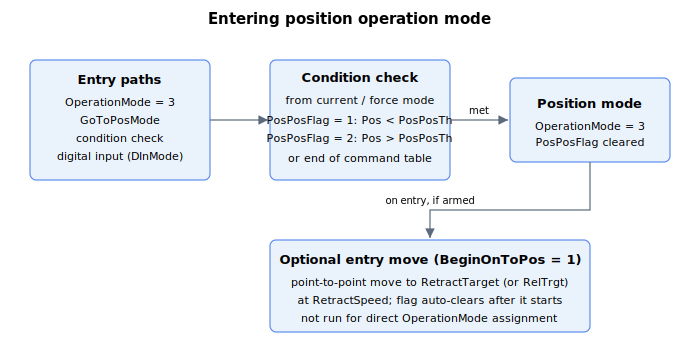

# Position operation mode

This section describes specific keywords for position operation mode.

User can enter position operation mode by

1.  [OperationMode](../../../02-keywords/08-axis-operation/01-general-keywords/OperationMode.md) keyword assignment,

2.  [GoToPosMode](../../../02-keywords/08-axis-operation/02-position-operation-mode/GoToPosMode.md) command,

3.  condition assignment, or

4.  digital input (velocity operation mode to position operation mode, as defined by [DInMode](../../../02-keywords/05-inputs-outputs/04-digital-inputs/DInMode.md))

For **condition assignment**, only feedback position (Pos) threshold is supported for entry from current or force operation mode. The related keywords are PosPosFlag and PosPosTh. Position operation mode is also entered once axis reaches the end of timing table for current or force command.

For more information on transition to and from position operation mode via condition assignment, please refer to

1.  [Current operation mode](../../../02-keywords/08-axis-operation/03-current-operation-mode/00-overview.md)

2.  [Force operation mode](../../../02-keywords/08-axis-operation/04-force-operation-mode/00-overview.md)

Additional point-to-point command upon entry to position mode can be activated by BeginOnToPos, with kinematics defined by RetractSpeed and RetractTarget (or RelTrgt). This feature is not available for direct OperationMode assignment.
