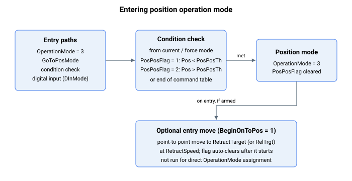

# 位置运行模式

本节描述位置运行模式专用的关键字。

用户可通过以下方式进入位置运行模式：

1.  [OperationMode](../../../02-keywords/08-axis-operation/01-general-keywords/OperationMode.md) 关键字赋值，

2.  [GoToPosMode](../../../02-keywords/08-axis-operation/02-position-operation-mode/GoToPosMode.md) 命令，

3.  条件赋值，或

4.  数字量输入（从速度运行模式切换到位置运行模式，由 [DInMode](../../../02-keywords/05-inputs-outputs/04-digital-inputs/DInMode.md) 定义）

对于**条件赋值**，从电流或力运行模式进入时仅支持反馈位置（Pos）阈值。相关关键字为 PosPosFlag 和 PosPosTh。当轴到达电流或力指令的时序表末尾时，也会进入位置运行模式。

有关通过条件赋值进入和退出位置运行模式的更多信息，请参阅

1.  [电流运行模式](../../../02-keywords/08-axis-operation/03-current-operation-mode/00-overview.md)

2.  [力运行模式](../../../02-keywords/08-axis-operation/04-force-operation-mode/00-overview.md)

进入位置模式时可通过 BeginOnToPos 激活附加的点到点命令，其运动学参数由 RetractSpeed 和 RetractTarget（或 RelTrgt）定义。此功能不适用于直接 OperationMode 赋值。
