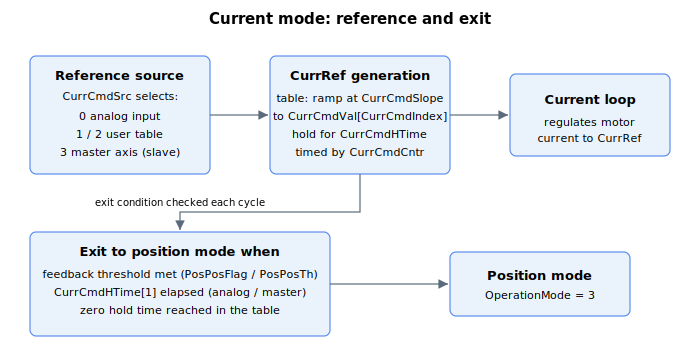

# Current operation mode

This section describes specific keywords for current operation mode.

User can enter current operation mode by

1.  [OperationMode](../../../02-keywords/08-axis-operation/01-general-keywords/OperationMode.md) keyword assignment,

2.  [GoToCurrMode](../../../02-keywords/08-axis-operation/03-current-operation-mode/GoToCurrMode.md) command,

3.  condition assignment, or

4.  digital input (velocity/position operation mode to current operation mode, as defined by [DInMode](../../../02-keywords/05-inputs-outputs/04-digital-inputs/DInMode.md))

The table below shows supported **condition assignment** for automatic current operation mode entry or exit.

| From | To | Conditions |
|---|---|---|
| Position mode (OperationMode = 3) or Velocity mode (OperationMode = 2) | Current mode (OperationMode = 1) | Switching is done if any of the condition A **and** any of the condition B are met. Condition A (Position reference): CurrPosThDir = 0 CurrPosThDir < 0 **and** PosRef < CurrPosTh CurrPosThDir > 0 **and** PosRef > CurrPosTh Condition B (checked only if condition A is fulfilled. Otherwise, axis remains in current operation mode): Condition B1 (Position error): CurrPosErrTh > 0 **and** PosErr > CurrPosErrTh CurrPosErrTh < 0 **and** PosErr < CurrPosErrTh To deactivate: Set CurrPosErrTh = 0 Upon trigger: CurrPosThDir and CurrPosErrTh are cleared. Condition B2 (Analog force feedback input): CurrAInTh > 0 **and** analog force feedback > CurrAInTh CurrAInTh < 0 **and** analog force feedback < CurrAInTh To deactivate: Set CurrAInTh = 0 Upon trigger: CurrPosThDir and CurrAInTh are cleared. Condition B3 (Current reference): CurrCurrTh != 0 **and** CurrCurrThDir = 0 and CurrRef > CurrCurrTh CurrCurrTh != 0 **and** CurrCurrThDir = 1 and CurrRef < CurrCurrTh To deactivate: Set CurrCurrTh = 0 Upon trigger: CurrPosThDir and CurrCurrTh are cleared. **Example:** Axis switches to current mode when both following conditions are satisfied. CurrPosThDir < 0 **and** PosRef < CurrPosTh CurrPosErrTh > 0 **and** PosErr > CurrPosErrTh After that, controller will make CurrPosThDir = 0 and CurrPosErrTh = 0. |
| Current mode (OperationMode = 1) | Position mode (OperationMode = 3) | Switching is done if any of the condition A **or** all of condition B **or** all of condition C is met. Condition A (Position feedback): PosPosFlag = 1 **and** Pos < PosPosTh PosPosFlag = 2 **and** Pos > PosPosTh To deactivate: Set PosPosFlag = 0 Upon trigger: PosPosFlag is cleared. Condition B (End of specified timing): CurrCmdSrc = 0 or 3 CurrCmdHTime[1] >= 0 time elapsed in current mode >= CurrCmdHTime[1] To deactivate: Set CurrCmdHTime[1] < 0 This means if current reference value is based on analog command or other axis’ current command, axis would exit current mode if time elapsed in current mode exceeds CurrCmdHTime[1], or stay forever if CurrCmdHTime[1] is less than 0. Condition C (End of timing table): CurrCmdSrc = 1 or 2 CurrCmdHTime[CurrCmdIndex] = 0 To deactivate: Set CurrCmdHTime[Index] < 0 or CurrCmdHTime[Last_Index] >= 0 This means if user-defined current reference value is used, axis will exit current mode when zero hold time is encountered as CurrCmdIndex increments. This also means if CurrCmdIndex manages to reach the last index value, and corresponding CurrCmdHTime is not 0, axis will hold onto last CurrCmdVal value indefinitely. |

In current operation mode, user can define the source of current reference (CurrRef) from either

1.  Analog input (CurrCmdSrc = 0)

2.  User defined values in a timing table (CurrCmdSrc = 1 or 2)

3.  Current command from other axis (as slave drive) (CurrCmdSrc = 3)

If CurrCmdSrc = 0 or 3, upon current mode entry, the current reference (CurrRef) will follow its respective source for period defined by CurrCmdHTime\[1\].

If CurrCmdSrc = 1 or 2, upon current mode entry, the CurrRef will successively follow each CurrCmdVal element value according to CurrCmdHTime timing table. User can also define individual ramp rate to each CurrCmdVal value through CurrCmdSlope. The timing only starts once CurrRef equals CurrCmdVal. These following examples illustrate its process flow.

**Example 1:** Holding first two CurrCmdVal values for limited time

| Index | CurrCmdHTime \[Index\] | CurrCmdVal \[Index\] |
|-------|------------------------|----------------------|
| 1     | 500                    | 364                  |
| 2     | 1000                   | -500                 |
| 3     | 0                      | 304                  |
| 4     | 600                    | 120                  |

After entry, CurrRef will be 364mA for 500ms, then -500mA for 1000ms before finally exiting the current operation mode. The fourth table value is ignored.

**Example 2:** Holding first two CurrCmdVal values for limited time, holding third CurrCmdVal value forever

| Index | CurrCmdHTime \[Index\] | CurrCmdVal \[Index\] |
|-------|------------------------|----------------------|
| 1     | 500                    | 364                  |
| 2     | 1000                   | -500                 |
| 3     | -1                     | 304                  |
| 4     | 600                    | 120                  |

After entry, CurrRef will be 364mA for 500ms, then -500mA for 1000ms before holding on to 304mA indefinitely. The fourth value is ignored.

**Example 3:** Holding all except last CurrCmdVal values for limited time and holding last CurrCmdVal value forever.

| Index      | CurrCmdHTime \[Index\] | CurrCmdVal \[Index\] |
|------------|------------------------|----------------------|
| 1          | 500                    | 364                  |
| 2          | 1000                   | -500                 |
| 3          | 700                    | 304                  |
| …          | …                      | …                    |
| Last index | 620                    | 120                  |

After entry, CurrRef will be 364mA for 500ms, -500mA for 1000ms and so on, before finally holding onto 120mA indefinitely. As long as last CurrCmdHTime element is non-zero and preceding elements are all more than zero, axis will hold onto the last CurrCmdVal value forever.
