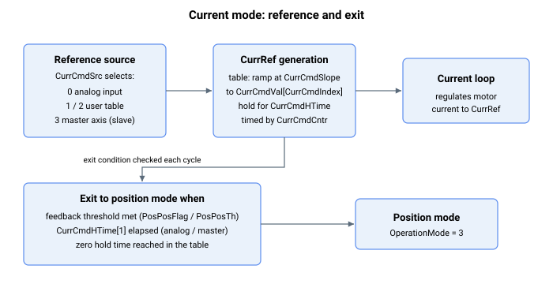

# 电流运行模式

本节介绍电流运行模式专用的关键字。

用户可通过以下方式进入电流运行模式：

1.  [OperationMode](../../../02-keywords/08-axis-operation/01-general-keywords/OperationMode.md) 关键字赋值，

2.  [GoToCurrMode](../../../02-keywords/08-axis-operation/03-current-operation-mode/GoToCurrMode.md) 命令，

3.  条件赋值，或

4.  数字量输入（从速度/位置运行模式切换到电流运行模式，由 [DInMode](../../../02-keywords/05-inputs-outputs/04-digital-inputs/DInMode.md) 定义）

下表列出了用于自动进入或退出电流运行模式的受支持**条件赋值**。

| 自 | 至 | 条件 |
|---|---|---|
| 位置模式 (OperationMode = 3) 或速度模式 (OperationMode = 2) | 电流模式 (OperationMode = 1) | 当满足条件 A 中的任一项**且**满足条件 B 中的任一项时执行切换。条件 A（位置参考）：CurrPosThDir = 0 CurrPosThDir < 0 **且** PosRef < CurrPosTh CurrPosThDir > 0 **且** PosRef > CurrPosTh 条件 B（仅在条件 A 满足时检查。否则，轴保持在电流运行模式）：条件 B1（位置误差）：CurrPosErrTh > 0 **且** PosErr > CurrPosErrTh CurrPosErrTh < 0 **且** PosErr < CurrPosErrTh 取消方法：设置 CurrPosErrTh = 0 触发时：清除 CurrPosThDir 和 CurrPosErrTh。条件 B2（模拟力反馈输入）：CurrAInTh > 0 **且** 模拟力反馈 > CurrAInTh CurrAInTh < 0 **且** 模拟力反馈 < CurrAInTh 取消方法：设置 CurrAInTh = 0 触发时：清除 CurrPosThDir 和 CurrAInTh。条件 B3（电流参考）：CurrCurrTh != 0 **且** CurrCurrThDir = 0 且 CurrRef > CurrCurrTh CurrCurrTh != 0 **且** CurrCurrThDir = 1 且 CurrRef < CurrCurrTh 取消方法：设置 CurrCurrTh = 0 触发时：清除 CurrPosThDir 和 CurrCurrTh。**示例：** 当同时满足以下两个条件时，轴切换至电流模式。CurrPosThDir < 0 **且** PosRef < CurrPosTh CurrPosErrTh > 0 **且** PosErr > CurrPosErrTh 之后，控制器会令 CurrPosThDir = 0 且 CurrPosErrTh = 0。 |
| 电流模式 (OperationMode = 1) | 位置模式 (OperationMode = 3) | 当满足条件 A 中的任一项**或**条件 B 的全部项**或**条件 C 的全部项时执行切换。条件 A（位置反馈）：PosPosFlag = 1 **且** Pos < PosPosTh PosPosFlag = 2 **且** Pos > PosPosTh 取消方法：设置 PosPosFlag = 0 触发时：清除 PosPosFlag。条件 B（指定计时结束）：CurrCmdSrc = 0 或 3 CurrCmdHTime[1] >= 0 在电流模式下经过的时间 >= CurrCmdHTime[1] 取消方法：设置 CurrCmdHTime[1] < 0 这意味着，如果电流参考值基于模拟指令或其他轴的电流指令，则当在电流模式下经过的时间超过 CurrCmdHTime[1] 时，轴会退出电流模式；如果 CurrCmdHTime[1] 小于 0，则一直保持。条件 C（计时表结束）：CurrCmdSrc = 1 或 2 CurrCmdHTime[CurrCmdIndex] = 0 取消方法：设置 CurrCmdHTime[Index] < 0 或 CurrCmdHTime[Last_Index] >= 0 这意味着，如果使用用户自定义的电流参考值，则当 CurrCmdIndex 递增时遇到为零的保持时间，轴会退出电流模式。这也意味着，如果 CurrCmdIndex 成功到达最后一个索引值，且对应的 CurrCmdHTime 不为 0，则轴会无限期保持最后一个 CurrCmdVal 值。 |

在电流运行模式下，用户可将电流参考 (CurrRef) 的来源定义为以下之一：

1.  模拟量输入 (CurrCmdSrc = 0)

2.  计时表中的用户自定义值 (CurrCmdSrc = 1 或 2)

3.  来自其他轴的电流指令（作为从动驱动器）(CurrCmdSrc = 3)

若 CurrCmdSrc = 0 或 3，则进入电流模式时，电流参考 (CurrRef) 将在 CurrCmdHTime\[1\] 所定义的时段内跟随其各自的来源。

若 CurrCmdSrc = 1 或 2，则进入电流模式时，CurrRef 将按照 CurrCmdHTime 计时表依次跟随每个 CurrCmdVal 元素值。用户也可通过 CurrCmdSlope 为每个 CurrCmdVal 值定义各自的斜坡速率。计时仅在 CurrRef 等于 CurrCmdVal 后才开始。以下示例说明了其处理流程。

无论来源为何，所生成的电流参考都不会原封不动地送入电流环。在产生来源值之后，它会经过与每种驱动电流的模式所用相同的最终输出级：

1.  **电流限制** —— 参考值先由 [CurrLimMode](../../06-protections/02-current-and-voltage/CurrLimMode.md) 所选的限值（固定的 [CurrLimFwd](../../06-protections/02-current-and-voltage/CurrLimFwd.md)/[CurrLimRev](../../06-protections/02-current-and-voltage/CurrLimRev.md)，或模拟转矩限制输入）钳位，再由绝对对称限值 ±[PeakCL](../../06-protections/02-current-and-voltage/PeakCL.md)（在 I²t 限制生效时降至有效的连续值）钳位。当指令被钳位时，电流饱和状态（[StatReg](../../07-status-and-faults/StatReg.md) bit 21）被置位。

2.  **方向** —— 受限后的参考值随后由 [CurrDir](../../09-current-and-voltage/02-motor-variables/CurrDir.md) 取反，再到达电流环。

该级由电流控制是否使能（而非运行模式）来门控，因此无论由哪个 CurrCmdSrc 产生，超出当前有效限值的指令值都会被裁剪。

**示例 1：** 在有限时间内保持前两个 CurrCmdVal 值

| Index | CurrCmdHTime \[Index\] | CurrCmdVal \[Index\] |
|-------|------------------------|----------------------|
| 1     | 500                    | 364                  |
| 2     | 1000                   | -500                 |
| 3     | 0                      | 304                  |
| 4     | 600                    | 120                  |

进入后，CurrRef 将为 364mA 持续 500ms，然后为 -500mA 持续 1000ms，最终退出电流运行模式。第四个表值被忽略。

**示例 2：** 在有限时间内保持前两个 CurrCmdVal 值，无限期保持第三个 CurrCmdVal 值

| Index | CurrCmdHTime \[Index\] | CurrCmdVal \[Index\] |
|-------|------------------------|----------------------|
| 1     | 500                    | 364                  |
| 2     | 1000                   | -500                 |
| 3     | -1                     | 304                  |
| 4     | 600                    | 120                  |

进入后，CurrRef 将为 364mA 持续 500ms，然后为 -500mA 持续 1000ms，再无限期保持 304mA。第四个值被忽略。

**示例 3：** 在有限时间内保持除最后一个外的所有 CurrCmdVal 值，并无限期保持最后一个 CurrCmdVal 值。

| Index      | CurrCmdHTime \[Index\] | CurrCmdVal \[Index\] |
|------------|------------------------|----------------------|
| 1          | 500                    | 364                  |
| 2          | 1000                   | -500                 |
| 3          | 700                    | 304                  |
| …          | …                      | …                    |
| Last index | 620                    | 120                  |

进入后，CurrRef 将为 364mA 持续 500ms、-500mA 持续 1000ms，依此类推，最终无限期保持 120mA。只要最后一个 CurrCmdHTime 元素非零且前面各元素均大于零，轴就会永远保持最后一个 CurrCmdVal 值。
