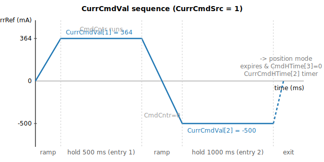

# CurrCmdVal

Sequence of user-defined current references (mA) for current mode.

## Overview

`CurrCmdVal` defines a sequence of user-defined current references, in milliamperes, applied in current operation mode. It is applicable only when [CurrCmdSrc](CurrCmdSrc.md) = 1 or 2, and each value is paired with a holding time from [CurrCmdHTime](CurrCmdHTime.md). The active entry is selected by [CurrCmdIndex](CurrCmdIndex.md), and transitions between entries can be ramped with [CurrCmdSlope](CurrCmdSlope.md).

## How it works

The array holds **20 usable entries, indexed 1 to 20** — the table is 1-indexed, matching the command syntax. Each control cycle the firmware reads the entry pointed to by [CurrCmdIndex](CurrCmdIndex.md):

1. `CurrRef` ramps toward `CurrCmdVal[index]` at the rate set by [CurrCmdSlope](CurrCmdSlope.md)`[index]` (the ramp counter [CurrCmdCntr](CurrCmdCntr.md) is held at 0 while ramping).
2. Once `CurrRef` reaches `CurrCmdVal[index]`, the holding timer [CurrCmdCntr](CurrCmdCntr.md) starts counting up and is compared against [CurrCmdHTime](CurrCmdHTime.md)`[index]` to decide when to advance to the next entry or exit current mode.

Each entry is the target the current reference ramps toward (in mA); positive and negative values correspond to the two current directions. The resulting reference is still subject to the current limits ([CurrLimMode](../../06-protections/02-current-and-voltage/CurrLimMode.md), [PeakCL](../../06-protections/02-current-and-voltage/PeakCL.md)) and the [CurrDir](../../09-current-and-voltage/02-motor-variables/CurrDir.md) polarity inversion before it reaches the current loop; a commanded value above the active limit is clipped and the current-saturation status ([StatReg](../../07-status-and-faults/StatReg.md) bit 21) is set. The range is symmetric: standalone/v4 stores integer milliamperes; central-i v5 stores the value as a 32-bit float (see Changes between versions).

The diagram below shows a two-entry sequence (`CurrCmdVal[1]` = 364 mA held 500 ms, then ramp to `CurrCmdVal[2]` = -500 mA held 1000 ms, with `CurrCmdHTime[3]` = 0 ending the sequence). The holding timer [CurrCmdCntr](CurrCmdCntr.md) only runs during the flat hold segments — it is held at 0 throughout each ramp.



## Examples

```text
ACurrCmdVal[1]=364   ; first current reference (mA)
ACurrCmdVal[2]=-500  ; second current reference (mA)
```

### Edge cases

- **Index 0** — invalid; valid indices are `CurrCmdVal[1]`–`CurrCmdVal[20]`. `CurrCmdVal[0]` does not exist.
- **Wrong mode** ([OperationMode](../01-general-keywords/OperationMode.md) ≠ 1 or [CurrCmdSrc](CurrCmdSrc.md) ∉ {1, 2}) — the table is **not consulted**; writes are stored but the current loop does not use them.
- **Out of range** — values outside the drive's ±full-scale current command (typically ±64000 mA) are rejected by the parameter table.
- **Motor off** — the table is not applied; on motor-on the dispatcher starts from `CurrCmdIndex` (without reset unless `GoToCurrMode` is used).
- **Sequence end via HTime = 0** — the dispatcher exits current mode when it encounters a [CurrCmdHTime](CurrCmdHTime.md) of `0`; the corresponding `CurrCmdVal` is reached but not held.
- **HTime negative** — holds indefinitely at that entry.
- **Reload while running** — writing a new value at the active index while in current mode takes effect on the next ramp/hold cycle; `CurrRef` ramps toward the new value at the current slope.
- **Save** — flash-saveable.
- **Platform** — v5 stores as `float32` (fractional mA); v4 stores as `int32`.

## Changes between versions

central-i v5 stores each `CurrCmdVal` entry as a 32-bit float (standalone/v4: 32-bit integer milliamperes). The table size (20 entries) and indexing are unchanged.

## See also

- [CurrCmdHTime](CurrCmdHTime.md) — holding time paired with each value
- [CurrCmdIndex](CurrCmdIndex.md) — active table entry
- [CurrCmdSlope](CurrCmdSlope.md) — ramp rate between entries
- [CurrCmdSrc](CurrCmdSrc.md) — selects this table as the source
