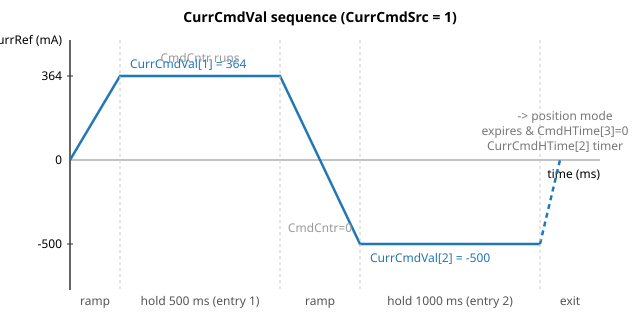

# CurrCmdVal

电流模式下用户定义的电流参考序列（mA）。

## 概述

`CurrCmdVal` 定义一组用户定义的电流参考序列（单位为毫安），在电流运行模式下施加。仅当 [CurrCmdSrc](CurrCmdSrc.md) = 1 或 2 时适用，且每个值都与 [CurrCmdHTime](CurrCmdHTime.md) 中的一个保持时间配对。活动条目由 [CurrCmdIndex](CurrCmdIndex.md) 选择，条目之间的切换可通过 [CurrCmdSlope](CurrCmdSlope.md) 进行斜坡过渡。

## 工作原理

该数组包含 **20 个可用条目，索引从 1 到 20** —— 表为 1 索引，与命令语法一致。每个控制周期，固件读取由 [CurrCmdIndex](CurrCmdIndex.md) 指向的条目：

1. `CurrRef` 以 [CurrCmdSlope](CurrCmdSlope.md)`[index]` 设定的速率向 `CurrCmdVal[index]` 进行斜坡过渡（斜坡过渡期间斜坡计数器 [CurrCmdCntr](CurrCmdCntr.md) 保持为 0）。
2. 一旦 `CurrRef` 到达 `CurrCmdVal[index]`，保持计时器 [CurrCmdCntr](CurrCmdCntr.md) 开始向上计数，并与 [CurrCmdHTime](CurrCmdHTime.md)`[index]` 比较，以决定何时推进到下一条目或退出电流模式。

每个条目是电流参考向其进行斜坡过渡的目标（单位为 mA）；正值和负值对应两个电流方向。所得的参考值在到达电流环之前仍受电流限制（[CurrLimMode](../../06-protections/02-current-and-voltage/CurrLimMode.md)、[PeakCL](../../06-protections/02-current-and-voltage/PeakCL.md)）以及 [CurrDir](../../09-current-and-voltage/02-motor-variables/CurrDir.md) 极性反转的约束；指令值高于活动限值时会被限幅，并设置电流饱和状态（[StatReg](../../07-status-and-faults/StatReg.md) bit 21）。范围是对称的：独立式/v4 存储整数毫安；central-i v5 将该值存储为 32 位浮点数（参见版本间的变化）。

下图显示了一个两条目序列（`CurrCmdVal[1]` = 364 mA 保持 500 ms，然后斜坡过渡至 `CurrCmdVal[2]` = -500 mA 保持 1000 ms，并以 `CurrCmdHTime[3]` = 0 结束该序列）。保持计时器 [CurrCmdCntr](CurrCmdCntr.md) 仅在平坦的保持段期间运行 —— 在每个斜坡过渡段中始终保持为 0。



## 示例

```text
ACurrCmdVal[1]=364   ; first current reference (mA)
ACurrCmdVal[2]=-500  ; second current reference (mA)
```

### 边界情况

- **索引 0** —— 无效；有效索引为 `CurrCmdVal[1]`–`CurrCmdVal[20]`。`CurrCmdVal[0]` 不存在。
- **模式错误**（[OperationMode](../01-general-keywords/OperationMode.md) ≠ 1 或 [CurrCmdSrc](CurrCmdSrc.md) ∉ {1, 2}）—— **不查询**该表；写入会被存储，但电流环不会使用。
- **超出范围** —— 超出驱动器 ±满量程电流指令（通常为 ±64000 mA）的值会被参数表拒绝。
- **入口点** —— [GoToCurrMode](GoToCurrMode.md) 以及自动阈值切换都会将 [CurrCmdIndex](CurrCmdIndex.md) 重置为 1 并将保持计数器重置为 0，因此序列从第一个条目开始。通过数字量输入模式切换进入电流模式则**不会**重置它们，因此调度器从现有的 `CurrCmdIndex` 继续。
- **通过 HTime = 0 结束序列** —— 当活动条目的 [CurrCmdHTime](CurrCmdHTime.md) 为 `0` 时，调度器直接切换回位置模式，不会向该条目的 `CurrCmdVal` 进行斜坡过渡（也不保持）。
- **HTime 为负** —— 在该条目上无限期保持。
- **运行中重新加载** —— 在电流模式下对活动索引写入新值会在下一个斜坡/保持周期生效；`CurrRef` 以当前斜率向新值进行斜坡过渡。
- **保存** —— 可保存至闪存。
- **平台** —— v5 存储为 `float32`（小数毫安）；v4 存储为 `int32`。

## 版本间的变化

central-i v5 将每个 `CurrCmdVal` 条目存储为 32 位浮点数（独立式/v4：32 位整数毫安）。表大小（20 个条目）和索引方式不变。

## 另请参阅

- [CurrCmdHTime](CurrCmdHTime.md) — 与每个值配对的保持时间
- [CurrCmdIndex](CurrCmdIndex.md) — 活动表条目
- [CurrCmdSlope](CurrCmdSlope.md) — 条目之间的斜坡速率
- [CurrCmdSrc](CurrCmdSrc.md) — 将此表选作来源
