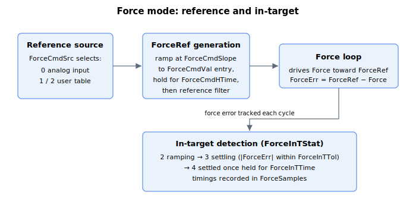

# Force operation mode

This section describes specific keywords for force operation mode.

User can enter force operation mode by

1.  [OperationMode](../../../02-keywords/08-axis-operation/01-general-keywords/OperationMode.md) keyword assignment,

2.  [GoToForceMode](../../../02-keywords/08-axis-operation/04-force-operation-mode/GoToForceMode.md) command,

3.  condition assignment, or

4.  digital input (position operation mode to force operation mode, as defined by [DInMode](../../../02-keywords/05-inputs-outputs/04-digital-inputs/DInMode.md))

The table below shows supported **condition assignment** for automatic force operation mode entry or exit.

| From | To | Conditions |
|---|---|---|
| Position mode (OperationMode = 3) or Velocity mode (OperationMode = 2) | Force mode (OperationMode = 4) | Switching is done if any of the condition A **and** any of the condition B are met. Condition A (Position reference): CurrPosThDir = 0 CurrPosThDir < 0 **and** PosRef < CurrPosTh CurrPosThDir > 0 **and** PosRef > CurrPosTh Condition B (checked only if condition A is fulfilled. Otherwise, axis remains in force operation mode): Condition B1 (Position error): ForcePosErrTh > 0 **and** PosErr > ForcePosErrTh ForcePosErrTh < 0 **and** PosErr < ForcePosErrTh To deactivate: ForcePosErrTh = 0 Upon trigger: ForcePosErrTh is cleared. Condition B2 (Analog force feedback input): ForceAInTh > 0 **and** analog force feedback > ForceAInTh ForceAInTh < 0 **and** analog force feedback < ForceAInTh To deactivate: ForceAInTh = 0 Upon trigger: ForceAInTh is cleared. |
| Force mode (OperationMode = 4) | Position mode (OperationMode = 3) | Switching is done if any of the condition A **or** all of condition B **or** all of condition C is met. Condition A (Position feedback): PosPosFlag = 1 **and** Pos < PosPosTh PosPosFlag = 2 **and** Pos > PosPosTh To deactivate: Set PosPosFlag = 0 Upon trigger: PosPosFlag is cleared. Condition B (End of specified timing): ForceCmdSrc = 0 ForceCmdHTime[1] >= 0 time elapsed in force mode >= ForceCmdHTime[1] To deactivate: Set ForceCmdHTime[1] < 0 This means if force reference value is based on analog command, axis would exit force mode if time elapsed in force mode exceeds ForceCmdHTime[1], or stay forever if ForceCmdHTime[1] is less than 0. Condition C (End of timing table): ForceCmdSrc = 1 or 2 ForceCmdHTime[ForceCmdIndex] = 0 To deactivate: Set ForceCmdHTime[Index] < 0 or ForceCmdHTime[Last_Index] >= 0 This means if user-defined force reference value is used, axis will exit force mode when zero hold time is encountered as ForceCmdIndex increments. This also means if ForceCmdIndex manages to reach the last index value, and corresponding ForceCmdHTime is not 0, axis will hold onto last ForceCmdVal value indefinitely. |

In force operation mode, user can define the source of force reference (ForceRef) from either

1.  Analog input (ForceCmdSrc = 0)

2.  User defined values in a timing table (ForceCmdSrc = 1 or 2)

If ForceCmdSrc = 0, upon force mode entry, the force reference (ForceRef) will follow its respective source for period defined by ForceCmdHTime\[1\].

If ForceCmdSrc = 1 or 2, upon force mode entry, the ForceRef will successively follow each ForceCmdVal element value according to ForceCmdHTime timing table. User can also define individual ramp rate to each ForceCmdVal value through ForceCmdSlope. The timing only starts once ForceRef (before the filter) equals ForceCmdVal.

These following examples illustrate the process flow when ForceCmdSrc = 1 or 2.

**Example 1:** Holding first two ForceCmdVal values for limited time

| Index | ForceCmdHTime \[Index\] | ForceCmdVal \[Index\] |
|-------|-------------------------|-----------------------|
| 1     | 400                     | 340                   |
| 2     | 500                     | -260                  |
| 3     | 0                       | -999                  |
| 4     | 400                     | 100                   |

After entry, ForceRef will be 340 units for 400ms, then -260 units for 500ms before finally exiting the force operation mode. The fourth table value is ignored.

**Example 2:** Holding first two ForceCmdVal values for limited time, holding third ForceCmdVal value forever

| Index | ForceCmdHTime \[Index\] | ForceCmdVal \[Index\] |
|-------|-------------------------|-----------------------|
| 1     | 400                     | 340                   |
| 2     | 500                     | -260                  |
| 3     | -1                      | -999                  |
| 4     | 400                     | 100                   |

After entry, ForceRef will be 340 units for 400ms, then -260 units for 500ms before holding on to -999 units indefinitely. The fourth value is ignored.

**Example 3:** Holding all except last ForceCmdVal values for limited time and holding last ForceCmdVal value forever.

| Index      | ForceCmdHTime \[Index\] | ForceCmdVal \[Index\] |
|------------|-------------------------|-----------------------|
| 1          | 400                     | 340                   |
| 2          | 500                     | -260                  |
| 3          | 700                     | -999                  |
| …          | …                       | …                     |
| Last index | 600                     | 200                   |

After entry, ForceRef will be 340 units for 400ms, then -260 units for 500ms and so on, before finally holding onto 200 units indefinitely. As long as last ForceCmdHTime element is non-zero and preceding elements are all more than zero, axis will hold onto the last ForceCmdVal value forever.

For more information on the control structures, tuning gains and filters of force control, please refer to [Control tuning – Force control](../../../02-keywords/11-control-tuning/07-force-control/00-overview.md) section.

For more information on the force control protection, please refer to [Protections – Force control](../../../02-keywords/06-protections/04-force-control/00-overview.md).
