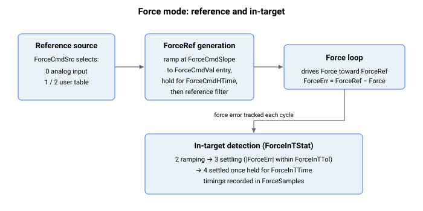

# 力运行模式

本节介绍力运行模式专用的关键字。

用户可通过以下方式进入力运行模式：

1.  [OperationMode](../../../02-keywords/08-axis-operation/01-general-keywords/OperationMode.md) 关键字赋值，

2.  [GoToForceMode](../../../02-keywords/08-axis-operation/04-force-operation-mode/GoToForceMode.md) 命令，

3.  条件赋值，或

4.  数字量输入（由 [DInMode](../../../02-keywords/05-inputs-outputs/04-digital-inputs/DInMode.md) 定义的位置运行模式到力运行模式）

下表展示了用于自动进入或退出力运行模式的受支持**条件赋值**。

| 从 | 到 | 条件 |
|---|---|---|
| 位置模式 (OperationMode = 3) 或 速度模式 (OperationMode = 2) | 力模式 (OperationMode = 4) | 当满足任一条件 A **且**满足任一条件 B 时执行切换。条件 A（位置参考）：CurrPosThDir = 0 CurrPosThDir < 0 **且** PosRef < CurrPosTh CurrPosThDir > 0 **且** PosRef > CurrPosTh 条件 B（仅在满足条件 A 时检查。否则轴保持在力运行模式）：条件 B1（位置误差）：ForcePosErrTh > 0 **且** PosErr > ForcePosErrTh ForcePosErrTh < 0 **且** PosErr < ForcePosErrTh 停用方法：ForcePosErrTh = 0 触发时：ForcePosErrTh 被清除。条件 B2（模拟量力反馈输入）：ForceAInTh > 0 **且**模拟量力反馈 > ForceAInTh ForceAInTh < 0 **且**模拟量力反馈 < ForceAInTh 停用方法：ForceAInTh = 0 触发时：ForceAInTh 被清除。 |
| 力模式 (OperationMode = 4) | 位置模式 (OperationMode = 3) | 当满足任一条件 A **或**全部条件 B **或**全部条件 C 时执行切换。条件 A（位置反馈）：PosPosFlag = 1 **且** Pos < PosPosTh PosPosFlag = 2 **且** Pos > PosPosTh 停用方法：设置 PosPosFlag = 0 触发时：PosPosFlag 被清除。条件 B（指定计时结束）：ForceCmdSrc = 0 ForceCmdHTime[1] >= 0 在力模式中已经过的时间 >= ForceCmdHTime[1] 停用方法：设置 ForceCmdHTime[1] < 0 这意味着如果力参考值基于模拟量指令，则当在力模式中已经过的时间超过 ForceCmdHTime[1] 时轴将退出力模式，或者如果 ForceCmdHTime[1] 小于 0 则永久保持。条件 C（计时表结束）：ForceCmdSrc = 1 或 2 ForceCmdHTime[ForceCmdIndex] = 0 停用方法：设置 ForceCmdHTime[Index] < 0 或 ForceCmdHTime[Last_Index] >= 0 这意味着如果使用用户自定义的力参考值，则当 ForceCmdIndex 递增遇到为零的保持时间时轴将退出力模式。这也意味着如果 ForceCmdIndex 成功到达最后一个索引值，且对应的 ForceCmdHTime 不为 0，则轴将无限期保持最后一个 ForceCmdVal 值。 |

在力运行模式中，用户可将力参考 (ForceRef) 的来源定义为以下任一种：

1.  模拟量输入 (ForceCmdSrc = 0)

2.  计时表中的用户自定义值 (ForceCmdSrc = 1 或 2)

若 ForceCmdSrc = 0，则进入力模式时，力参考 (ForceRef) 将在 ForceCmdHTime\[1\] 所定义的时段内跟随其相应来源。

若 ForceCmdSrc = 1 或 2，则进入力模式时，ForceRef 将根据 ForceCmdHTime 计时表依次跟随每个 ForceCmdVal 元素值。用户还可通过 ForceCmdSlope 为每个 ForceCmdVal 值定义各自的斜坡变化率。计时仅在 ForceRef（滤波前）等于 ForceCmdVal 时才开始。

以下示例说明了 ForceCmdSrc = 1 或 2 时的处理流程。

**示例 1：** 将前两个 ForceCmdVal 值保持有限时长

| Index | ForceCmdHTime \[Index\] | ForceCmdVal \[Index\] |
|-------|-------------------------|-----------------------|
| 1     | 400                     | 340                   |
| 2     | 500                     | -260                  |
| 3     | 0                       | -999                  |
| 4     | 400                     | 100                   |

进入后，ForceRef 将为 340 单位持续 400ms，然后为 -260 单位持续 500ms，最后退出力运行模式。第四个表值被忽略。

**示例 2：** 将前两个 ForceCmdVal 值保持有限时长，将第三个 ForceCmdVal 值永久保持

| Index | ForceCmdHTime \[Index\] | ForceCmdVal \[Index\] |
|-------|-------------------------|-----------------------|
| 1     | 400                     | 340                   |
| 2     | 500                     | -260                  |
| 3     | -1                      | -999                  |
| 4     | 400                     | 100                   |

进入后，ForceRef 将为 340 单位持续 400ms，然后为 -260 单位持续 500ms，最后无限期保持 -999 单位。第四个值被忽略。

**示例 3：** 将除最后一个之外的所有 ForceCmdVal 值保持有限时长，并将最后一个 ForceCmdVal 值永久保持。

| Index      | ForceCmdHTime \[Index\] | ForceCmdVal \[Index\] |
|------------|-------------------------|-----------------------|
| 1          | 400                     | 340                   |
| 2          | 500                     | -260                  |
| 3          | 700                     | -999                  |
| …          | …                       | …                     |
| Last index | 600                     | 200                   |

进入后，ForceRef 将为 340 单位持续 400ms，然后为 -260 单位持续 500ms，依此类推，最后无限期保持 200 单位。只要最后一个 ForceCmdHTime 元素非零且前面的所有元素都大于零，轴就会永久保持最后一个 ForceCmdVal 值。

有关力控制的控制结构、整定增益和滤波器的更多信息，请参见[控制整定 – 力控制](../../../02-keywords/11-control-tuning/07-force-control/00-overview.md)一节。

有关力控制保护的更多信息，请参见[保护 – 力控制](../../../02-keywords/06-protections/04-force-control/00-overview.md)。
