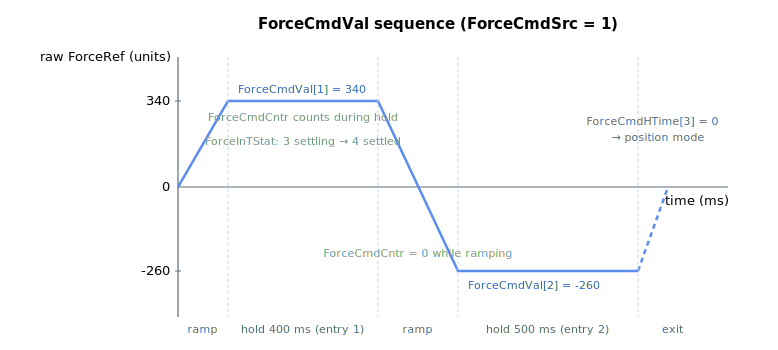

# ForceCmdVal

Sequence of user-defined force references (units) for force mode.

## Overview

`ForceCmdVal` defines a sequence of user-defined force references, in units, applied in force operation mode. It is applicable only when [ForceCmdSrc](ForceCmdSrc.md) = 1 or 2, and each value is paired with a holding time from [ForceCmdHTime](ForceCmdHTime.md). The active entry is selected by [ForceCmdIndex](ForceCmdIndex.md), and the transition into each value is ramped at [ForceCmdSlope](ForceCmdSlope.md).

The array holds **20 usable entries, indexed 1 to 20** — the table is 1-indexed, matching the command syntax.

## How it works

While `ForceCmdSrc = 1` or `2`, each cycle the generator reads the entry at [ForceCmdIndex](ForceCmdIndex.md) and ramps the raw force reference toward `ForceCmdVal[ForceCmdIndex]` at [ForceCmdSlope](ForceCmdSlope.md) units/second. Once the raw reference equals the target value, the holding timer [ForceCmdCntr](ForceCmdCntr.md) begins counting against [ForceCmdHTime](ForceCmdHTime.md). When the hold time elapses, [ForceCmdIndex](ForceCmdIndex.md) advances to the next entry.

The sequence end is governed entirely by [ForceCmdHTime](ForceCmdHTime.md): a `0` hold time exits force mode and returns to position mode at that entry; a negative hold time holds that value indefinitely. If the index reaches the last array element (20) with a positive hold time, the axis holds that last value indefinitely rather than rolling over. See [Force operation mode](00-overview.md) for fully worked sequence examples.

The diagram below shows a two-entry sequence (`ForceCmdVal[1]` = 340 held 400 ms, then ramp to `ForceCmdVal[2]` = -260 held 500 ms, with `ForceCmdHTime[3]` = 0 ending the sequence). [ForceCmdCntr](ForceCmdCntr.md) runs only during the flat hold segments — it is held at 0 throughout each ramp.



## Examples

```text
AForceCmdVal[1]=340  ; first force reference (units)
AForceCmdVal[2]=-260 ; second force reference (units)
```

### Edge cases

- **Index 0** — invalid; valid indices are `ForceCmdVal[1]`–`ForceCmdVal[20]`.
- **Wrong mode** ([OperationMode](../01-general-keywords/OperationMode.md) ≠ 4 or [ForceCmdSrc](ForceCmdSrc.md) ∉ {1, 2}) — the table is **not consulted**.
- **HTime = 0** — the dispatcher exits force mode at the corresponding entry; the value is reached but not held.
- **HTime negative** — holds the value indefinitely.
- **End of table (index 20 with positive HTime)** — the firmware holds the last value indefinitely rather than rolling over.
- **Reload while running** — writing a new value at the active index takes effect on the next ramp/hold cycle; `ForceRef` ramps toward the new value at the current slope.
- **In-target detection** — settling/dwell is evaluated only for the table sources (1/2); see [ForceInTStat](ForceInTStat.md).
- **Save** — flash-saveable.

## See also

- [ForceCmdHTime](ForceCmdHTime.md) — holding time paired with each value
- [ForceCmdIndex](ForceCmdIndex.md) — active table entry
- [ForceCmdSlope](ForceCmdSlope.md) — ramp rate between entries
- [ForceCmdSrc](ForceCmdSrc.md) — selects this table as the source
