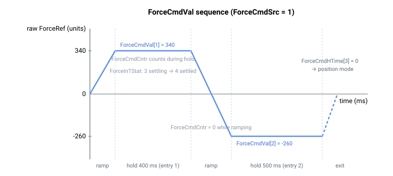

# ForceCmdVal

用于力模式的用户自定义力参考序列（单位）。

## 概述

`ForceCmdVal` 定义在力运行模式下施加的一系列用户自定义力参考（以单位表示）。仅当 [ForceCmdSrc](ForceCmdSrc.md) = 1 或 2 时适用，每个值与来自 [ForceCmdHTime](ForceCmdHTime.md) 的保持时间配对。活动项由 [ForceCmdIndex](ForceCmdIndex.md) 选择，向每个值的过渡以 [ForceCmdSlope](ForceCmdSlope.md) 进行斜坡变化。

该数组保存 **20 个可用项，索引为 1 到 20**——该表为 1 索引，与命令语法一致。

## 工作原理

当 `ForceCmdSrc = 1` 或 `2` 时，每个周期生成器读取 [ForceCmdIndex](ForceCmdIndex.md) 处的项，并以 [ForceCmdSlope](ForceCmdSlope.md) 单位/秒的速率将原始力参考向 `ForceCmdVal[ForceCmdIndex]` 斜坡变化。一旦原始参考等于目标值，保持计时器 [ForceCmdCntr](ForceCmdCntr.md) 开始按 [ForceCmdHTime](ForceCmdHTime.md) 计数。当保持时间结束时，[ForceCmdIndex](ForceCmdIndex.md) 前进到下一项。

序列的结束完全由 [ForceCmdHTime](ForceCmdHTime.md) 控制：保持时间为 `0` 会在该项退出力模式并返回位置模式；保持时间为负则无限期保持该值。如果索引以正保持时间到达最后一个数组元素（20），轴将无限期保持该最后值而不会循环回绕。完整的序列示例参见[力运行模式](00-overview.md)。

下图展示了一个两项序列（`ForceCmdVal[1]` = 340 保持 400 ms，随后斜坡变化至 `ForceCmdVal[2]` = -260 保持 500 ms，并以 `ForceCmdHTime[3]` = 0 结束序列）。[ForceCmdCntr](ForceCmdCntr.md) 仅在平直的保持段期间运行——在每个斜坡段中均保持为 0。



## 示例

```text
AForceCmdVal[1]=340  ; first force reference (units)
AForceCmdVal[2]=-260 ; second force reference (units)
```

### 边界情况

- **索引 0**——无效；有效索引为 `ForceCmdVal[1]`–`ForceCmdVal[20]`。
- **模式错误**（[OperationMode](../01-general-keywords/OperationMode.md) ≠ 4 或 [ForceCmdSrc](ForceCmdSrc.md) ∉ {1, 2}）——**不会读取**该表。
- **HTime = 0**——调度器在对应项退出力模式；该值会被到达但不保持。
- **HTime 为负**——无限期保持该值。
- **表尾（索引 20 且 HTime 为正）**——固件将无限期保持最后值而不会循环回绕。
- **运行时重新加载**——在活动索引处写入新值会在下一个斜坡/保持周期生效；`ForceRef` 以当前斜率向新值斜坡变化。
- **到位检测**——仅对表来源（1/2）评估稳定/驻留；参见 [ForceInTStat](ForceInTStat.md)。
- **保存**——可保存至闪存。

## 另请参阅

- [ForceCmdHTime](ForceCmdHTime.md) —— 与每个值配对的保持时间
- [ForceCmdIndex](ForceCmdIndex.md) —— 活动表项
- [ForceCmdSlope](ForceCmdSlope.md) —— 各项之间的斜坡速率
- [ForceCmdSrc](ForceCmdSrc.md) —— 将本表选为来源
