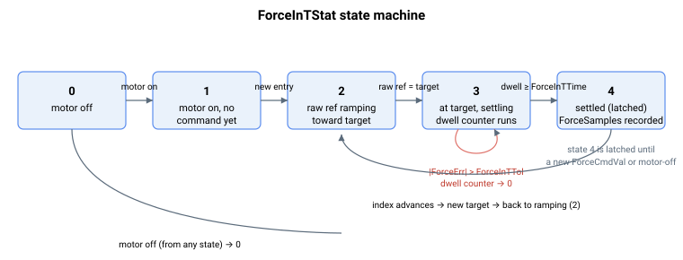

# ForceInTStat

In-target status of force control for the user-defined reference table.

## Overview

`ForceInTStat` reports the in-target (force-settled) status of force control when a user-defined force reference array is used. It is the force-mode counterpart of the position/velocity [InTargetStat](../../10-motion/05-motion-status/InTargetStat.md), and it uses the same status values. It is applicable in Force Operation Mode ([OperationMode](../01-general-keywords/OperationMode.md) = 4) when [ForceCmdSrc](ForceCmdSrc.md) = 1 or 2, and in Current Operation Mode ([OperationMode](../01-general-keywords/OperationMode.md) = 1) when [CurrCmdSrc](../03-current-operation-mode/CurrCmdSrc.md) = 1 or 2. It tracks progress from motor enable through ramping to settling within [ForceInTTol](ForceInTTol.md) for at least [ForceInTTime](ForceInTTime.md). EtherCAT Profile Torque (with 0x2C00 CSTForceLoopEnable = 0 and [FIFOPosType](../../10-motion/11-motion-mode-fifo/FIFOPosType.md) = 0 (linear)) runs in Current Operation Mode with CurrCmdSrc = 1, and sets statusword bit 10 (target reached) while ForceInTStat = 4 and clears it otherwise.

In Current Operation Mode the same state machine runs on the current command: the target is [CurrCmdVal](../03-current-operation-mode/CurrCmdVal.md), the ramp is [CurrCmdSlope](../03-current-operation-mode/CurrCmdSlope.md), and ForceInTTol is compared in mA against `CurrRef − MotorCurr` (MotorCurr of the previous control cycle); the value you read or write is scaled by [UsrUnits](../../03-encoder/01-general-settings/UsrUnits-AuxUsrUnits.md), as for other keywords given in user units. It runs for both an infinite hold ([CurrCmdHTime](../03-current-operation-mode/CurrCmdHTime.md) < 0) and a timed hold (CurrCmdHTime > 0). [ForceSamples](ForceSamples.md) is written when state 4 is reached in Current Operation Mode as well, but its values are not meaningful there: [CurrCmdCntr](../03-current-operation-mode/CurrCmdCntr.md) does not count during an infinite hold, and the sample counter carries over from earlier commands.

## How it works

| ForceInTStat | Descriptions |
|----|----|
| 0 | Motor is disabled. Set when the axis turns off. |
| 1 | Motor is enabled, no force command settling yet. Set on motor-on. |
| 2 | Raw force reference is ramping toward the target value ([ForceCmdVal](ForceCmdVal.md)) at [ForceCmdSlope](ForceCmdSlope.md). |
| 3 | Raw reference has reached the target value; the force feedback is settling within the [ForceInTTol](ForceInTTol.md) window around the target and the [ForceInTTime](ForceInTTime.md) dwell is pending. |
| 4 | Force feedback has stayed within `ForceInTTol` of the target for at least `ForceInTTime`. |

The state machine advances inside the force-command generator:

- **2 → 3:** the moment the raw reference equals the target [ForceCmdVal](ForceCmdVal.md), the controller leaves the ramping state, switches to state 3, and clears the dwell counter.
- **within 3:** each cycle, if `|ForceErr| <= ForceInTTol` (in Current Operation Mode, `|CurrRef − MotorCurr| <= ForceInTTol`) the dwell counter increments; if the error leaves the window the counter is re-zeroed. This means state 3 covers both "settling" and "settled but waiting for the dwell".
- **3 → 4:** once the dwell counter reaches [ForceInTTime](ForceInTTime.md), the status latches to 4 and the [ForceSamples](ForceSamples.md) timings are recorded.

Once state 4 is reached the settling condition is **no longer checked** for that entry, so it is effectively latched until the force command changes (the raw reference ramps to a new [ForceCmdVal](ForceCmdVal.md), returning to state 2) or the motor is disabled (state 0). This mirrors the sticky behavior of [InTargetStat](../../10-motion/05-motion-status/InTargetStat.md) = 4 in position control.



> **Note:** `ForceInTStat` reflects the table source only. With the analog source ([ForceCmdSrc](ForceCmdSrc.md) = 0, or [CurrCmdSrc](../03-current-operation-mode/CurrCmdSrc.md) = 0 in Current Operation Mode) there is no defined target to settle on, so the in-target detection is not run. The same holds for CurrCmdSrc = 3 (follow a master axis) and 4 (EtherCAT master, set by EtherCAT Cyclic Synchronous Torque).

## Examples

```text
AForceInTStat       ; 4 = settled in target, 2 = still ramping
```

### Edge cases

- **Motor off** — latched to `0`. Going motor-on re-arms to `1`.
- **Wrong mode** ([OperationMode](../01-general-keywords/OperationMode.md) other than 1 or 4) — neither command engine runs; `ForceInTStat` is not updated and holds its last value until the next entry into force or current mode.
- **`ForceCmdSrc` = 0 (analog source)** — there is no defined target to settle on, so the state machine does not run; `ForceInTStat` stays at the motor-on state (`1`).
- **State 4 is sticky** — once `4` is reached, leaving the tolerance window does **not** drop the state. Only a new ramp (state `2`) or motor-off (state `0`) clears it.
- **Tolerance change at runtime** — increasing [ForceInTTol](ForceInTTol.md) does not retroactively enter state `3` if the force happened to be within the new window earlier; the state machine looks forward only.
- **`ForceInTTime` = 0** — state `3` advances to `4` on the first in-window cycle (dwell of zero).
- **Read-only** — writes are rejected.

## See also

- [ForceInTTol](ForceInTTol.md) — settling window
- [ForceInTTime](ForceInTTime.md) — required dwell time within the window
- [ForceSamples](ForceSamples.md) — measured move/settle timings (recorded when state reaches 4; not meaningful in Current Operation Mode)
- [InTargetStat](../../10-motion/05-motion-status/InTargetStat.md) — position/velocity/current in-target status (same state values)
