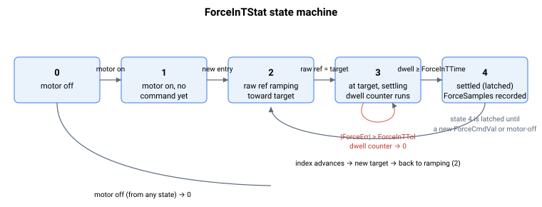

# ForceInTStat

用户自定义参考表的力控制到位状态。

## 概述

`ForceInTStat` 在使用用户自定义力参考数组时报告力控制的到位（力稳定到位）状态。它是位置/速度 [InTargetStat](../../10-motion/05-motion-status/InTargetStat.md) 在力模式下的对应项，并使用相同的状态值。仅当 [ForceCmdSrc](ForceCmdSrc.md) = 1 或 2 时适用，它跟踪从电机使能、斜坡变化直至在 [ForceInTTol](ForceInTTol.md) 范围内稳定到位至少 [ForceInTTime](ForceInTTime.md) 的进程。

## 工作原理

| ForceInTStat | 说明 |
|----|----|
| 0 | 电机已禁用。在轴关闭时设置。 |
| 1 | 电机已使能，尚无力指令稳定到位。在电机使能时设置。 |
| 2 | 原始力参考正以 [ForceCmdSlope](ForceCmdSlope.md) 向目标值（[ForceCmdVal](ForceCmdVal.md)）斜坡变化。 |
| 3 | 原始参考已到达目标值；力反馈正在目标值周围的 [ForceInTTol](ForceInTTol.md) 窗口内稳定，[ForceInTTime](ForceInTTime.md) 驻留尚未完成。 |
| 4 | 力反馈已在目标值的 `ForceInTTol` 范围内保持至少 `ForceInTTime`。 |

状态机在力指令生成器内部推进：

- **2 → 3：** 原始参考等于目标 [ForceCmdVal](ForceCmdVal.md) 的那一刻，控制器离开斜坡变化状态，切换到状态 3，并清零驻留计数器。
- **3 内部：** 每个周期，若 `|ForceErr| <= ForceInTTol` 则驻留计数器递增；若 `ForceErr` 离开窗口则计数器重新清零。这意味着状态 3 同时涵盖“正在稳定”和“已稳定但等待驻留”。
- **3 → 4：** 一旦驻留计数器达到 [ForceInTTime](ForceInTTime.md)，状态锁存为 4，并记录 [ForceSamples](ForceSamples.md) 时间。

一旦达到状态 4，该项的稳定到位条件**不再被检查**，因此它实际上被锁存，直到力指令改变（原始参考斜坡变化至新的 [ForceCmdVal](ForceCmdVal.md)，返回状态 2）或电机被禁用（状态 0）。这与位置控制中 [InTargetStat](../../10-motion/05-motion-status/InTargetStat.md) = 4 的粘滞行为一致。



> **注意：** `ForceInTStat` 仅反映表来源。使用模拟量来源（[ForceCmdSrc](ForceCmdSrc.md) = 0）时没有定义的稳定目标，因此不运行到位检测。

## 示例

```text
AForceInTStat       ; 4 = settled in target, 2 = still ramping
```

### 边界情况

- **电机失能**——锁存为 `0`。电机使能后重新置位为 `1`。
- **模式错误**（[OperationMode](../01-general-keywords/OperationMode.md) ≠ 4）——力指令引擎不运行；`ForceInTStat` 不更新，并保持其最后值，直到下一次进入力模式。
- **`ForceCmdSrc` = 0（模拟量来源）**——没有定义的稳定目标，因此状态机不运行；`ForceInTStat` 保持在电机使能状态（`1`）。
- **状态 4 具有粘滞性**——一旦达到 `4`，离开容差窗口**不会**使状态下降。只有新的斜坡变化（状态 `2`）或电机失能（状态 `0`）才会清除它。
- **运行时更改容差**——增大 [ForceInTTol](ForceInTTol.md) 不会因力此前恰好处于新窗口内而追溯进入状态 `3`；状态机只向前看。
- **`ForceInTTime` = 0**——状态 `3` 在第一个处于窗口内的周期推进到 `4`（驻留为零）。
- **只读**——写入被拒绝。

## 另请参阅

- [ForceInTTol](ForceInTTol.md) —— 稳定到位窗口
- [ForceInTTime](ForceInTTime.md) —— 窗口内所需的驻留时间
- [ForceSamples](ForceSamples.md) —— 测得的移动/稳定时间（状态达到 4 时记录）
- [InTargetStat](../../10-motion/05-motion-status/InTargetStat.md) —— 位置/速度/电流到位状态（相同的状态值）
