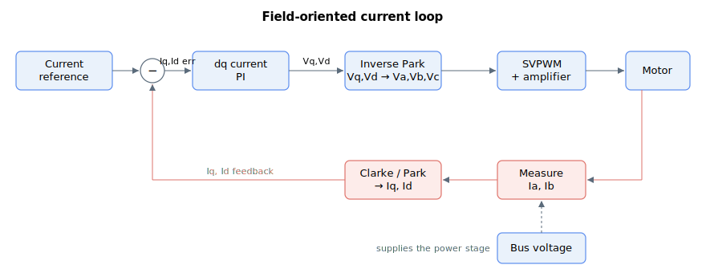

# Current and voltage

This section describes the keywords that set, command and report the electrical state of the drive: the phase currents and voltages of the motor, the dq0-domain current-control variables, the DC bus and logic supply measurements, current compensation and injection, motor resistance/inductance measurement, and regeneration (braking-resistor) control.

Most of these keywords sit somewhere in the field-oriented current loop: a current reference is regulated by the dq current PI, transformed back to phase voltages and switched onto the motor, while the measured phase currents are transformed into the dq feedback that closes the loop. The DC bus supplies the power stage behind it all.

It is grouped into the following subgroups:

- [System variables](01-system-variables/00-overview.md) — bus and logic supply voltage readings.
- [Motor variables](02-motor-variables/00-overview.md) — phase/dq0 currents, references, errors and voltage commands.
- [Current compensation](03-current-compensation/00-overview.md) — loop and motor current offsets and torque compensation.
- [Motor measurement](04-motor-measurement/00-overview.md) — measured motor resistance and inductance.
- [Regeneration](05-regeneration/00-overview.md) — braking-resistor thresholds and monitoring.

These keywords are closely related to the current control loop (see [Control tuning – Current control](../11-control-tuning/06-current-control/00-overview.md)) and to bus-voltage protection (see [Protections – Current and voltage](../06-protections/02-current-and-voltage/00-overview.md)).
