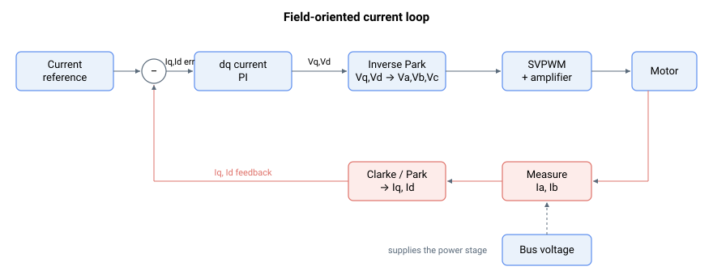

# 电流与电压

本节描述用于设置、命令并报告驱动器电气状态的关键字：电机的相电流与相电压、dq0 域的电流控制变量、直流母线与逻辑电源测量值、电流补偿与注入、电机电阻/电感测量，以及再生（制动电阻）控制。

这些关键字大多位于磁场定向电流环中的某处：电流参考由 dq 电流 PI 调节器进行调节，经逆变换回相电压并切换施加到电机上，而测得的相电流则变换为闭合该环路的 dq 反馈。直流母线为其背后的功率级供电。

它分为以下子组：

- [系统变量](01-system-variables/00-overview.md) —— 母线和逻辑电源电压读数。
- [电机变量](02-motor-variables/00-overview.md) —— 相/dq0 电流、参考、误差和电压指令。
- [电流补偿](03-current-compensation/00-overview.md) —— 控制环和电机电流偏置以及转矩补偿。
- [电机测量](04-motor-measurement/00-overview.md) —— 测得的电机电阻与电感。
- [再生](05-regeneration/00-overview.md) —— 制动电阻阈值与监控。

这些关键字与电流控制环密切相关（参见[控制整定 – 电流控制](../11-control-tuning/06-current-control/00-overview.md)），也与母线电压保护密切相关（参见[保护 – 电流与电压](../06-protections/02-current-and-voltage/00-overview.md)）。
