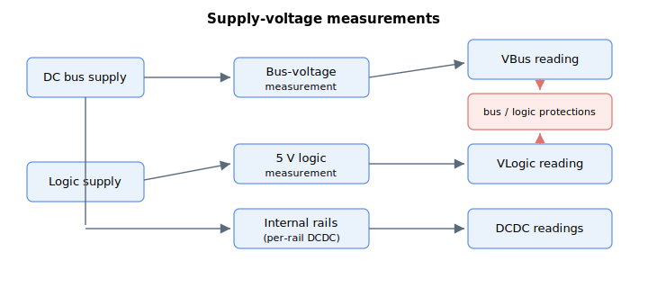

# System variables

This subgroup contains the read-only supply-voltage measurements reported by the drive: the amplifier DC bus voltage, the internal logic-supply rails, and (for linear-amplifier products) the linear-amplifier bus voltage. These readings feed the bus- and logic-voltage protections.

- [VBus](VBus.md) — amplifier DC bus voltage.
- [VLogic](VLogic.md) — 5 V logic-supply voltage.
- [DCDC](DCDC.md) — internal logic-rail measurements.
- [LAmpVBus](LAmpVBus.md) — linear-amplifier bus voltage.
