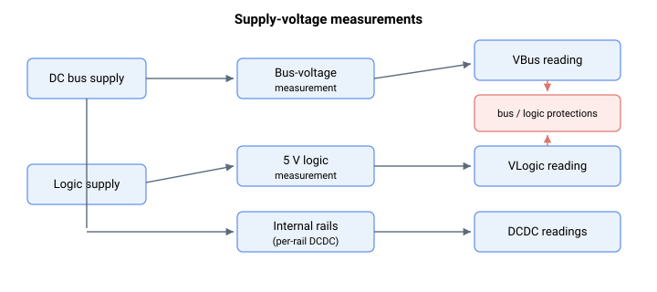

# 系统变量

本子组包含驱动器报告的只读电源电压测量值：驱动器直流母线电压、内部逻辑电源轨，以及（对于线性放大器产品）线性放大器母线电压。这些读数供给母线电压和逻辑电压保护使用。

- [VBus](VBus.md) —— 驱动器直流母线电压。
- [VLogic](VLogic.md) —— 5 V 逻辑电源电压。
- [DCDC](DCDC.md) —— 内部逻辑电源轨测量值。
- [LAmpVBus](LAmpVBus.md) —— 线性放大器母线电压。
