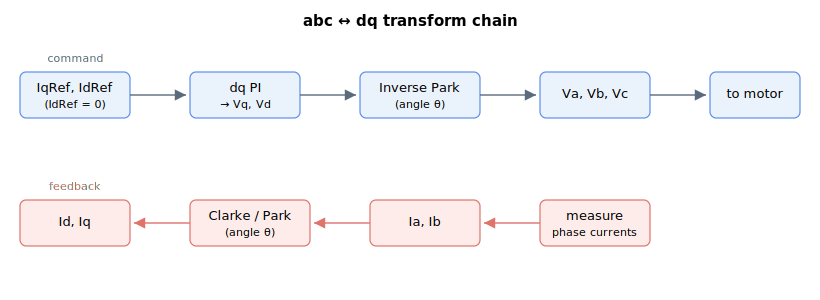

# Motor variables

This subgroup describes the settings, commands and readings related to the motor's currents and voltages. It is closely related to current control (see [Control tuning – Current control](../../11-control-tuning/06-current-control/00-overview.md)).

For a three-phase motor the keywords here live on the two sides of the abc/dq transform: the dq references IqRef/IdRef become the voltage outputs Vq/Vd and then the phase voltages Va/Vb/Vc, while the measured phase currents Ia/Ib are transformed into the dq feedback Iq/Id.

It contains:

- **Configuration** — [ControlMode](ControlMode.md) (vector/phase control and protection options) and [CurrDir](CurrDir.md) (excitation direction).
- **Current references** — [CurrRef](CurrRef.md), [CurrRefCtrl](CurrRefCtrl.md), and the per-phase/dq references [IaRef](IaRef.md), [IbRef](IbRef.md), [IqRef](IqRef.md), [IdRef](IdRef.md).
- **Measured currents** — [Ia](Ia.md), [Ib](Ib.md), [Iq](Iq.md), [Id](Id.md), [MotorCurr](MotorCurr.md).
- **Current errors** — [IaErr](IaErr.md), [IbErr](IbErr.md), [IqErr](IqErr.md), [IdErr](IdErr.md).
- **Voltage commands** — [Va](Va.md), [Vb](Vb.md), [Vc](Vc.md), [Vd](Vd.md), [Vq](Vq.md).
