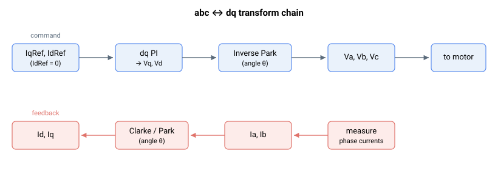

# 电机变量

本子组介绍与电机电流和电压相关的设置、指令和读数。它与电流控制密切相关（参见[控制整定 – 电流控制](../../11-control-tuning/06-current-control/00-overview.md)）。

对于三相电机，此处的关键字位于 abc/dq 变换的两侧：dq 参考值 IqRef/IdRef 成为电压输出 Vq/Vd，进而成为相电压 Va/Vb/Vc；而测量得到的相电流 Ia/Ib 被变换为 dq 反馈 Iq/Id。

它包含：

- **配置** — [ControlMode](ControlMode.md)（矢量/相控制及保护选项）和 [CurrDir](CurrDir.md)（励磁方向）。
- **电流参考** — [CurrRef](CurrRef.md)、[CurrRefCtrl](CurrRefCtrl.md)，以及各相/dq 参考 [IaRef](IaRef.md)、[IbRef](IbRef.md)、[IqRef](IqRef.md)、[IdRef](IdRef.md)。
- **测量电流** — [Ia](Ia.md)、[Ib](Ib.md)、[Iq](Iq.md)、[Id](Id.md)、[MotorCurr](MotorCurr.md)。
- **电流误差** — [IaErr](IaErr.md)、[IbErr](IbErr.md)、[IqErr](IqErr.md)、[IdErr](IdErr.md)。
- **电压指令** — [Va](Va.md)、[Vb](Vb.md)、[Vc](Vc.md)、[Vd](Vd.md)、[Vq](Vq.md)。
