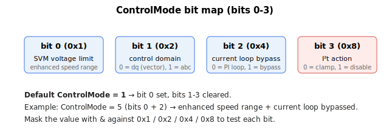

# ControlMode

Bit-packed selection of current/voltage control options (SVM limit, vector vs phase, loop bypass, I2T action).

## Overview

`ControlMode` selects the current- and voltage-control options through individual bit assignments. It determines whether current control runs in the dq0 domain (vector control) or the abc domain (phase control), how much of the bus voltage the space-vector modulator may use, whether the current loop is bypassed, and what action the I2T protection takes when triggered. It works together with [MotorType](../../02-motor-and-amplifier/MotorType.md) and the current-control tuning (see [Control tuning – Current control](../../11-control-tuning/06-current-control/00-overview.md)). The dq0 outputs [Vd](Vd.md)/[Vq](Vq.md) versus abc outputs [Va](Va.md)/[Vb](Vb.md)/[Vc](Vc.md) depend on the bit 1 setting.

> This keyword is marked `partial`: only bits 0–3 are defined, the valid range is 0–15, and behavior may change. The firmware power-on default is bit 0 set (`ControlMode` = 1, enhanced speed range active).

## How it works

The bits are 0-based. The value is treated as a bit-mask; the default is `0x1` (bit 0 set, all others reset).

| Bit | Mask | Function |
|---|---|---|
| 0 | 0x1 | **Space-vector modulation limit (enhanced speed range).** Default **set (1)**. When set, the allowed voltage-vector limit is enlarged by a factor of $(2/\sqrt3)^2$ on the squared limit (and a third-harmonic / mid-point offset is injected into the phase voltages), letting the line-to-line voltage reach up to ≈0.866·VBus instead of ≈0.75·VBus. When reset (0), the smaller limit applies. |
| 1 | 0x2 | **Vector control.** Default 0. If reset (0), current control of a brushless motor runs in the dq0 domain (vector control on [Iq](Iq.md)/[Id](Id.md), producing [Vq](Vq.md)/[Vd](Vd.md)). If set (1), control runs in the abc domain (phase control directly on [Ia](Ia.md)/[Ib](Ib.md), producing [Va](Va.md)/[Vb](Vb.md)). |
| 2 | 0x4 | **Current control loop bypass.** Default 0. If reset (0), the current PI loop is used. If set (1), the loop is bypassed and the phase voltage references for SVM are taken directly from the phase current references — that is, [Va](Va.md) = [IaRef](IaRef.md) and [Vb](Vb.md) = [IbRef](IbRef.md). |
| 3 | 0x8 | **Action taken for I2T protection.** Default 0. If reset (0), triggering motor I²T protection clamps the current reference at [ContCL](../../06-protections/02-current-and-voltage/ContCL.md) until the filtered I² value falls below (ContCL)². If set (1), triggering I²T protection disables the motor, reports an error code and records it to ErrLog. If the current control loop is bypassed (bit 2 set), triggering I²T protection always disables the motor regardless of this bit. |

Note that bits 1 and 2 only apply where a current loop runs in the controller — see [AmpType](../../02-motor-and-amplifier/AmpType.md). For an external current-command amplifier the current loop runs in the drive, not in the controller, so the current limits are still applied to the reference but these domain/bypass bits do not select the loop.



## Examples

```text
AControlMode=1       ; bit 0 set (default): enhanced speed range, vector control, loop active
AControlMode=3       ; bits 0+1 set: enhanced speed range + abc-domain (phase) current control
AControlMode=5       ; bits 0+2 set: enhanced speed range + current loop bypassed
AControlMode        ; read the current configuration
```

## See also

- [MotorType](../../02-motor-and-amplifier/MotorType.md) — motor type that determines applicable control domains
- [AmpType](../../02-motor-and-amplifier/AmpType.md) — amplifier type; determines whether the current loop runs in the controller
- [ContCL](../../06-protections/02-current-and-voltage/ContCL.md) — continuous current limit used by I2T protection
- [Vd](Vd.md), [Vq](Vq.md) — dq0 voltage outputs (vector control)
- [Va](Va.md), [Vb](Vb.md), [Vc](Vc.md) — phase voltage commands
- [StatReg](../../07-status-and-faults/StatReg.md) — reports current- and voltage-saturation status set by the loop
