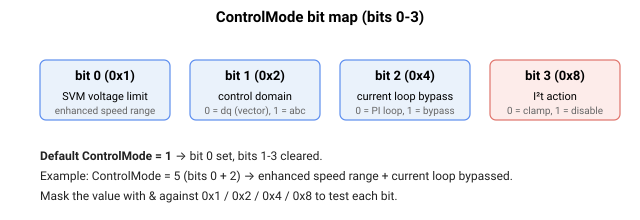

# ControlMode

以位打包方式选择电流/电压控制选项（SVM 限值、矢量 vs 相控制、环路旁路、I2T 动作）。

## 概述

`ControlMode` 通过各个位的赋值来选择电流控制和电压控制选项。它决定电流控制是在 dq0 域中运行（矢量控制）还是在 abc 域中运行（相控制）、空间矢量调制器可使用多少母线电压、是否旁路电流环，以及 I2T 保护触发时所采取的动作。它与 [MotorType](../../02-motor-and-amplifier/MotorType.md) 及电流控制整定协同工作（参见[控制整定 – 电流控制](../../11-control-tuning/06-current-control/00-overview.md)）。dq0 输出 [Vd](Vd.md)/[Vq](Vq.md) 与 abc 输出 [Va](Va.md)/[Vb](Vb.md)/[Vc](Vc.md) 取决于 bit 1 的设置。

> 此关键字标记为 `partial`：仅定义了 bit 0–3，有效范围为 0–15，行为可能会变化。固件上电默认值为置位 bit 0（`ControlMode` = 1，增强速度范围生效）。

## 工作原理

各位从 0 开始计数。该值被当作位掩码处理；默认值为 `0x1`（bit 0 置位，其余全部复位）。

| Bit | Mask | 功能 |
|---|---|---|
| 0 | 0x1 | **空间矢量调制限值（增强速度范围）。** 默认**置位 (1)**。置位时，所允许的电压矢量限值在平方限值上被放大 $\left(\frac{2}{\sqrt3}\right)^2$ 倍（并向相电压中注入三次谐波/中点偏置），使线间电压可达约 0.866·$\text{VBus}$，而非约 0.75·$\text{VBus}$。复位 (0) 时，采用较小的限值。 |
| 1 | 0x2 | **矢量控制。** 默认 0。若复位 (0)，无刷电机的电流控制在 dq0 域中运行（对 [Iq](Iq.md)/[Id](Id.md) 进行矢量控制，产生 [Vq](Vq.md)/[Vd](Vd.md)）。若置位 (1)，控制在 abc 域中运行（直接对 [Ia](Ia.md)/[Ib](Ib.md) 进行相控制，产生 [Va](Va.md)/[Vb](Vb.md)）。 |
| 2 | 0x4 | **电流控制环旁路。** 默认 0。若复位 (0)，使用电流 PI 环。若置位 (1)，旁路该环，用于 SVM 的相电压参考直接取自相电流参考——即 [Va](Va.md) = [IaRef](IaRef.md) 且 [Vb](Vb.md) = [IbRef](IbRef.md)。 |
| 3 | 0x8 | **I2T 保护所采取的动作。** 默认 0。若复位 (0)，触发电机 I²T 保护时将电流参考钳位在 [ContCL](../../06-protections/02-current-and-voltage/ContCL.md)；当滤波后的 I² 值升高到 (ContCL)² 以上时钳位接入，当其回落到 (ContCL)² 的 90 % 以下时释放（带迟滞）。若置位 (1)，触发 I²T 保护时将禁用电机、报告错误码（故障 1044，电机电流超过 I²t）并将其记录到 [ErrLog](../../07-status-and-faults/ErrLog.md)。若电流控制环被旁路（bit 2 置位），则触发 I²T 保护时始终禁用电机，无论此位如何设置。 |

请注意，bit 1 和 bit 2 仅在控制器中运行电流环的情况下适用——参见 [AmpType](../../02-motor-and-amplifier/AmpType.md)。对于外部电流指令型驱动器，电流环运行在驱动器中而非控制器中，因此电流限值仍施加于参考值，但这些域/旁路位并不选择该环。



## 示例

```text
AControlMode=1       ; bit 0 set (default): enhanced speed range, vector control, loop active
AControlMode=3       ; bits 0+1 set: enhanced speed range + abc-domain (phase) current control
AControlMode=5       ; bits 0+2 set: enhanced speed range + current loop bypassed
AControlMode        ; read the current configuration
```

## 另请参阅

- [MotorType](../../02-motor-and-amplifier/MotorType.md) — 决定适用控制域的电机类型
- [AmpType](../../02-motor-and-amplifier/AmpType.md) — 驱动器类型；决定电流环是否运行在控制器中
- [ContCL](../../06-protections/02-current-and-voltage/ContCL.md) — I2T 保护所使用的连续电流限值
- [Vd](Vd.md)、[Vq](Vq.md) — dq0 电压输出（矢量控制）
- [Va](Va.md)、[Vb](Vb.md)、[Vc](Vc.md) — 相电压指令
- [StatReg](../../07-status-and-faults/StatReg.md) — 报告由该环设置的电流和电压饱和状态
