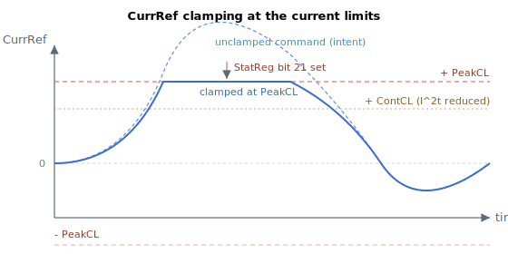

# CurrRef

Read-only final motor current command after all loops, compensation and injection.

## Overview

`CurrRef` is the current reference fed into the current control loop. It is the final motor current command after summing all control efforts (feedback loops and feedforward), plus any current-related compensation and injection that apply. It differs from [CurrRefCtrl](CurrRefCtrl.md), which is the loop-side reference taken *before* the decoupling matrix, current injection and current-related compensation.

See [Control tuning – Current control](../../11-control-tuning/06-current-control/00-overview.md) for where `CurrRef` sits in the signal path.

## How it works

In position/velocity operation the firmware builds `CurrRef` by summing the velocity-loop PI output with the feedforward terms (acceleration and velocity feedforward), then adds the applicable current-related compensation and injection — torque compensation, FIFO position-current offset, and the repetitive/UPM current tables. In current operation mode `CurrRef` is instead driven directly from the selected current command source (analog input or a command array).

`CurrRef` is then limited: first by the active current-limit mode, then absolutely against the peak current limit ([PeakCL](../../06-protections/02-current-and-voltage/PeakCL.md), as reduced by I²t toward [ContCL](../../06-protections/02-current-and-voltage/ContCL.md)). Reaching a limit sets the current-saturation status bit in [StatReg](../../07-status-and-faults/StatReg.md). Finally the sign is corrected by [CurrDir](CurrDir.md) to produce the loop-side command that becomes [IqRef](IqRef.md) (three-phase) or [IaRef](IaRef.md) (brush):

$$
CurrRef_{dir} = \pm\,CurrRef \quad (\text{sign from CurrDir})
$$

When the unclamped command would exceed `PeakCL` (or the I²t-reduced `ContCL` when continuous protection has tripped), `CurrRef` is held at the limit and the saturation status bit is set for those cycles:



## Examples

```text
ACurrRef            ; read the final current command (mA)
```

## See also

- [CurrRefCtrl](CurrRefCtrl.md) — loop-side current reference before decoupling/compensation
- [CurrRefOffset](../03-current-compensation/CurrRefOffset.md) — offset added on top of the motor current reference
- [UPMVelTable](../03-current-compensation/UPMVelTable.md) — angle-indexed compensation added in the same chain
- [CurrDir](CurrDir.md) — sets the sign of the direction correction applied to CurrRef
- [IqRef](IqRef.md) — q-axis reference taken from the direction-corrected CurrRef (three-phase)
- [IaRef](IaRef.md), [IbRef](IbRef.md) — per-phase references derived from the current command
- [PeakCL](../../06-protections/02-current-and-voltage/PeakCL.md) / [ContCL](../../06-protections/02-current-and-voltage/ContCL.md) — current limits CurrRef is clamped against
- [StatReg](../../07-status-and-faults/StatReg.md) — bit 21 reports the current-saturation status
