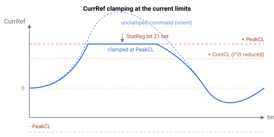

# CurrRef

只读的最终电机电流指令，已经过所有环路、补偿和注入。

## 概述

`CurrRef` 是馈入电流控制环的电流参考。它是对所有控制量（反馈环路和前馈）以及所有适用的电流相关补偿和注入求和之后的最终电机电流指令。它与 [CurrRefCtrl](CurrRefCtrl.md) 不同，后者是在解耦矩阵、电流注入和电流相关补偿*之前*取得的环路侧参考。

关于 `CurrRef` 在信号路径中的位置，参见 [Control tuning – Current control](../../11-control-tuning/06-current-control/00-overview.md)。

## 工作原理

在位置/速度运行模式下，固件通过将速度环 PI 输出与前馈项（加速度前馈和速度前馈）求和来构建 `CurrRef`，然后加上适用的电流相关补偿和注入——转矩补偿、FIFO 位置-电流偏置，以及重复/UPM 电流表。在电流运行模式下，`CurrRef` 则直接由所选的电流指令源（模拟量输入或指令数组）驱动。

随后 `CurrRef` 被限制：首先由激活的电流限制模式限制，然后绝对地针对峰值电流限值（[PeakCL](../../06-protections/02-current-and-voltage/PeakCL.md)，由 I²t 朝 [ContCL](../../06-protections/02-current-and-voltage/ContCL.md) 缩减）进行限制。达到限值会在 [StatReg](../../07-status-and-faults/StatReg.md) 中置位电流饱和状态位。最后，符号由 [CurrDir](CurrDir.md) 修正，以产生成为 [IqRef](IqRef.md)（三相）或 [IaRef](IaRef.md)（有刷）的环路侧指令：

$$
\text{CurrRef}_{dir} = \pm\,\text{CurrRef} \quad (\text{sign from }\text{CurrDir})
$$

当未钳位的指令会超过 `PeakCL`（或在连续保护已跳闸时超过经 I²t 缩减的 `ContCL`）时，`CurrRef` 被保持在该限值，并且在这些周期内置位饱和状态位：



## 示例

```text
ACurrRef            ; read the final current command (mA)
```

## 另请参阅

- [CurrRefCtrl](CurrRefCtrl.md) — 解耦/补偿之前的环路侧电流参考
- [CurrRefOffset](../03-current-compensation/CurrRefOffset.md) — 叠加在电机电流参考之上的偏置
- [UPMVelTable](../03-current-compensation/UPMVelTable.md) — 在同一链路中加入的按角度索引的补偿
- [CurrDir](CurrDir.md) — 设置施加于 CurrRef 的方向修正符号
- [IqRef](IqRef.md) — 取自方向修正后 CurrRef 的 q 轴参考（三相）
- [IaRef](IaRef.md)、[IbRef](IbRef.md) — 由电流指令导出的各相参考
- [PeakCL](../../06-protections/02-current-and-voltage/PeakCL.md) / [ContCL](../../06-protections/02-current-and-voltage/ContCL.md) — CurrRef 钳位所针对的电流限值
- [StatReg](../../07-status-and-faults/StatReg.md) — bit 21 报告电流饱和状态
```
