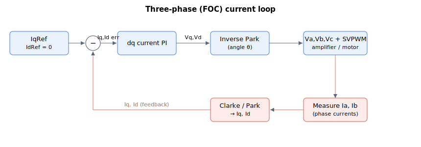

# Id

Read-only direct-axis feedback current after Park transform (three-phase only), in milliamperes.

## Overview

`Id` is the feedback current in the direct (d) axis after the Park transform, in milliamperes. The d axis is aligned with the rotor flux, so `Id` is the flux/field-producing component (as opposed to the torque-producing [Iq](Iq.md)). It is only applicable for three-phase motors ([MotorType](../../02-motor-and-amplifier/MotorType.md) = 3 or 4); for brush motors `Id` is 0, and for stepper motors `Id` is 0. It is the direct-axis counterpart of [Iq](Iq.md) and is regulated against its reference [IdRef](IdRef.md) in dq0-domain (vector) current control, producing the error [IdErr](IdErr.md).

## How it works

`Id` is computed from the measured phase currents [Ia](Ia.md) and [Ib](Ib.md) by a combined Clarke + Park transform, using the sine and cosine of the electrical commutation angle θ (evaluated at the commutation angle, together with the −120° shifted pair used for the phase-B term):

$$
Id\ \lbrack mA\rbrack = \frac{2}{\sqrt 3}\left(Ib \cdot \sin\theta - Ia \cdot \sin(\theta - 120^\circ)\right)
$$

The factor $2/\sqrt3 \approx 1.1547$ is applied as written. θ is the electrical commutation angle from the commutation/auto-phasing logic (the same angle that produces the phase references). The quadrature counterpart [Iq](Iq.md) uses the cosine terms.

The current-loop gains that act on the resulting error are [CurrGain](../../11-control-tuning/06-current-control/CurrGain.md) and [CurrKi](../../11-control-tuning/06-current-control/CurrKi.md) (see [Control tuning – Current control](../../11-control-tuning/06-current-control/00-overview.md)); this page does not give tuning guidance.



## Examples

```text
AId                 ; read direct-axis feedback current (mA)
```

## See also

- [IdRef](IdRef.md) — direct-axis current reference
- [IdErr](IdErr.md) — direct-axis current error (IdRef − Id), into the current PI
- [Iq](Iq.md) — quadrature-axis (torque-producing) feedback current
- [Vd](Vd.md) — direct-axis PI output, fed to the inverse Park transform
- [Ia](Ia.md), [Ib](Ib.md) — measured phase currents that Id is derived from
