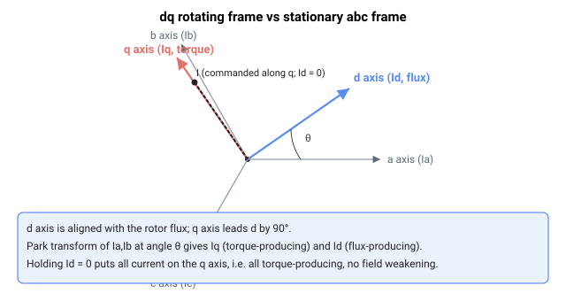

# Id

只读的经 Park 变换后的直轴反馈电流（仅限三相），单位为毫安。

## 概述

`Id` 是经 Park 变换后直轴 (d 轴) 上的反馈电流，单位为毫安。d 轴与转子磁链对齐，因此 `Id` 是产生磁通/磁场的分量（与产生转矩的 [Iq](Iq.md) 相对）。它仅适用于三相电机（[MotorType](../../02-motor-and-amplifier/MotorType.md) = 3 或 4）；对于有刷电机 `Id` 为 0，对于步进电机 `Id` 为 0。它是 [Iq](Iq.md) 的直轴对应量，并在 dq0 域（矢量）电流控制中相对其参考 [IdRef](IdRef.md) 进行调节，产生误差 [IdErr](IdErr.md)。

## 工作原理

`Id` 由测得的相电流 [Ia](Ia.md) 和 [Ib](Ib.md) 经组合的 Clarke + Park 变换计算得出，使用电气换相角 θ 的正弦和余弦（在换相角处求值，并结合用于 B 相项的 −120° 移相对）：

$$
\text{Id}\ \lbrack mA\rbrack = \frac{2}{\sqrt 3}\left(\text{Ib} \cdot \sin\theta - \text{Ia} \cdot \sin(\theta - 120^\circ)\right)
$$

系数 $\frac{2}{\sqrt3} \approx 1.1547$ 按所示应用。θ 是来自换相/自动定相逻辑的电气换相角（即产生相参考的同一角度）。交轴对应量 [Iq](Iq.md) 使用余弦项。

在旋转 dq 坐标系中，d 轴与转子磁链对齐（因此 Id 是磁通/磁场分量），q 轴超前其 90°。整个坐标系相对静止的 abc 相以 θ 旋转；Id 和 Iq 即为测得电流矢量在这两个轴上的投影：



当 [IdRef](IdRef.md) 保持为 0（默认电流固件行为）时，d 轴 PI 将 Id 驱向零，因此所有指令电流都位于 q 轴上并产生转矩。

作用于所得误差的电流环增益为 [CurrGain](../../11-control-tuning/06-current-control/CurrGain.md) 和 [CurrKi](../../11-control-tuning/06-current-control/CurrKi.md)（参见 [控制整定 – 电流控制](../../11-control-tuning/06-current-control/00-overview.md)）；本页不提供整定指导。


## 示例

```text
AId                 ; read direct-axis feedback current (mA)
```

## 另请参阅

- [IdRef](IdRef.md) — 直轴电流参考
- [IdErr](IdErr.md) — 直轴电流误差（IdRef − Id），输入到电流 PI
- [Iq](Iq.md) — 交轴（产生转矩）反馈电流
- [Vd](Vd.md) — 直轴 PI 输出，馈入逆 Park 变换
- [Ia](Ia.md)、[Ib](Ib.md) — Id 由其推导得出的测得相电流
