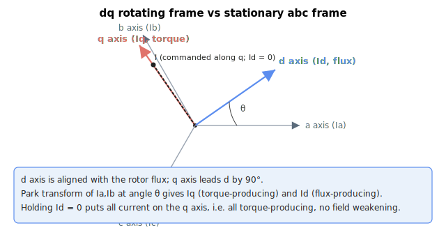

# Iq

Read-only quadrature-axis feedback current (definition varies by motor type), in milliamperes.

## Overview

`Iq` is the quadrature (q) axis feedback current. The q axis is orthogonal to the rotor flux, so for a three-phase motor `Iq` is the torque-producing component (its direct-axis counterpart [Id](Id.md) is the flux/field component). Its meaning depends on [MotorType](../../02-motor-and-amplifier/MotorType.md). For three-phase motors it is regulated against [IqRef](IqRef.md) in dq0-domain (vector) current control.

## How it works

| Motor type | Description |
|----|----|
| Single-phase / brush motor (MotorType = 1 or 2) | `Iq` equals [Ia](Ia.md) (no transform; brush motors close the loop on phase A only). |
| Three-phase motor (MotorType = 3 or 4) | `Iq` is the quadrature-axis current after the combined Clarke + Park transform of the measured phase currents (see below). |
| Two-phase stepper motor (MotorType = 6 or 7) | `Iq` equals 0. |

For three-phase motors, `Iq` is computed from the measured phase currents [Ia](Ia.md) and [Ib](Ib.md) using the sine/cosine of the electrical commutation angle θ (evaluated at the commutation angle and at θ − 120°):

$$
\text{Iq}\ \lbrack mA\rbrack = \frac{2}{\sqrt 3}\left(\text{Ia} \cdot \cos(\theta - 120^\circ) - \text{Ib} \cdot \cos\theta\right)
$$

The factor $\frac{2}{\sqrt3} \approx 1.1547$ is applied as written. θ is the electrical commutation angle from the commutation/auto-phasing logic. The direct counterpart [Id](Id.md) uses the corresponding sine terms.

In the rotating dq frame the q axis carries the torque-producing component and is orthogonal to the rotor flux on the d axis. Iq and Id are the projections of the measured current vector onto this rotating frame, indexed by θ:




## Examples

```text
AIq                 ; read quadrature-axis feedback current (mA)
```

## See also

- [IqRef](IqRef.md) — quadrature-axis current reference
- [IqErr](IqErr.md) — quadrature-axis current error (IqRef − Iq), into the current PI
- [Id](Id.md) — direct-axis (flux/field) feedback current
- [Vq](Vq.md) — quadrature-axis PI output, fed to the inverse Park transform
- [Ia](Ia.md), [Ib](Ib.md) — measured phase currents that Iq is derived from
- [MotorType](../../02-motor-and-amplifier/MotorType.md) — motor type that determines the definition
