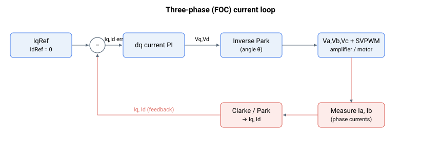

# IqRef

只读交轴电流参考（定义因电机类型而异），单位为毫安。

## 概述

`IqRef` 是交轴 (q 轴) 的参考电流，单位为毫安。其推导方式取决于 [MotorType](../../02-motor-and-amplifier/MotorType.md)。对于三相电机，它是产生力矩的参考值，由 [CurrRefCtrl](CurrRefCtrl.md) 经方向修正后得出，并相对于反馈 [Iq](Iq.md) 进行调节。

## 工作原理

| 电机类型 | 说明 |
|----|----|
| 单相 / 有刷电机（MotorType = 1 或 2） | `IqRef` 等于 [IaRef](IaRef.md)（两者均等于经方向修正后的电流指令）。 |
| 三相电机（MotorType = 3 或 4） | `IqRef` 等于经方向修正后的最终电机电流指令。它用于 dq0 域电流控制。 |
| 两相步进电机（MotorType = 6 或 7） | `IqRef` 等于 0。 |

在三相电流环中，固件将 q 轴参考直接赋值为经方向修正后的电机电流指令：

$$
\text{IqRef}\ \lbrack mA\rbrack = \pm\,\text{CurrRef}
$$

其中符号由 [CurrDir](CurrDir.md) 设定（`+` 表示正常方向，`−` 表示反转方向）。`CurrRef` 是经过控制环、补偿和注入后的[最终电机电流指令](CurrRef.md)；在控制环一侧它可追溯至 [CurrRefCtrl](CurrRefCtrl.md)。直轴参考 [IdRef](IdRef.md) 保持为 0，因此所有指令电流都位于产生力矩的 q 轴上。然后 `IqRef` 与反馈 [Iq](Iq.md) 作差，形成 [IqErr](IqErr.md)。



## 示例

```text
AIqRef              ; read quadrature-axis current reference (mA)
```

## 另请参阅

- [Iq](Iq.md) — 交轴反馈电流
- [IqErr](IqErr.md) — 交轴电流误差（IqRef − Iq）
- [IdRef](IdRef.md) — 直轴电流参考（保持为 0）
- [CurrRef](CurrRef.md) — IqRef 取值的最终电机电流指令（相对于 [PeakCL](../../06-protections/02-current-and-voltage/PeakCL.md)/[ContCL](../../06-protections/02-current-and-voltage/ContCL.md) 进行钳位）
- [CurrRefCtrl](CurrRefCtrl.md) — 控制环一侧的电流参考（解耦/补偿之前）
- [CurrDir](CurrDir.md) — 设定方向修正的符号
- [IaRef](IaRef.md) — 有刷电机中 IqRef 所等于的 A 相参考
- [StatReg](../../07-status-and-faults/StatReg.md) — 位 21 报告 IqRef 上游的电流饱和
