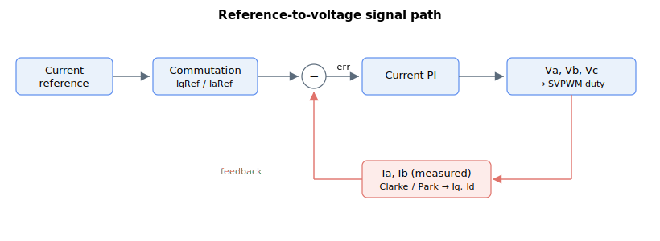

# Va

Read-only phase A voltage reference for space-vector modulation (PWM-count fraction ×1000).

## Overview

`Va` is the phase A voltage reference for space-vector modulation (SVM), expressed as a fraction of the full PWM count times a factor of 1000 (so ±1000 corresponds to ±100 % of the maximum PWM amplitude). Phase A is defined in the hardware reference guide. Together with [Vb](Vb.md) and [Vc](Vc.md) it forms the three-phase voltage commands sent to the modulator and ultimately the PWM duty.

## How it works

How `Va` is produced depends on the motor group and the [ControlMode](ControlMode.md) bits:

| Case | Source of Va |
|----|----|
| Brushless, vector (dq0) control (ControlMode bit 1 = 0) | Inverse transform of the dq0 voltage outputs: $Va\ = \ Vq \cdot \sin(\theta) + Vd \cdot \cos(\theta)$, where $\theta$ is the commutation angle and [Vd](Vd.md)/[Vq](Vq.md) come from the dq current loops. |
| Brushless or stepper, abc (phase) control (ControlMode bit 1 = 1) | Output of the phase A current PI loop on [IaErr](IaErr.md): integral term ([CurrKi](../../11-control-tuning/06-current-control/CurrKi.md)) plus proportional term, scaled by the loop gain ([CurrGain](../../11-control-tuning/06-current-control/CurrGain.md)). |
| Brush (single-phase) motor | Output of the phase A current PI loop on [IaErr](IaErr.md). |
| Current loop bypassed (ControlMode bit 2 = 1) | $Va\ = \ IaRef$ — the phase current reference is used directly as the voltage command. |

After `Va` is formed:

- **Phase C / completion.** For brushless motors `Vc = -(Va + Vb)` so the three phase voltages sum to zero. For brush motors `Vb = -Va` and `Vc = 0`; for steppers `Vc = 0`.
- **Enhanced speed range.** If [ControlMode](ControlMode.md) bit 0 is set (default), the firmware subtracts the midpoint of the phase voltages from all phases (a common-mode / third-harmonic injection), which raises the usable line-to-line voltage.
- **Saturation.** Each phase is clamped to the maximum PWM amplitude (firmware `glMaxPWM`); in vector mode the Vq/Vd vector is scaled before this so the sinusoidal relationship is preserved. Saturation sets the voltage-saturation bit in [StatReg](../../07-status-and-faults/StatReg.md).

**Scaling.** `Va` is reported with the SVM scaling: a value of 1000 equals the full PWM count for the platform, so the internal PWM command is `Va × (PWM count per 1000)`. The factor depends on the hardware/PWM clock period.

The full reference-to-voltage chain (shared by all phase variables) is:



## Examples

```text
AVa                 ; read phase A SVM voltage reference
```

## See also

- [Vb](Vb.md), [Vc](Vc.md) — phase B and C voltage references
- [Vd](Vd.md), [Vq](Vq.md) — dq0 voltage outputs that form Va/Vb/Vc
- [IaRef](IaRef.md) — phase A current reference (equals Va when the loop is bypassed)
- [IaErr](IaErr.md) — phase A current error driving Va when the abc loop runs
- [ControlMode](ControlMode.md) — control-domain, loop-bypass and enhanced-speed-range options
- [StatReg](../../07-status-and-faults/StatReg.md) — voltage-saturation status set when Va is clamped
