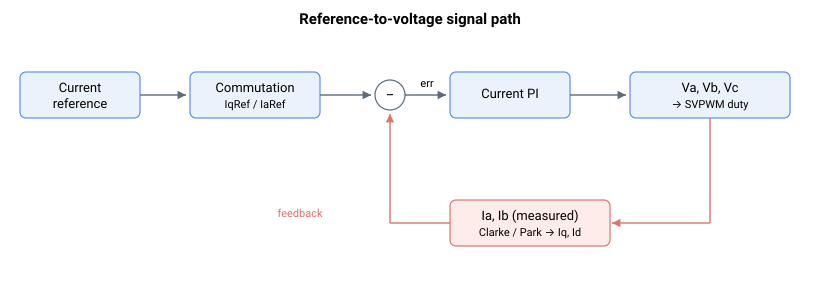
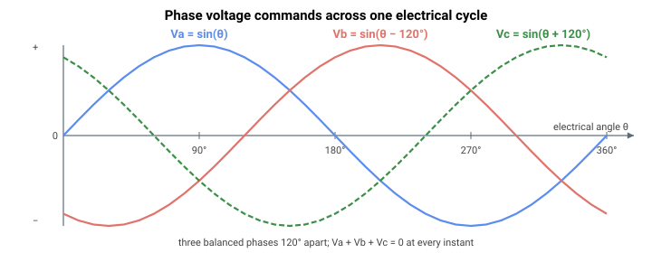

# Va

只读 A 相电压参考，用于空间矢量调制（PWM 计数分数 ×1000）。

## 概述

`Va` 是用于空间矢量调制 (SVM) 的 A 相电压参考，表示为满 PWM 计数的分数乘以系数 1000（因此 ±1000 对应于最大 PWM 幅值的 ±100 %）。A 相在硬件参考指南中定义。它与 [Vb](Vb.md) 和 [Vc](Vc.md) 一起，构成发送至调制器并最终形成 PWM 占空比的三相电压指令。

## 工作原理

`Va` 的产生方式取决于电机组和 [ControlMode](ControlMode.md) 位：

| 情况 | Va 的来源 |
|----|----|
| 无刷，矢量 (dq0) 控制（[MotorType](../../02-motor-and-amplifier/MotorType.md) = 3 或 4，[ControlMode](ControlMode.md) 位 1 = 0，位 2 = 0） | dq0 电压输出的逆变换：$\text{Va}\ = \ \text{Vq} \cdot \sin(\theta) + \text{Vd} \cdot \cos(\theta)$，其中 $\theta$ 是换相角，[Vd](Vd.md)/[Vq](Vq.md) 来自 dq 电流环。 |
| 无刷，abc（相）控制（[MotorType](../../02-motor-and-amplifier/MotorType.md) = 3 或 4，[ControlMode](ControlMode.md) 位 1 = 1，位 2 = 0） | 基于 [IaErr](IaErr.md) 的 A 相电流 PI 调节器的输出：积分项（[CurrKi](../../11-control-tuning/06-current-control/CurrKi.md)）加比例项，并按环路增益（[CurrGain](../../11-control-tuning/06-current-control/CurrGain.md)）缩放。[Vq](Vq.md) 和 [Vd](Vd.md) 强制为 0。 |
| 步进电机（[MotorType](../../02-motor-and-amplifier/MotorType.md) = 6 或 7） | 基于 [IaErr](IaErr.md) 的 A 相电流 PI 调节器的输出，其中 [IaRef](IaRef.md) 生成为 $\text{CurrRef} \cdot \sin(\text{stepper electrical angle})$。步进路径始终为逐相（abc 域）并忽略 [ControlMode](ControlMode.md) 位 1 和位 2。 |
| 有刷 / 音圈电机（[MotorType](../../02-motor-and-amplifier/MotorType.md) = 1 或 2，[ControlMode](ControlMode.md) 位 2 = 0） | 基于 [IaErr](IaErr.md) 的 A 相电流 PI 调节器的输出。不使用 [ControlMode](ControlMode.md) 位 1。 |
| 无刷或有刷，电流环旁路（[ControlMode](ControlMode.md) 位 2 = 1） | $\text{Va}\ = \ \text{IaRef}$ — 相电流参考直接用作电压指令。（步进电机忽略此位。） |

`Va` 形成后：

- **相位补全。** 对于无刷电机，$\text{Vc} = -(\text{Va} + \text{Vb})$，使三相电压之和为零。对于有刷电机，$\text{Vb} = -\text{Va}$ 且 $\text{Vc} = 0$。对于步进电机，$\text{Vb}$ 来自其自身的 B 相 PI 调节器，$\text{Vc} = 0$（电机回线连接至驱动器的 C 桥臂）。
- **增强速度范围。** 如果设置了 [ControlMode](ControlMode.md) 位 0（默认），则从所有相中减去相电压的中点（一种共模 / 三次谐波式注入），从而提高可用的线间电压。对于无刷电机，所减去的中点是三相电压中最大值和最小值的平均值，$\tfrac{1}{2}\big(\max(\text{Va},\text{Vb},\text{Vc}) + \min(\text{Va},\text{Vb},\text{Vc})\big)$；对于两相步进电机（其中 Vc 起始为 0）则为 $\tfrac{1}{2}(\text{Va} + \text{Vb})$。此步骤对无刷和步进电机运行；有刷电机跳过此步骤。
- **饱和。** 电压被限制到最大 PWM 幅值（[MaxPWM](../../06-protections/02-current-and-voltage/MaxPWM.md)），它以与 `Va` 相同的每 1000 单位表示，默认为满计数的 90 %（900 个关键字单位）。`MaxPWM` 永远无法达到满 ±1000，因为半周期中有一部分被预留给 PWM 死区，因此即使在满指令下 `Va` 也被严格保持在 1000 以下。在正常的无刷矢量 (dq0) 控制中，限幅在逆变换*之前*对 [Vq](Vq.md)/[Vd](Vd.md) 矢量进行（两轴按相同系数缩放），从而保持正弦相位关系。对 `Va`（以及 `Vb`、`Vc`）到 ±`MaxPWM` 的直接逐相钳位仅在旁路模式下应用——abc 域控制（[ControlMode](ControlMode.md) 位 1 = 1）或电流环旁路（[ControlMode](ControlMode.md) 位 2 = 1）——这些模式下没有矢量可供缩放；在这些模式下独立钳位各相可能会扭曲 `Va`、`Vb` 和 `Vc` 之间的相位关系。任一路径都会置位电压饱和位（[StatReg](../../07-status-and-faults/StatReg.md) 位 22）。

**缩放。** `Va` 以 SVM 缩放进行报告：值 1000 等于该平台的满 PWM 计数，因此内部 PWM 指令为 $\text{Va} \cdot (\text{PWM count per }1000)$。该系数取决于硬件/PWM 时钟周期。具体而言，每 1000 的 PWM 计数等于所报告的缩放系数 × 1000：在 central-i 系统上，`Va` = 1000 指令满半周期计数 1526 个 PWM 时钟（缩放 1.526），而在 standalone 控制器上，它指令该构建的满计数——根据 PWM/采样率构建为 1144 或 4577 个 PWM 时钟（缩放 1.144 或 4.577，本页缩放中所示的值）。因此内部 PWM 比较值就是 `Va` × 缩放，且 `Va` = ±1000 即为 PWM 半周期的 ±100 %（应用 [MaxPWM](../../06-protections/02-current-and-voltage/MaxPWM.md) 之前的满调制深度）。

完整的参考值到电压链（由所有相变量共享）为：



这三个相指令是在电角度 θ 上相差 120° 的三个正弦波，因此 Vc 完全由 Va 和 Vb 决定：



### 边界情况

- **电机失能。** 当 [MotorOn](../../08-axis-operation/01-general-keywords/MotorOn.md) 为 0 时，电流环复位，`Va` 强制为 0。
- **力 / 位置 / 电流运行模式。** 电流环在所有模式下运行方式相同；仅 [CurrRef](CurrRef.md) 的来源不同。
- **开环电压模式。** 当开环电压指令激活时（[OpenLoopVolt](../../08-axis-operation/01-general-keywords/OpenLoopVolt.md) / [OpenLoopCurr](../../08-axis-operation/01-general-keywords/OpenLoopCurr.md)），`Va` 反映该指令路径而非闭环。
- **仿真。** 在仿真中，`Va` 遵循相同的公式，因为整个控制环都在仿真的相电流上运行。
- **外部电流指令驱动器（[AmpType](../../02-motor-and-amplifier/AmpType.md) = 电流指令）。** 电流环在驱动器中运行而非控制器中，此处的 `Va` 不代表驱动器的 A 相电压。

## 示例

```text
AVa                 ; read phase A SVM voltage reference
```

## 另请参阅

- [Vb](Vb.md)、[Vc](Vc.md) — B 相和 C 相电压参考
- [Vd](Vd.md)、[Vq](Vq.md) — 形成 Va/Vb/Vc 的 dq0 电压输出
- [IaRef](IaRef.md) — A 相电流参考（控制环旁路时等于 Va）
- [IaErr](IaErr.md) — abc 环运行时驱动 Va 的 A 相电流误差
- [ControlMode](ControlMode.md) — 控制域、环路旁路和增强速度范围选项
- [StatReg](../../07-status-and-faults/StatReg.md) — Va 被钳位时置位的电压饱和状态
