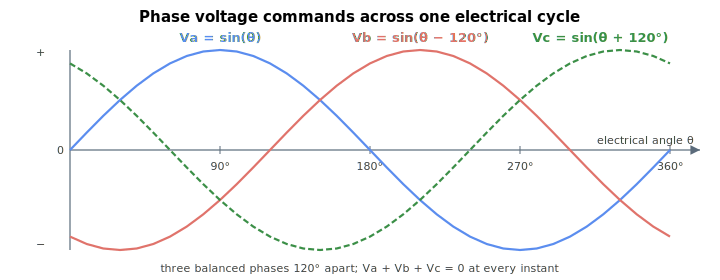

# Vc

Read-only phase C voltage reference for space-vector modulation (PWM-count fraction ×1000).

## Overview

`Vc` is the phase C voltage reference for space-vector modulation (SVM), expressed as a fraction of the full PWM count times a factor of 1000 (±1000 = ±100 % of maximum PWM amplitude). Phase C is defined in the hardware reference guide. Together with [Va](Va.md) and [Vb](Vb.md) it forms the three-phase voltage commands sent to the modulator and ultimately the PWM duty.

The per-1000 PWM count equals the reported scaling factor × 1000: on a central-i system `Vc` = 1000 commands the full half-period count of 1526 PWM clocks (scaling 1.526), and on a standalone controller it commands that build's full count — 1144 or 4577 PWM clocks depending on the PWM/sampling-rate build (scaling 1.144 or 4.577, the value shown in this page's scaling). The internal PWM compare value is `Vc` × scaling, and `Vc` = ±1000 is ±100 % of the PWM half-period (full modulation depth before [MaxPWM](../../06-protections/02-current-and-voltage/MaxPWM.md) is applied).

## How it works

Unlike [Va](Va.md) and [Vb](Vb.md), phase C is not produced by its own current loop — it is derived to complete the phase set:

| Motor group | Source of Vc |
|----|----|
| Three-phase brushless motor | $\text{Vc}\ = \ -(\text{Va} + \text{Vb})$ so the three phase voltages sum to zero (balanced star). |
| Brush (single-phase) motor | $\text{Vc}\ = \ 0$ (only phases A and B are driven, with $\text{Vb} = -\text{Va}$). |
| Two-phase stepper motor | $\text{Vc}\ = \ 0$ before the enhanced-speed-range step (the motor return lines connect to the amplifier C leg). |

After it is formed, `Vc` is subject to the same post-processing as the other phases: the enhanced-speed-range midpoint subtraction (ControlMode bit 0, which can make `Vc` non-zero for steppers), and saturation to the maximum PWM amplitude ([MaxPWM](../../06-protections/02-current-and-voltage/MaxPWM.md)) which sets the voltage-saturation bit ([StatReg](../../07-status-and-faults/StatReg.md) bit 22). `MaxPWM` is in the same per-1000 units as `Vc`, defaults to 90 % of the full count (900 keyword units), and can never reach ±1000 because a share of the half-period is reserved for the PWM dead band.

For three-phase motors `Vc` is the third 120°-spaced phase that completes the balanced set ($\text{Va} + \text{Vb} + \text{Vc} = 0$):



### Edge cases

- **Motor off.** When [MotorOn](../../08-axis-operation/01-general-keywords/MotorOn.md) is 0 the current loop is reset and `Vc` is forced to 0.
- **Brush motor.** `Vc` stays at 0 regardless of [ControlMode](ControlMode.md) (brush does not run the enhanced-speed-range midpoint step).
- **Stepper motor.** `Vc` starts at 0 and is then offset by the negative phase midpoint when [ControlMode](ControlMode.md) bit 0 is set. For the two-phase stepper that midpoint is $\tfrac{1}{2}(\text{Va} + \text{Vb})$ (with `Vc` = 0 at the start), so after the subtraction $\text{Vc} = -\tfrac{1}{2}(\text{Va} + \text{Vb})$ — unlike the brushless case, where the midpoint is $\tfrac{1}{2}\big(\max(\text{Va},\text{Vb},\text{Vc}) + \min(\text{Va},\text{Vb},\text{Vc})\big)$. On saturation `Vc` is scaled together with `Va` and `Vb` to preserve the relationship.
- **Brushless current loop bypassed ([ControlMode](ControlMode.md) bit 2 = 1).** `Vc` is still completed as $-(\text{Va} + \text{Vb})$ using the bypassed-mode `Va`, `Vb` values.
- **Simulation.** Same formula as on hardware.

## Examples

```text
AVc                 ; read phase C SVM voltage reference
```

## See also

- [Va](Va.md), [Vb](Vb.md) — phase A and B voltage references that Vc completes
- [Vd](Vd.md), [Vq](Vq.md) — dq0 voltage outputs that form Va/Vb/Vc
- [ControlMode](ControlMode.md) — control-domain, loop-bypass and enhanced-speed-range options
- [StatReg](../../07-status-and-faults/StatReg.md) — voltage-saturation status set when Vc is clamped
