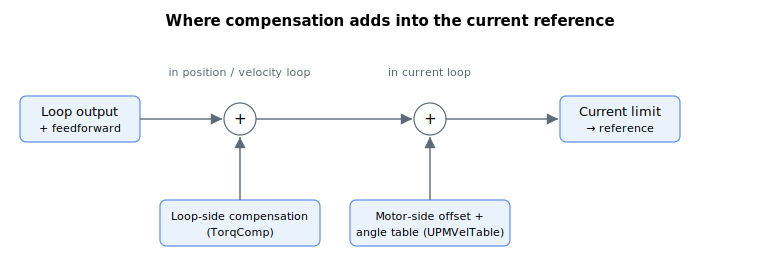

# Current compensation

This subgroup describes the keywords related to current offsets for the loop (before the decoupling matrix) and for the motor (after the decoupling matrix). For an axis that does not use the decoupling matrix (for example, not in gantry mode), loop and motor current compensation amount to the same thing.

The decoupling matrix here is the gantry / cross-axis transformation that forms each motor's current reference from the loop references; it is not the d/q model-based voltage decoupling. That voltage decoupling (the back-EMF and inductive cross-coupling terms enabled by [VoltageFFWOn](../../11-control-tuning/05-feedforwards/VoltageFFWOn.md), with [RmFFWLevel](../../11-control-tuning/05-feedforwards/RmFFWLevel.md), [LmFFWLevel](../../11-control-tuning/05-feedforwards/LmFFWLevel.md), and [BEMFFFWLevel](../../11-control-tuning/05-feedforwards/BEMFFFWLevel.md)) acts on the current loop's voltage command, not on the current reference, so it is unrelated to the current compensation described here.

The loop-side compensation (TorqComp) is summed into the current reference inside the position/velocity loop, while the motor-side offset and the commutation-angle table (UPMVelTable) are summed in later, in the current loop, before the current limit.

It contains:

- [CurrRefOffset](CurrRefOffset.md) — motor-side current reference offset.
- [TorqCompMode](TorqCompMode.md) — selects the source of the loop's current compensation.
- [TorqCompFix](TorqCompFix.md) — fixed loop current-compensation values.
- [UPMVelTable](UPMVelTable.md) — commutation-angle current compensation table (e.g. cogging compensation).
