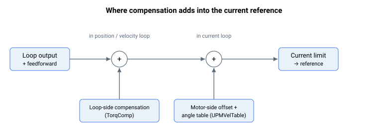

# 电流补偿

本子组描述与电流偏置相关的关键字，包括用于环路（解耦矩阵之前）的电流偏置和用于电机（解耦矩阵之后）的电流偏置。对于不使用解耦矩阵的轴（例如未处于龙门模式），环路和电机电流补偿是同一回事。

此处的解耦矩阵是指由环路参考形成各电机电流参考的龙门/跨轴变换；它不是 d/q 基于模型的电压解耦。该电压解耦（由 [VoltageFFWOn](../../11-control-tuning/05-feedforwards/VoltageFFWOn.md) 启用、并配合 [RmFFWLevel](../../11-control-tuning/05-feedforwards/RmFFWLevel.md)、[LmFFWLevel](../../11-control-tuning/05-feedforwards/LmFFWLevel.md) 和 [BEMFFFWLevel](../../11-control-tuning/05-feedforwards/BEMFFFWLevel.md) 的反电动势和电感交叉耦合项）作用于电流环的电压指令，而非电流参考，因此与此处描述的电流补偿无关。

环路侧补偿（TorqComp）在位置/速度环内被累加到电流参考中，而电机侧偏置和换相角表（UPMVelTable）则在稍后的电流环中、电流限制之前被累加进来。

它包含：

- [CurrRefOffset](CurrRefOffset.md) — 电机侧电流参考偏置。
- [TorqCompMode](TorqCompMode.md) — 选择环路电流补偿的来源。
- [TorqCompFix](TorqCompFix.md) — 固定的环路电流补偿值。
- [UPMVelTable](UPMVelTable.md) — 换相角电流补偿表（例如齿槽补偿）。
