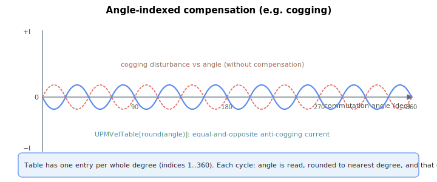

# UPMVelTable

Per-commutation-angle current compensation table for brushless motors (e.g. cogging compensation).

## Overview

`UPMVelTable` is a parameter array that provides commutation-angle-dependent motor current compensation, for example to compensate cogging. It is only used when [MotorType](../../02-motor-and-amplifier/MotorType.md) = 3 or 4 (linear or rotary brushless motor — the firmware classifies both as a brushless motor type). See [Control tuning – Current control](../../11-control-tuning/06-current-control/00-overview.md) for its application point.

## How it works

The compensation is applied in the current control loop while the motor is enabled and commutation (auto-phasing) is complete. Two conditions must hold for the table to be used:

1. The motor is a brushless type (so a commutation angle exists — brush motors have no commutation angle).
2. The anti-cogging feature is enabled by its on/off flag ([UPMVelOn](../../../03-special-features/upm/UPMVelOn.md) ≠ 0).

When enabled, each control cycle the firmware reads the present commutation angle ([ComtAng](../../15-commutation/ComtAng.md)), converts it from radians to degrees and rounds to the nearest whole degree, then uses that as the array index. The value found there is **added** to the current reference:

$$
\text{CurrRef} \mathrel{+}= \text{UPMVelTable}[\,\mathrm{round}(\text{ComtAng}_{deg})\,]
$$

So `UPMVelTable[54]` is the current compensation value applied when the commutation angle rounds to 54 degrees. The table holds one entry per whole degree over a full electrical cycle (0–360 degrees); it is 1-indexed, so the valid compensation entries begin at index `1`. All array elements default to 0 (no compensation).

To cancel an angle-periodic disturbance (such as cogging torque), populate `UPMVelTable` with the *opposite* current pattern — the angle-by-angle anti-cogging current that, when summed into `CurrRef`, leaves the net torque flat:



The added term is in the same units as the current reference ([CurrRef](../02-motor-variables/CurrRef.md)). On central-i v5 the table and reference are floating-point; on v4 they are integer. The indexing and the conditions for application are identical across versions.

## Examples

```text
AUPMVelTable[54]=300 ; compensation applied at commutation angle 54 degrees
AUPMVelTable[1]=0    ; no compensation at the first angle entry
```

### Walk-through: write a small anti-cogging entry by entry

This recipe writes a few entries into the table to balance an observed cogging ripple at one electrical angle. The same pattern repeats around the cycle, but only the principle is shown here.

1. **Confirm the motor is brushless** ([MotorType](../../02-motor-and-amplifier/MotorType.md) = 3 or 4) - the table is only used in that case.

2. **Enable the angle-indexed compensation** via its on/off flag:

   ```text
   AUPMVelOn=1
   ```

3. **Identify the disturbance.** From a recording of commutation angle ([ComtAng](../../15-commutation/ComtAng.md)) and current draw at constant velocity, observe the cogging current ripple as a function of angle. For each whole-degree angle θ where the ripple is +I, the compensation entry should be -I; where it is -I, the entry should be +I.

4. **Write the entries** (one whole degree at a time, 1-indexed, valid range 1 to 360):

   ```text
   AUPMVelTable[54]=300        ; +300 at 54 deg cancels a -300 cogging ripple
   AUPMVelTable[55]=280
   AUPMVelTable[56]=200
   ; ... continue around the electrical cycle
   ```

5. **Repeat the test recording** to confirm the residual ripple has shrunk. Adjust individual entries that are still off.

6. **Disable temporarily for comparison** without losing the table contents:

   ```text
   AUPMVelOn=0
   ```

## See also

- [ComtAng](../../15-commutation/ComtAng.md) — commutation angle that indexes this table
- [UPMVelOn](../../../03-special-features/upm/UPMVelOn.md) — enables/disables this table at run time
- [MotorType](../../02-motor-and-amplifier/MotorType.md) — must be 3 or 4 (brushless) for this to apply
- [CurrRef](../02-motor-variables/CurrRef.md) — current reference this table adds into
- [CurrRefOffset](CurrRefOffset.md) — motor-side current offset (constant bias rather than angle-indexed)
