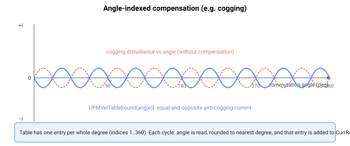

# UPMVelTable

无刷电机的逐换相角电流补偿表（例如齿槽补偿）。

## 概述

`UPMVelTable` 是一个参数数组，提供随换相角变化的电机电流补偿，例如用于补偿齿槽效应。仅当 [MotorType](../../02-motor-and-amplifier/MotorType.md) = 3 或 4（直线或旋转无刷电机——固件将两者均归类为无刷电机类型）时使用。其作用点参见 [Control tuning – Current control](../../11-control-tuning/06-current-control/00-overview.md)。

## 工作原理

该补偿在电流控制环中、当电机已使能且换相（自动定相）已完成时施加。使用此表须满足两个条件：

1. 电机为无刷类型（因而存在换相角——有刷电机没有换相角）。
2. 齿槽补偿功能已通过其开/关标志启用（[UPMVelOn](../../../03-special-features/upm/UPMVelOn.md) ≠ 0）。

启用后，固件在每个控制周期读取当前换相角（[ComtAng](../../15-commutation/ComtAng.md)），将其从弧度转换为度并四舍五入到最近的整数度，然后将其用作数组索引。在该处找到的值被**加到**电流参考上：

$$
\text{CurrRef} \mathrel{+}= \text{UPMVelTable}[\,\mathrm{round}(\text{ComtAng}_{deg})\,]
$$

因此 `UPMVelTable[54]` 是当换相角四舍五入到 54 度时所施加的电流补偿值。该表在一个完整电气周期（0–360 度）上每整数度保存一个条目；它为 1 索引，因此有效的补偿条目从索引 `1` 开始。所有数组元素默认为 0（无补偿）。

为抵消某个随角度周期性变化的扰动（例如齿槽转矩），应将 `UPMVelTable` 填入*相反*的电流模式——即逐角度的齿槽补偿电流，当其求和进 `CurrRef` 时，使净转矩保持平直：



所加项与电流参考（[CurrRef](../02-motor-variables/CurrRef.md)）采用相同单位。在 central-i v5 上，该表和参考为浮点数；在 v4 上为整数。索引方式和施加条件在各版本间完全相同。

由于电流参考会成为磁场定向电流环的交轴（产生转矩）指令（[IqRef](../02-motor-variables/IqRef.md)），且直轴（励磁）参考保持为 0，因此齿槽补偿电流仅偏置 q 轴（产生转矩）参考。

## 示例

```text
AUPMVelTable[54]=300 ; compensation applied at commutation angle 54 degrees
AUPMVelTable[1]=0    ; no compensation at the first angle entry
```

### 操作演练：逐条目写入一小段齿槽补偿

此方法向表中写入若干条目，以平衡在某一电气角度处观察到的齿槽波动。同一模式在整个周期内重复，但此处仅展示其原理。

1. **确认电机为无刷电机**（[MotorType](../../02-motor-and-amplifier/MotorType.md) = 3 或 4）——只有在此情况下才使用该表。

2. **通过其开/关标志启用按角度索引的补偿**：

   ```text
   AUPMVelOn=1
   ```

3. **辨识扰动。** 从恒定速度下换相角（[ComtAng](../../15-commutation/ComtAng.md)）与电流消耗的记录中，观察齿槽电流波动随角度的变化。对于波动为 +I 的每个整数度角度 θ，补偿条目应为 -I；波动为 -I 处，条目应为 +I。

4. **写入条目**（一次一个整数度，1 索引，有效范围 1 至 360）：

   ```text
   AUPMVelTable[54]=300        ; +300 at 54 deg cancels a -300 cogging ripple
   AUPMVelTable[55]=280
   AUPMVelTable[56]=200
   ; ... continue around the electrical cycle
   ```

5. **重复测试记录**以确认残余波动已减小。调整仍有偏差的个别条目。

6. **临时禁用以作对比**，而不丢失表内容：

   ```text
   AUPMVelOn=0
   ```

## 另请参阅

- [ComtAng](../../15-commutation/ComtAng.md) — 索引此表的换相角
- [UPMVelOn](../../../03-special-features/upm/UPMVelOn.md) — 在运行时启用/禁用此表
- [MotorType](../../02-motor-and-amplifier/MotorType.md) — 须为 3 或 4（无刷）时本项才适用
- [CurrRef](../02-motor-variables/CurrRef.md) — 此表加入的电流参考
- [CurrRefOffset](CurrRefOffset.md) — 电机侧电流偏置（恒定偏置而非按角度索引）
