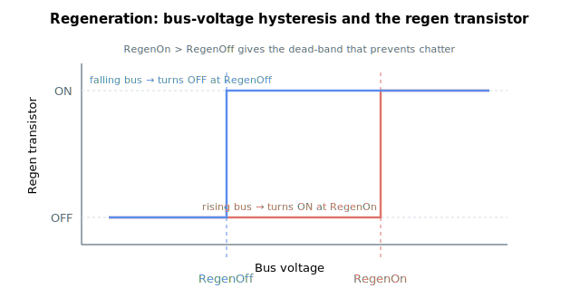

# Regeneration

This subgroup describes the keywords that control and monitor the regeneration (braking-resistor) circuit, which dissipates excess DC-bus energy generated during deceleration. The on/off voltage thresholds provide hysteresis around the bus voltage [VBus](../01-system-variables/VBus.md): the regen transistor switches on when the bus rises to RegenOn and off again only when it falls back to RegenOff.

- [RegenOn](RegenOn.md) — bus-voltage threshold to activate the regen resistor.
- [RegenOff](RegenOff.md) — bus-voltage threshold to deactivate the regen resistor.
- [RegenUsed](RegenUsed.md) — selects external vs internal regen resistor.
- [RegenCurr](RegenCurr.md) — measured regen-resistor current (read-only).
