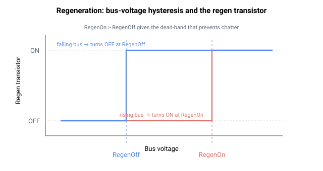

# 再生（能量回馈）

本子组描述用于控制和监测再生（制动电阻）电路的关键字，该电路耗散减速期间产生的多余直流母线能量。开/关电压阈值在母线电压 [VBus](../01-system-variables/VBus.md) 周围提供迟滞：母线电压升至 RegenOn 时再生晶体管导通，仅当其回落至 RegenOff 时再次关断。

- [RegenOn](RegenOn.md) — 激活再生电阻的母线电压阈值。
- [RegenOff](RegenOff.md) — 停用再生电阻的母线电压阈值。
- [RegenUsed](RegenUsed.md) — 选择外部或内部再生电阻。
- [RegenCurr](RegenCurr.md) — 测得的再生电阻电流（只读）。
