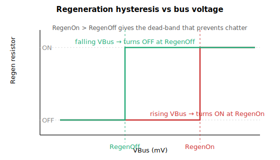

# RegenOn

DC bus-voltage threshold (mV) above which the regeneration resistor is activated.

## Overview

`RegenOn` sets the DC bus-voltage threshold (mV) above which the regeneration (braking-resistor) circuit is switched on. During deceleration the motor pumps energy back into the DC bus, raising [VBus](../01-system-variables/VBus.md); when `VBus` reaches `RegenOn` the controller switches the brake-chopper transistor on, connecting the regen resistor to burn off the excess energy and keep the bus below the over-voltage limit [MaxVBus](../../06-protections/02-current-and-voltage/MaxVBus.md). The resistor is switched off again only once `VBus` falls back to [RegenOff](RegenOff.md), so `RegenOn` is the upper edge of the switching hysteresis.

## How it works

Once per regeneration step (per-axis on central-i, controller-wide on a standalone controller), and only when [RegenUsed](RegenUsed.md) ≠ 0, the controller compares the filtered bus voltage against the two thresholds:

| Condition | Action |
|-----------|--------|
| `VBus ≥ RegenOn`  | Turn the regeneration chopper ON and set [StatReg](../../07-status-and-faults/StatReg.md) bit 1 (regeneration active) |
| `VBus ≤ RegenOff` | Turn the regeneration chopper OFF and clear `StatReg` bit 1 |
| `RegenOff < VBus < RegenOn` | No change — the chopper holds its current state |

The middle row is the dead-band: between the two thresholds nothing changes, so the chopper does not chatter on every small ripple. For this to work you must set **`RegenOn` > `RegenOff`**; if they are equal there is no hysteresis, and `RegenOn` < `RegenOff` is not a valid configuration. On a standalone controller the regen circuit is not per-axis — when it activates, `StatReg` bit 1 is set on all axes at once.

The "regeneration active" state is also available as a digital output (output function "regeneration active"), which follows `StatReg` bit 1 while `RegenUsed` ≠ 0.



> **Note:** `RegenOn`/`RegenOff` only switch the chopper. They do **not** trip a fault — the over-voltage protection ([MaxVBus](../../06-protections/02-current-and-voltage/MaxVBus.md) / [MaxVBusAbs](../../06-protections/02-current-and-voltage/MaxVBusAbs.md)) is the separate, higher safety net if regeneration cannot hold the bus down.

## Examples

```text
ARegenOn=80000       ; activate regen when bus reaches 80 V (mV)
ARegenOff=75000      ; ...and deactivate it when the bus falls back to 75 V
ARegenOn             ; read the present activation threshold
```

## See also

- [RegenOff](RegenOff.md) — deactivation threshold (lower edge of the hysteresis)
- [RegenCurr](RegenCurr.md) — measured regen-resistor current while the chopper is on
- [RegenUsed](RegenUsed.md) — enables the regen circuit; thresholds are ignored when 0
- [VBus](../01-system-variables/VBus.md) — bus voltage compared against this threshold
- [MaxVBus](../../06-protections/02-current-and-voltage/MaxVBus.md) — over-voltage protection (the safety net above the regen thresholds)
- [StatReg](../../07-status-and-faults/StatReg.md) — bit 1 reports regeneration active
