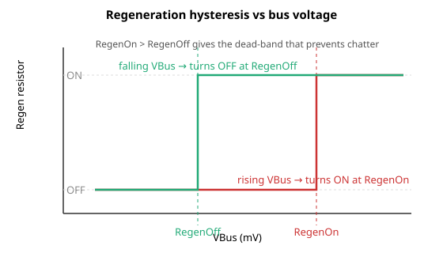

# RegenOn

再生电阻被激活的直流母线电压阈值（mV），高于该值时激活。

## 概述

`RegenOn` 设置直流母线电压阈值（mV），当母线电压高于该值时，再生（制动电阻）电路被接通。在减速过程中，电机将能量回馈至直流母线，从而抬升 [VBus](../01-system-variables/VBus.md)；当 `VBus` 达到 `RegenOn` 时，控制器接通制动斩波器晶体管，将再生电阻接入以耗散多余能量，并将母线电压保持在过压限值 [MaxVBus](../../06-protections/02-current-and-voltage/MaxVBus.md) 以下。只有当 `VBus` 回落至 [RegenOff](RegenOff.md) 时，电阻才会再次被切断，因此 `RegenOn` 是开关迟滞的上边沿。

## 工作原理

在每个再生步骤中（在 central-i 上为按轴，在独立控制器上为控制器范围），并且仅当 [RegenUsed](RegenUsed.md) ≠ 0 时，控制器将经滤波的母线电压与两个阈值进行比较：

| 条件 | 动作 |
|-----------|--------|
| `VBus ≥ RegenOn`  | 接通再生斩波器并置位 [StatReg](../../07-status-and-faults/StatReg.md) 位 1（再生激活） |
| `VBus ≤ RegenOff` | 断开再生斩波器并清除 `StatReg` 位 1 |
| `RegenOff < VBus < RegenOn` | 无变化——斩波器保持当前状态 |

中间一行是死区：在两个阈值之间不发生任何变化，因此斩波器不会在每次微小纹波时抖动。为使其生效，你必须设置 **`RegenOn` > `RegenOff`**；若二者相等则没有迟滞，而 `RegenOn` < `RegenOff` 不是有效配置。在独立控制器上，再生电路不是按轴的——当其激活时，所有轴上的 `StatReg` 位 1 会同时被置位。

再生阈值不是在每个控制周期都被检测的。控制器以 16 步轮询方式处理其周期性检查（每个控制中断执行一步），`RegenOn`/`RegenOff` 比较在其中一步中运行——因此 `VBus` 每 16 个控制中断才与阈值比较一次。所以斩波器可能在 `VBus` 越过阈值后延迟至多 16 个控制中断周期才进行切换。请合理设置死区（`RegenOn` − `RegenOff`），使母线电压在该时间间隔内无法反向越过另一阈值，从而防止斩波器抖动。

在独立控制器上，`RegenOn` 与 `RegenOff` 的默认值、最小值和最大值与 [MaxVBus](../../06-protections/02-current-and-voltage/MaxVBus.md) 共用。在出厂默认情况下，两个阈值都等于 `MaxVBus` 的默认值，因此没有迟滞间隙，激活点与过压限值重合。在依赖再生电路之前，你必须自行降低 `RegenOff`（通常还有 `RegenOn`），以在 `MaxVBus` 以下创建一个可用的死区。

“再生激活”状态也可作为数字量输出（输出功能“regeneration active”）使用，在 `RegenUsed` ≠ 0 时它跟随 `StatReg` 位 1。



> **注意：** `RegenOn`/`RegenOff` 仅切换斩波器。它们**不会**触发故障——过压保护（[MaxVBus](../../06-protections/02-current-and-voltage/MaxVBus.md) / [MaxVBusAbs](../../06-protections/02-current-and-voltage/MaxVBusAbs.md)）是独立的、更高一级的安全网，在再生无法抑制母线电压时起作用。

## 示例

```text
ARegenOn=80000       ; activate regen when bus reaches 80 V (mV)
ARegenOff=75000      ; ...and deactivate it when the bus falls back to 75 V
ARegenOn             ; read the present activation threshold
```

## 另请参阅

- [RegenOff](RegenOff.md) — 停用阈值（迟滞的下边沿）
- [RegenCurr](RegenCurr.md) — 斩波器开启时测得的再生电阻电流
- [RegenUsed](RegenUsed.md) — 使能再生电路；为 0 时忽略阈值
- [VBus](../01-system-variables/VBus.md) — 与此阈值比较的母线电压
- [MaxVBus](../../06-protections/02-current-and-voltage/MaxVBus.md) — 过压保护（再生阈值之上的安全网）
- [StatReg](../../07-status-and-faults/StatReg.md) — 位 1 报告再生处于激活状态
