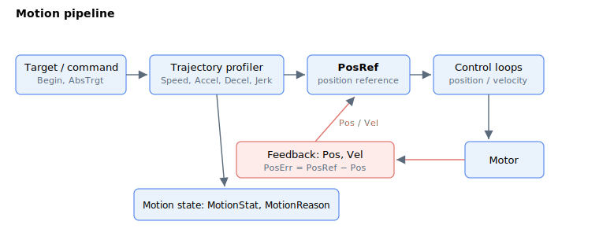

# Motion

A motion command flows through a pipeline: a target or command is shaped by the trajectory profiler (using the speed, acceleration, deceleration and jerk limits) into a position reference ([PosRef](01-kinematics-status/PosRef.md)), which the control loops track on the motor. The motor feedback ([Pos](01-kinematics-status/Pos.md), [Vel](01-kinematics-status/Vel.md)) closes the loops, and the motion state ([MotionStat](05-motion-status/MotionStat.md), [MotionReason](05-motion-status/MotionReason.md)) reports the progress and why a move ended.

Standard motion keywords can be generally divided into 5 sub-categories:

1.  Kinematics status

2.  Motion configuration

3.  Kinematics configuration

4.  Motion command

5.  Motion status
