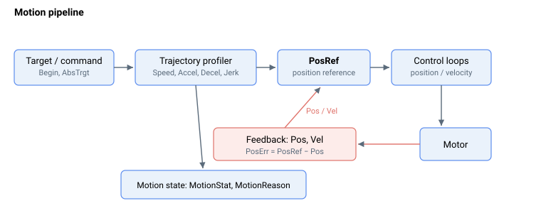

# Motion

一条运动指令通过流水线进行处理：目标或指令由轨迹规划器（使用速度、加速度、减速度和加加速度限值）整形为位置参考（[PosRef](01-kinematics-status/PosRef.md)），随后控制环在电机上对其进行跟踪。电机反馈（[Pos](01-kinematics-status/Pos.md)、[Vel](01-kinematics-status/Vel.md)）闭合控制环，运动状态（[MotionStat](05-motion-status/MotionStat.md)、[MotionReason](05-motion-status/MotionReason.md)）报告进度以及移动结束的原因。

标准运动关键字大致可分为 5 个子类别：

1.  运动学状态

2.  运动配置

3.  运动学配置

4.  运动指令

5.  运动状态
